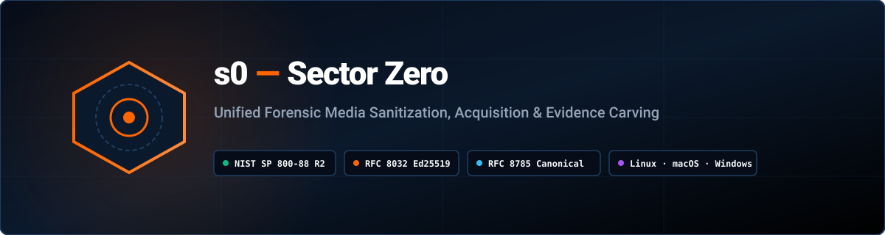

<div align="center">

<picture>
  <source media="(prefers-color-scheme: dark)" srcset="docs/assets/banner-dark.svg">
  <source media="(prefers-color-scheme: light)" srcset="docs/assets/banner-light.svg">
  
</picture>

<br><br>

[](https://github.com/kartik2005221/s0/releases)
[](LICENSE)
[](https://sector0.pages.dev/)
[](https://sector0.gitbook.io/compliance/)
[](https://sector0.gitbook.io/architecture/canonical-json/)
[](https://sector0.gitbook.io/)

*One unified toolchain. Disk sanitization, forensic acquisition, file carving & evidence recovery, audit-ledger verification, and offline certificate validation. Cryptographic chain of custody throughout.*

---

### Official Links & Deployments

| Service | Live URL | Purpose |
|---|---|---|
| **Official Website** | [sector0.pages.dev](https://sector0.pages.dev/) | Main product showcase, feature overview & ecosystem hub |
| **Documentation** | [sector0.gitbook.io](https://sector0.gitbook.io/) | Complete engineering manuals, compliance matrices & guides |
| **Certificate Verification** | [sector0.pages.dev/verify/](https://sector0.pages.dev/verify/) | 100% client-side, offline Ed25519 certificate verifier |
| **Install s0** | [sector0.pages.dev/get/](https://sector0.pages.dev/get/) | One-line installation scripts, checksums & release packages |
| **GitHub Releases** | [github.com/kartik2005221/s0/releases](https://github.com/kartik2005221/s0/releases) | Pre-built hybrid Bootable Live ISOs, tarballs & checksums |

</div>

---

## What is s0?

**s0** is an open-source digital forensic and media sanitization suite engineered for investigators, compliance auditors, and system administrators. It integrates three core modules and independent cryptographic verification into a single multi-platform suite:

| Capability | Module | What s0 Does |
|---|:---:|---|
| **Sanitization & Erasure** | Module 1 | Irreversibly purges drives, files, and partitions per NIST SP 800-88 Rev. 2 & IEEE 2883-2022, emitting Ed25519-signed PDF/JSON sanitization certificates. |
| **Evidence Carving & Recovery** | Module 2 | Reconstructs deleted evidence from raw images, formatted disks, and corrupt media across ext4, NTFS, FAT32, and exFAT with 4-factor Shannon entropy scoring. |
| **Bit-Stream Imaging** | Module 3 | Fault-tolerant raw evidence acquisition (`s0 image`) and drive duplication (`s0 clone`) with simultaneous live SHA-256/MD5 hashing and bad sector zero-filling. |
| **Cryptographic Verification** | Verifier | Instant client-side verification of emitted certificates via WebCrypto or CLI without uploading sensitive case data. |

Every operation is recorded in a supporting hash-chained audit ledger (`~/.s0/s0_audit.db`), providing a tamper-evident chain of custody verifiable offline in milliseconds.

---

## Legal & Responsible Use Notice

> **IMPORTANT:** s0 is a digital forensic sanitization and recovery tool.

Only operate on storage media, physical drives, or files that you **legally own** or have **documented, written authorization** to examine. Unauthorized data destruction or forensic acquisition violates computer crime laws worldwide:
- **United States:** Computer Fraud and Abuse Act (CFAA), 18 U.S.C. § 1030
- **United Kingdom:** Computer Misuse Act 1990
- **European Union:** Directive 2013/40/EU
- **India:** Information Technology Act 2000, §§ 43, 66
- **International:** Budapest Convention on Cybercrime

Consult the [Documentation Legal FAQ](https://sector0.gitbook.io/getting-started/faq/) for responsible use policies.

---

## Quick Installation

Full installation instructions and verification guides are hosted at [sector0.pages.dev/get/](https://sector0.pages.dev/get/).

### Linux/MacOS
```bash
curl -fsSL https://sector0.pages.dev/sh | bash
```

### Windows (PowerShell)
```powershell
irm https://sector0.pages.dev/ps1 | iex
```

### Windows (Command Prompt)
```cmd
curl -fsSL https://sector0.pages.dev/cmd -o s0-install.cmd && s0-install.cmd && del s0-install.cmd
```

After installation, `s0` is immediately registered on your system `PATH`:
```bash
s0 --version
```

<details>
<summary><b>Lifecycle Management (Upgrade & Uninstall)</b></summary>

```bash
s0 upgrade

s0 uninstall
```
</details>

---

## Quick Start CLI Examples

### 1. Storage Device Inventory & Pre-Flight Planning
```bash
s0 list

s0 plan --target /dev/sdb
```

> **Machine-Readable Output:** Human-readable progress goes to **stderr** while stdout carries clean machine-readable data. For scripting or automation, use `--json` or `--format csv`:
> `s0 list --json | jq -r '.result[] | .path'`

### 2. NIST SP 800-88 Drive Sanitization
```bash
sudo s0 wipe --target /dev/sdb --yes --operator "analyst-01" --organization "Forensic Lab"
```

### 3. File & Directory Secure Deletion
```bash
s0 wipe --targets /path/to/file.pdf /path/to/sensitive_folder/ --yes
```

### 4. Forensic File Carving & Evidence Recovery
```bash
s0 carve --target evidence.raw --out-dir ./recovered --extensions jpg,png,pdf,zip --min-confidence 50
```

### 5. Bit-Stream Disk Imaging & Hardware Cloning
```bash
s0 image --source /dev/sdb --destination /evidence/drive_image.raw

sudo s0 clone --source /dev/sdb --destination /dev/sdc --yes
```

### 6. Audit Trail & Offline Cryptographic Verification
```bash
s0 audit list --limit 25

s0 audit verify

s0 verify certificate_12345678.json
```

### 7. Bootable Live Media & USB Station (`s0 live`)
```bash
s0 live download

s0 live devices

sudo s0 live flash --target /dev/sdb -y
```

---

## Interfaces: CLI, Web Console & Bare-Metal ISO

### 1. Local Forensic Web Dashboard (`sudo s0 web`)
Launch the browser console directly on loopback (`127.0.0.1:8669`):
```bash
sudo s0 web
```
> **Note on Privileges:** Direct block device sanitization and raw disk acquisition require root (`sudo`) privileges. Without sudo, unprivileged file/folder wiping and carving remain fully available. See [Web Console Guide](https://sector0.gitbook.io/guides/web-dashboard/) for details.

### 2. Bare-Metal Bootable Live ISO (Debian 12)
When internal or system drives cannot be unmounted within a running host OS:
1. Download verified hybrid ISO directly from CLI: `s0 live download`
2. Flash to USB pendrive: `sudo s0 live flash --target /dev/sdb`
3. Boot target system into the air-gapped kiosk station. See [Live ISO Guide](https://sector0.gitbook.io/guides/live-iso/).

### 3. Client-Side Verification ([sector0.pages.dev/verify/](https://sector0.pages.dev/verify/))
Every certificate issued embeds a verification QR code and SHA-256 fingerprint:
- Operates 100% offline in browser via WebCrypto.
- Zero case data leaves your local machine.
- Immediate cryptographic signature and hash-chain validation.

---

## Agentic AI Skill (`skills/s0-forensics/`)

`s0` includes a dedicated, high-assurance agentic skill conforming to the **Skill Creator** standard:
- **Specification:** [`skills/s0-forensics/SKILL.md`](skills/s0-forensics/SKILL.md)
- **Safety Directives:** Enforces mandatory pre-flight dry-runs (`s0 plan`), drive serial/model confirmation, operational patience, and post-execution certificate verification.
- **Documentation Guide:** See [Agentic AI Guide](https://sector0.gitbook.io/project/agentic-ai/) on GitBook.

---

## Standards Compliance Matrix

| Standard | Category | S0 Engineering Implementation |
|---|---|---|
| **NIST SP 800-88 Rev. 2** | Media Sanitization | Purge (NVMe Sanitize, ATA Secure Erase), Clear (1-pass zero overwrite, file cluster sanitization). |
| **IEEE 2883-2022** | Storage Sanitization | Standardized classification of physical and logical block sanitization. |
| **ISO/IEC 27037** | Digital Evidence Handling | Simultaneous SHA-256 & MD5 evidence hashing, non-repudiation via Ed25519 signing, append-only ledger. |
| **RFC 8785** | Canonical JSON (JCS) | Deterministic certificate serialization and block hashing. |
| **RFC 8032** | Digital Signatures | High-performance Ed25519 public-key signature system. |

Full compliance details: [NIST Compliance Matrix](https://sector0.gitbook.io/compliance/)

---

## Documentation Index

| Guide | Online URL | Local File |
|---|---|---|
| **User & Operator Manual** | [sector0.gitbook.io/guides/user-manual](https://sector0.gitbook.io/guides/user-manual/) | [`docs/guides/user-manual.md`](docs/guides/user-manual.md) |
| **Architecture Specification** | [sector0.gitbook.io/architecture](https://sector0.gitbook.io/architecture/) | [`docs/architecture/system-architecture.md`](docs/architecture/system-architecture.md) |
| **CLI Complete Reference** | [sector0.gitbook.io/guides/cli-reference](https://sector0.gitbook.io/guides/cli-reference/) | [`docs/guides/cli-reference.md`](docs/guides/cli-reference.md) |
| **Forensic Carving Guide** | [sector0.gitbook.io/guides/forensic-carving](https://sector0.gitbook.io/guides/forensic-carving/) | [`docs/guides/forensic-carving.md`](docs/guides/forensic-carving.md) |
| **Live ISO Build Guide** | [sector0.gitbook.io/guides/live-iso](https://sector0.gitbook.io/guides/live-iso/) | [`docs/guides/live-iso.md`](docs/guides/live-iso.md) |
| **Agentic AI Guide** | [sector0.gitbook.io/project/agentic-ai](https://sector0.gitbook.io/project/agentic-ai/) | [`docs/project/agentic-ai.md`](docs/project/agentic-ai.md) |
| **Standards Compliance** | [sector0.gitbook.io/compliance](https://sector0.gitbook.io/compliance/) | [`docs/compliance/nist-compliance.md`](docs/compliance/nist-compliance.md) |
| **Engineering Handover** | [sector0.gitbook.io/project/evaluator-guide](https://sector0.gitbook.io/project/evaluator-guide/) | [`docs/project/evaluator-guide.md`](docs/project/evaluator-guide.md) |

---

## Automated Test Verification

Execute the complete automated test suite locally:

```bash
.venv/bin/pytest tests/core tests/cli tests/web tests/platform_windows tests/platform_macos tests/portal -v

bash tools/build_all.sh
```

---

## License

Distributed under the **MIT License**. See [LICENSE](LICENSE) for full legal text.

