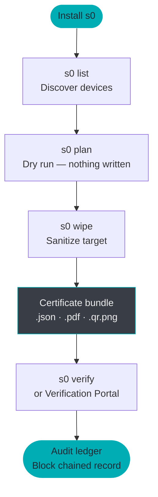

# Getting Started with s0


**Document Scope: 5-Minute Quickstart & Installation Guide**
This guide is intended for new users and evaluators who need to install s0, verify toolchain prerequisites, and execute their first safe dry-run in under 5 minutes.

For certified field sanitization procedures, bad-sector fault recovery, live bit-stream imaging, batch enterprise destruction, and legal audit chain management, consult the **[User & Forensic Operator Manual](../guides/user-manual.md)** or the **[Secure Data Erasure Guide](../guides/secure-erasure.md)**.


---

**s0 (Sector Zero)** is a command-line suite that unifies two capabilities rarely found in a single open-source tool: *forensic-grade drive and file sanitization* and *deleted-file recovery from raw disk images*. Every operation it performs — wipe, erase, or carve — is automatically recorded into a SHA-256 block-chained audit ledger and sealed with an Ed25519 digital signature, giving you a tamper-evident chain of custody that holds up to forensic scrutiny.

This page takes you from a bare machine to completing your first wipe, erasure, and carve operation — in under ten minutes.

---

## Workflow at a Glance



---

## 1. Prerequisites

Before installing, confirm that the following are present on your system.

| Requirement | Minimum Version | Notes |
|---|---|---|
| **Python** | 3.10+ | Checked automatically by the install script |
| **Git** | Any recent | Required to clone the repository during install |
| **curl** | Any | Pre-installed on all modern Linux/macOS/Windows 10+ |


**Privilege requirements by operation**
Not all s0 operations need elevated privileges — only block-device wiping does:

| Operation | Linux | macOS | Windows |
|---|---|---|---|
| Drive wipe (`s0 wipe`) | `sudo` / root | `sudo` | Administrator |
| File erase (`s0 wipe --targets`) | No | No | No |
| Image carve (`s0 carve`) | No | No | No |
| List devices (`s0 list`) | No | No | No |
| Audit / verify | No | No | No |



**Legal & Responsible Use Requirement**
s0 is a certified digital forensic sanitization and recovery tool. You must **only** operate on storage media and files that you **legally own** or have **explicit, documented authorization** to process. Operating on unauthorized systems or drives may violate computer crime laws (e.g., CFAA 18 U.S.C. § 1030, Computer Misuse Act, IT Act 2000). See the [Legal FAQ](faq.md#0-legal-ethical-use).


---

## 2. Installation




Run the fast one-line installer. It verifies toolchain prerequisites, bootstraps a dedicated Python virtual environment, installs cryptographic engines, and registers `s0` in your `PATH`.

```bash
# Universal Linux installer via s0-install portal
curl -fsSL https://s0-install.pages.dev/sh | bash
```


**What the installer does**
The script places the `s0` launcher at `~/.local/bin/s0` alongside a self-contained `.venv` inside `~/.s0`. You do **not** need to activate the virtual environment manually.




The universal installer works identically across Apple Silicon (M1/M2/M3/M4) and Intel Macs:

```bash
# Universal macOS installer via s0-install portal
curl -fsSL https://s0-install.pages.dev/sh | bash
```


**Homebrew Python**
If you manage Python with Homebrew, ensure `python3 --version` reports 3.10 or newer before running the installer.




Open **PowerShell** (run as administrator for physical drive access) and run:

```powershell
# Automated Windows PowerShell installer via s0-install portal
irm https://s0-install.pages.dev/ps1 | iex
```


**Execution policy**
If you receive a `cannot be loaded because running scripts is disabled` error, temporarily allow remote scripts:
```powershell
Set-ExecutionPolicy -Scope CurrentUser RemoteSigned
```




Open **Command Prompt** and run:

```cmd
:: Automated Windows CMD installer via s0-install portal
curl -fsSL https://s0-install.pages.dev/cmd -o s0-install.cmd && s0-install.cmd && del s0-install.cmd
```



Use this approach when you need offline installation, want to audit the install script first, or intend to contribute to the codebase.

```bash
# Clone repository and execute master bootstrap orchestrator
git clone https://github.com/kartik2005221/s0.git
cd s0
bash scripts/build_all.sh   # (1)
```

1. `build_all.sh` creates `.venv`, installs all Python dependencies, and runs the full test suite (180+ tests). Expect 1–3 minutes on first run.

After `build_all.sh` completes, invoke s0 directly through the virtual environment:

```bash
# Verify installation directly via virtualenv binary
.venv/bin/s0 --version
```


**Add to PATH manually**
To use `s0` without the `.venv/bin/` prefix, add the following to your shell profile (`~/.bashrc`, `~/.zshrc`, etc.):
```bash
# Export s0 binary directory to PATH
export PATH="/path/to/s0/.venv/bin:$PATH"
```




---

## 3. Verify Installation

Confirm the installation completed successfully:

```bash
# Print installed version string
s0 --version
```

Expected output (version numbers may differ):

```
# Output verification string
s0 version 2.2.1
```


**Shell not finding s0?**
If your shell reports `command not found`, open a **new terminal window** first — the installer modifies `PATH` in your shell profile, which only takes effect in new sessions. If the issue persists, check that the install location (e.g. `/usr/local/bin` or `~/.local/bin`) is in your `PATH`:
```bash
# Inspect PATH entries for s0 binaries
echo $PATH | tr ':' '\n' | grep -E "local/bin|s0"
```


---

## 4. Upgrade & Uninstallation

### Upgrade Suite
To pull the latest release, verify dependencies, and update in-place:

```bash
# In-place terminal upgrade
s0 upgrade
```

Alternatively, re-run the fast upgrade script:
```bash
# Linux / macOS
curl -fsSL https://s0-install.pages.dev/upgrade-sh | bash

# Windows PowerShell
irm https://s0-install.pages.dev/upgrade-ps1 | iex
```

### Uninstallation
To cleanly remove `s0`, its virtual environment, and PATH symlinks:

```bash
# Interactive uninstallation (prompts for confirmation)
s0 uninstall

# Non-interactive with audit ledger backup
s0 uninstall --yes --keep-audit
```

---

## 5. Your First Wipe

This walkthrough sanitizes a USB drive or block device. Follow the three steps in sequence: **list → plan → wipe**.


**This operation is irreversible**
`s0 wipe` permanently destroys all data on the target device. Double-check the device path in each step before proceeding.


### Step 1 — Discover attached devices

```bash
# List all attached storage devices
s0 list
```

This command enumerates all block devices visible to the operating system and presents a formatted table:

```
┌───────────────────────────────────────────────────────────────────┐
│  s0 — Device Inventory                                            │
├─────────────┬─────────┬───────────────┬─────────────┬────────────┤
│  Device     │  Type   │  Size         │  Model      │  Removable │
├─────────────┼─────────┼───────────────┼─────────────┼────────────┤
│  /dev/sda   │  HDD    │  500.1 GB     │  Samsung …  │  No        │
│  /dev/sdb   │  USB    │   32.0 GB     │  SanDisk …  │  Yes       │
│  /dev/nvme0 │  NVMe   │    1.0 TB     │  WD Black … │  No        │
└─────────────┴─────────┴───────────────┴─────────────┴────────────┘
```


**Platform device paths:**

* **Linux:** Devices appear as `/dev/sdb`, `/dev/nvme0n1`, `/dev/mmcblk0`, etc.
* **macOS:** Use raw disk paths for best performance: `/dev/rdisk1`, `/dev/rdisk2`, etc.
* **Windows:** Use physical drive notation: `\\.\PhysicalDrive1`, a drive letter like `E:`, or `\\.\PHYSICALDRIVE1`.


---

### Step 2 — Dry-run with `plan`

Before writing a single byte, run `plan` to see exactly which sanitization method s0 will apply:

```bash
# Dry run: view selected sanitization strategy without modifying data
s0 plan --target /dev/sdb
```

Sample output:

```
[s0 plan]  Target : /dev/sdb  (SanDisk Ultra, 32.0 GB, USB, Removable)
[s0 plan]  Method : OVERWRITE_ZERO_1PASS  (NIST SP 800-88 Clear)
[s0 plan]  Reason : USB mass storage — firmware Secure Erase not supported
[s0 plan]  Est.   : ~27 seconds at current throughput
[s0 plan]  No data written. Run `s0 wipe --target /dev/sdb --yes` to proceed.
```

`plan` resolves the best available sanitization method for the specific hardware — `NVME_SANITIZE` for NVMe, `ATA_SECURE_ERASE` for SATA, `BLKDISCARD` for SSD/discard-capable media, or multi-pass overwrite for HDDs and USB — without touching any data.


**Why use plan?**
For NVMe drives, the firmware-level `NVME_SANITIZE` command completes in under 30 seconds for any drive size. For a spinning HDD, zero-overwrite takes roughly 1 minute per 10 GB. `plan` shows you the exact method and time estimate before you commit.


---

### Step 3 — Execute the wipe

```bash
# Execute certified physical media sanitization
sudo s0 wipe --target /dev/sdb --yes \
    --operator "analyst-01" \
    --organization "Forensic Lab"
```


**Root / Administrator required**
Block device access requires elevated privileges. On Linux/macOS, prefix with `sudo`. On Windows, run from an Administrator terminal.


A live progress bar streams to the terminal throughout the operation:

```
# Real-time ANSI progress stream
[s0 wipe]  ████████████████░░░░  78.2%  22.6 GiB / 28.9 GiB  18.4 MB/s  ETA 05m 42s  44°C
```

When complete:

```
# Sanitization completion summary
[s0 wipe]  [OK]  Sanitization complete
[s0 wipe]  Method   : OVERWRITE_ZERO_1PASS (NIST SP 800-88 Clear)
[s0 wipe]  Verified : 64-block sampled readback — PASS
[s0 wipe]  Duration : 29m 14s
[s0 wipe]  Certificate → ./certificate_a3f19c22.json
[s0 wipe]              → ./certificate_a3f19c22.pdf
[s0 wipe]              → ./certificate_a3f19c22.qr.png
[s0 wipe]  Ledger block #7 appended → SHA-256 continuity verified
```

---

## 5. Your First File Erasure

`s0 wipe` seamlessly auto-detects individual files and directories — no root access needed. It overwrites data in-place at the cluster level, zeroes filesystem timestamps, and scrambles directory entry names before unlinking.

```bash
# Execute in-place cluster sanitization on target files and directories (auto-detected)
s0 wipe \
    --targets /path/to/classified_report.pdf /path/to/sensitive_folder/ \
    --passes 1
```

| Flag | Purpose |
|---|---|
| `--targets` | Space-separated list of files and/or directories (or passed as positional target) |
| `--passes` | Number of overwrite passes (1 = NIST Clear; 3 = additional assurance) |


**Batch erasure**
You can mix files and directories freely: `--targets file1.pdf dir1/ file2.docx dir2/nested/`. s0 recursively processes directories and emits a single consolidated certificate for the entire batch.


Sample output:

```
# File erasure progress output
[s0 wipe]  Auto-detected 2 file/directory target(s)
[s0 wipe]  Processing 2 target(s)...
[s0 wipe]  [OK]  classified_report.pdf   — 4.2 MB  overwritten (1 pass), timestamps zeroed, unlinked
[s0 wipe]  [OK]  sensitive_folder/       — 23 files / 81.4 MB  overwritten (1 pass), metadata scrubbed
[s0 wipe]  Certificate → ./certificate_b88f4d01.json
[s0 wipe]              → ./certificate_b88f4d01.pdf
[s0 wipe]              → ./certificate_b88f4d01.qr.png
```


**Copy-on-Write filesystems (Btrfs, ZFS, APFS, ReFS)**
On CoW filesystems, in-place overwrite may not reach the original data blocks — the filesystem transparently redirects writes to new locations. s0 detects CoW filesystems and emits a warning. See [Limitations & Boundaries](../compliance/limitations.md) for the full engineering disclosure.


---

## 6. Your First Carve

The carver recovers deleted files from raw disk images — no root access needed, and it works entirely on image files, so your original evidence drive is never touched.


**What is a disk image?**
A disk image (`.raw`, `.img`, `.dd`) is a byte-for-byte copy of a storage device. You can create one from a physical drive with standard forensic tools (`s0 image`, `dd`, `dcfldd`). s0's carver then operates on this image without any risk of modifying the original evidence.


```bash
# Extract deleted forensic evidence from raw image file
s0 carve \
    --target /evidence/suspect_drive.raw \
    --out-dir ./recovered_evidence \
    --extensions jpg,png,pdf,zip \
    --min-confidence 50
```

| Flag | Purpose |
|---|---|
| `--target` | Path to the disk image (or live block device with root) |
| `--out-dir` | Directory where carved files will be written |
| `--extensions` | Comma-separated list of file types to recover |
| `--min-confidence` | Score threshold 0–100; files scoring below this are discarded |

**Supported file types:** `jpg`, `png`, `pdf`, `zip`, `docx`, `xlsx`, `gif`, `bmp`, `elf`, `mp3`, `sqlite`, `gz`

**Supported filesystem structures:** ext4, NTFS (`$MFT`), FAT32, exFAT — plus raw signature carving that works on any filesystem (or no filesystem at all).

Live output streams a progress bar and a rolling found-file counter:

```
# Terminal status line output
[s0 carve]  ████████░░░░░░░░░░░░  35.4%  10.2 GiB / 28.9 GiB  142 MB/s   ETA 02m 10s  Found: 36,790
```

When complete:

```
# Evidence recovery completion summary
[s0 carve]  [OK]  Carving complete
[s0 carve]  Files recovered : 1,247  (above 50% confidence)
[s0 carve]  Output          : ./recovered_evidence/
[s0 carve]  Manifest        : ./recovered_evidence/carve_manifest_9e4a1b77.json  (Ed25519-signed)
[s0 carve]  Ledger block #8 appended → SHA-256 continuity verified
```


**Confidence score explained**
Each recovered file is scored 0–100 based on four factors:

| Factor | Weight | What it checks |
|---|---|---|
| Header magic match | 30% | File type byte signature at offset 0 |
| Footer magic match | 30% | End-of-file marker presence |
| Size plausibility | 20% | File size within expected bounds for the type |
| Shannon entropy | 20% | Data randomness consistent with the file type |

A score of 50 is a reasonable default. Raise to 70–80 for highest-confidence files only; lower to 30 to capture more fragments at the cost of some false positives.


---

## 7. Understanding the Output

Every `s0 wipe` operation produces a **certificate bundle** — three files tied to a single UUID:

```
# Certificate bundle files
certificate_a3f19c22.json      # (1) Machine-readable canonical payload
certificate_a3f19c22.pdf       # (2) Official printable PDF with QR
certificate_a3f19c22.qr.png    # (3) Standalone verification QR code
```

1. **Machine-readable** — Canonical JSON payload with Ed25519 signature. Submit to `s0 verify` or drag-and-drop into the [Verification Portal](https://s0-verify.pages.dev/).
2. **Human-readable** — Formatted PDF report: operator name, organization, target device, method, sectors verified, timestamp, and embedded QR code. Court-admissible artifact.
3. **Optical verification** — Standalone QR image. Scan with any smartphone camera → opens the certificate pre-loaded in the Verification Portal.

The `carve` command produces a **signed manifest** instead:

```
# Forensic carving manifest
carve_manifest_9e4a1b77.json   # Signed list of all recovered files + SHA-256 hashes
```


**Where are certificates saved?**
By default, certificates are written to the **current working directory** from which you ran `s0`. Pass `--out-dir /path/to/output/` to any command to specify a custom location.


### Audit Ledger

Every operation also appends a cryptographic block to `~/.s0/s0_audit.db`:

```bash
# View the 25 most recent operations
s0 audit list --limit 25

# Verify the entire chain has not been tampered with
s0 audit verify
```

`audit verify` traverses from the genesis block to the latest tip and confirms that every `prev_hash` matches the preceding block's `block_hash`. Any alteration — even editing a single character in the SQLite file — breaks the chain and is immediately flagged.

---

## 8. Verifying a Certificate

You have three independent ways to verify any s0 certificate, all of which work completely offline:




```bash
# Verify certificate signature against demo authority key
s0 verify certificate_a3f19c22.json --key core/keys/demo_issuer_public.pem
```

Expected output on a valid certificate:

```
# Cryptographic verification summary
[s0 verify]  [OK]  Signature VALID
[s0 verify]  Issuer    : s0 Demo Authority
[s0 verify]  Target    : /dev/sdb  (SanDisk Ultra, 32.0 GB)
[s0 verify]  Method    : OVERWRITE_ZERO_1PASS
[s0 verify]  Operator  : analyst-01 / Forensic Lab
[s0 verify]  Timestamp : 2026-09-09T13:31:00Z
```



1. Open [s0-verify.pages.dev](https://s0-verify.pages.dev/) — or open `verification-portal/index.html` locally for full air-gap operation.
2. Drag and drop `certificate_a3f19c22.json` onto the portal.
3. The portal verifies the Ed25519 signature using pure WebCrypto — **no data is ever uploaded to a server**.



Scan the QR code from the PDF certificate (or `certificate_a3f19c22.qr.png`) with any smartphone camera. The QR encodes a link that pre-loads the certificate data into the Verification Portal — still 100% client-side.




**Air-gap verification**
For classified environments with no internet access, copy the `verification-portal/` directory to your air-gapped machine and open `index.html` directly in any browser. The portal is a static single-page application with zero external dependencies.


---

## 9. Uninstallation




```bash
# Download and run the automated uninstaller
curl -sSL https://raw.githubusercontent.com/kartik2005221/s0/master/scripts/uninstall.sh | bash
```

This removes the `s0` launcher from `PATH` and optionally removes the cloned repository. Your audit database at `~/.s0/s0_audit.db` is **not** deleted by default — preserve it for chain-of-custody records.



```powershell
# Execute the Windows PowerShell automated uninstaller
irm https://raw.githubusercontent.com/kartik2005221/s0/master/scripts/uninstall.ps1 | iex
```




**Preserve your audit database**
The ledger at `~/.s0/s0_audit.db` (Linux/macOS) or `%USERPROFILE%\.s0\s0_audit.db` (Windows) is the canonical chain-of-custody record for every operation s0 has performed. Back it up before uninstalling if you need to retain those records.


---

## 10. Workspace Configuration (`s0_config.json`)

To eliminate the need for passing repeated command-line arguments and ensure organizational consistency across all workstation interfaces, `s0` automatically reads `s0_config.json` at the root of the repository or the current working directory (override path via the `S0_CONFIG_PATH` environment variable):

```json
{
  "version": "2.4.1",
  "tool_name": "s0",
  "tool_title": "Sector Zero — Unified Forensic & Sanitization Workstation",
  "documentation_url": "https://s0-docs.pages.dev/",
  "verification_portal_url": "https://s0-verify.pages.dev/",
  "install_portal_url": "https://s0-install.pages.dev/",
  "github_url": "https://github.com/kartik2005221/s0",
  "default_operator": "op-forensic",
  "default_organization": "Digital Forensics & Data Sanitization Lab",
  "default_key_path": "core/keys/demo_issuer_private.pem",
  "default_public_key_path": "core/keys/demo_issuer_public.pem",
  "default_out_dir": "demo-out",
  "qr_url_template": "https://s0-verify.pages.dev/?cert={cert_uuid}",
  "api_port": 8669
}
```

Every command line interface (`s0 wipe`, `s0 carve`, `s0 image`), macOS/Windows CLI tool, Web Dashboard, and Verification Portal automatically derives its operational defaults from this central file.

---

## 11. Next Steps

Now that you have s0 installed and have run your first operations, explore the deeper documentation:

<table data-view="cards">
  <thead>
    <tr>
      <th></th>
      <th></th>
      <th data-hidden data-card-target data-type="content-ref"></th>
    </tr>
  </thead>
  <tbody>
    <tr>
      <td><strong>Full CLI Reference</strong></td>
      <td>Every flag, subcommand, and option with examples covering NVMe, SATA, and batch file erasure.</td>
      <td><a href="../guides/cli-reference.md">CLI Reference</a></td>
    </tr>
    <tr>
      <td><strong>Compliance &amp; Standards</strong></td>
      <td>How each method maps to NIST SP 800-88 Clear and Purge tiers, IEEE 2883-2022, and ISO 27037.</td>
      <td><a href="../compliance/nist-compliance.md">Compliance Matrix</a></td>
    </tr>
    <tr>
      <td><strong>System Architecture</strong></td>
      <td>Subsystem design, cryptographic flow to signed certificates, and blockchain audit ledger block-hash formula.</td>
      <td><a href="../architecture/system-architecture.md">Architecture</a></td>
    </tr>
    <tr>
      <td><strong>Bare-Metal Live ISO</strong></td>
      <td>Build a bootable Live ISO with s0 pre-installed for offline host drive sanitization.</td>
      <td><a href="../guides/live-iso.md">Live ISO Guide</a></td>
    </tr>
    <tr>
      <td><strong>Limitations &amp; Boundaries</strong></td>
      <td>Honest engineering disclosure: SSD FTL wear-leveling, Copy-on-Write caveats, and journaling remnants.</td>
      <td><a href="../compliance/limitations.md">Limitations</a></td>
    </tr>
    <tr>
      <td><strong>Agentic AI Safety</strong></td>
      <td>Safety guidelines and prompt protocols for autonomous AI coding agents performing forensic tasks.</td>
      <td><a href="../project/agentic-ai.md">Agentic AI Guide</a></td>
    </tr>
    <tr>
      <td><strong>Verification Portal</strong></td>
      <td>Deploy the offline certificate verifier, Ed25519 key pinning, and air-gap verification.</td>
      <td><a href="../architecture/verification.md">Verification Guide</a></td>
    </tr>
  </tbody>
</table>

