# Changelog & Engineering Release History

All notable changes to the **s0 (Sector Zero)** suite are documented in this file. The project adheres to [Semantic Versioning](https://semver.org/spec/v2.0.0.html) and [Keep a Changelog](https://keepachangelog.com/en/1.0.0/) standards.

```mermaid
flowchart LR
    subgraph M1 ["Foundation (v0.9)"]
        direction TB
        F1["Canonical JSON v1"]
        F2["Ed25519 Signatures"]
        F3["WebCrypto Verifier"]
    end
    subgraph M2 ["Core Suite (v1.0)"]
        direction TB
        C1["Drive Eraser (Purge & Clear)"]
        C2["File Eraser & Metadata Scrub"]
        C3["NTFS & ext4 Carvers"]
        C4["SQLite Hash Chain"]
    end
    subgraph M3 ["Hardening (v1.5)"]
        direction TB
        H1["Cross-Platform Parity"]
        H2["Windows ADS Scrubbing"]
        H3["macOS F_FULLFSYNC"]
        H4["exFAT & FAT32 Carvers"]
    end
    subgraph M4 ["Production (v2.0+)"]
        direction TB
        P1["Bare-Metal Live ISO"]
        P2["Web Dashboard Console"]
        P3["Unified Media Wipe (v2.4)"]
        P4["Cloudflare Zero-Trust Portals"]
    end
    M1 --> M2 --> M3 --> M4
```

## [2.4.1] — 2026-09-24

### Added
- **Unified Media & File Sanitization (`s0 wipe`):** Merged file/folder erasing into the master `s0 wipe` command with automatic detection of block devices, disk images, single files, and directories. Completely removed obsolete `s0 erase` and `s0 erase-files` commands.
- **ASCII Art Banner:** Added branded fastfetch-style ASCII art banner for interactive TTY invocations of bare `s0` and `s0 --help`, displaying the active version and repository link while preserving scripted pipeline compatibility.
- **Hardware Thermal Telemetry:** Added hardware temperature monitoring across both CLI and Web Dashboard (real-time temperature badge with normal, warm, and critical states).
- **Graceful Signal Handling:** Implemented clean `SIGINT` / Ctrl+C cancellation handlers across all commands (`s0 wipe`, `s0 image`, `s0 carve`, `s0 live flash/download`, `s0 web`), restoring cursor state and terminating workers safely.
- **Web Console Sudo Privilege Detection:** Added runtime root/administrator privilege detection in the Web Dashboard (`/api/capabilities`). Detects unprivileged execution, alerts users with an informational banner, and disables direct physical drive wiping while keeping file sanitization accessible.
- **Modern Web Progress Bars:** Upgraded web execution consoles with visual orange-gradient progress bars, percentage readouts, throughput metrics, and estimated time remaining across light and dark themes.
- **Cloudflare Pages Production Deployment & Zero-Vercel Policy:** Migrated all production hosting endpoints (`s0-docs.gitbook.io`, `s0-verify.pages.dev`, `s0-install.pages.dev`) to Cloudflare Pages with native headers and security headers, purging all legacy hosting artifacts.
- **Verification Portal One-Click Install:** Embedded cross-platform one-line installation commands (`curl` for Linux/macOS and `irm` for Windows PowerShell) and official documentation links directly into the zero-trust Verification Portal.
- **Sequential Forensic Architecture Renumbering:** Formally sequenced core forensic modules following media/file sanitization unification: Module 1 (Defensive Sanitization), Module 2 (Offensive Carving), Module 3 (Forensic Bit-Stream Imaging & Cloning), Module 4 (Blockchain Cryptographic Audit Ledger).

### Security
- **Path Traversal Hardening:** Patched potential path traversal vulnerabilities in `cmd_uninstall` directory cleanup and live image downloads.
- **Subprocess Shell Injection Prevention:** Replaced shell-wrapped execution in Live ISO builder fallbacks with direct argument vector invocations.
- **Secure File Flush & Plant Marker Progress:** Added visual progress indicators during disk marker planting and hardware `fsync` operations.

### Changed
- **Default Web Dashboard Port:** Migrated default web dashboard port from `8000` to `8669` across `s0_config.json`, CLI arguments, runner scripts (`run.sh`, `run.bat`, `run.ps1`), and Live ISO systemd services.
- **Standalone Software Release Mode:** Decoupled GitHub Releases from the Live ISO generation toolchain to deliver lightweight, fast, pure software distribution without requiring 550MB ISO image generation.

---

## [2.4.0] — 2026-09-17

### Added
- **`s0 live` Command Suite:** Added native CLI subcommands (`download`, `devices`, `flash`, `build`) to manage bare-metal Live ISO acquisition and USB burning directly from the terminal without third-party flashing utilities.
- **Safe Removable USB Enumeration:** Implemented cross-platform physical USB drive discovery (`s0 live devices`) that automatically filters out internal system, root, and boot disks to prevent destructive misidentification.
- **Automated ISO Download & Verification:** Built-in public GitHub Releases discovery and streaming download with real-time progress bar (`ProgressBar`) and strict SHA-256 integrity validation against release signatures.
- **Native Block Flashing Engine:** Cross-platform raw block writer with partition unmounting (`umount`, `diskutil unmountDisk`, Win32 dismount), interactive safety confirmation prompt, and streaming progress bar.
- **Versioned ISO Release Naming:** Updated `.github/workflows/build-iso.yml` to package and attach versioned hybrid ISOs (`s0-live-v2.4.0-amd64.hybrid.iso`) with corresponding checksum files.
- **Cross-Platform CLI Context & Tips:** Added intelligent device path error detection (e.g. Linux path on Windows or Windows path on Linux/macOS) with actionable platform syntax tips.

### Fixed
- **Documentation Portal Desktop Sidebar Navigation:** Fixed desktop sidebar navigation regression by properly scoping mobile drawer drill-down back bars inside `@media screen and (max-width: 76.1875em)`, eliminating unwanted orange back arrows on desktop viewports.
- **Install Portal Header Harmonization:** Standardized Install Portal header dimensions, typography, button palettes, and status indicators to exactly match the Verification Portal design system.
- **Debian Live-Build SHA-256 Checksum:** Pinned Debian archive bookworm checksum (`a863905724e7b69d45066ebab113cb6de12a11984349847ad49f6151c10f017d`) ensuring 100% reproducible ISO builds on GitHub Actions.

---

## [2.3.0] — 2026-09-17

### Security
- **HIGH — Web Authentication Token Hardening:** Restricted `/run/s0/web_auth_token` permissions from `0644` to `0640` with group ownership assigned to the dedicated `s0-kiosk` security group, preventing unauthorized local processes from reading session tokens.
- **HIGH — ISO Build Toolchain Integrity Verification:** Hardened `.github/workflows/build-iso.yml` to download Debian live-build packages over HTTPS and enforce strict SHA-256 checksum validation (`db5e5ae5925092066fee0e87e9e274af32c56f7b08db254377e248e95e07efae`) before installation.
- **MEDIUM — macOS Symlink-Safe Extended Attribute Clearing:** Added `-s` flag to `xattr` invocations across `macos/cli/s0_eraser.py` and `linux/cli/s0_cli/file_eraser.py` to prevent extended attribute manipulation across symbolic links, with absolute binary path resolution (`/usr/bin/xattr`).
- **MEDIUM — Windows NTFS Alternate Data Stream (ADS) Multi-Chunk Scrubbing:** Upgraded Windows ADS scrubbing in `windows/cli/s0_eraser.py` to zero out entire stream allocations in multi-chunk buffers regardless of size prior to stream unlinking.
- **LOW — Central Configuration Discovery Path Alignment:** Added `/etc/s0/s0_config.json` to central `find_config_file()` discovery candidates in `s0_core.config`, ensuring live appliances and system-wide installations resolve global configuration without split-brain issues.

### Added
- **Automated GitHub Actions ISO Releases:** Configured automated bare-metal hybrid ISO generation in GitHub Actions (`build-iso.yml`) on release publication, automatically attaching `s0-live-amd64.hybrid.iso` and cryptographic checksums to GitHub Releases.
- **Cross-Platform CLI Harmonization:** Fully synced Windows (`windows/cli/s0_eraser.py`) and macOS (`macos/cli/s0_eraser.py`) command-line interfaces to support both modern subcommands (`erase`, `wipe`, `list`, `plan`, `audit`, `verify`, `keygen`, `web`) and legacy flags, standardizing options across platforms (`-y`, `-p`, `-t`, `--key`, `--operator`, `--portal-url`, `--verify-samples`).
- **Unified Portal Theming & Legal Protection:** Standardized footer layout across Verification Portal, Install Portal, Web Dashboard, and Documentation Portal to vertically stack the statutory legal authorization notice directly below the author accreditation.

### Changed
- **Total Eradication of Legacy 'GUI' Nomenclature:** Completely transitioned all internal services, directories, scripts, and documentation from `gui` to `web` (`s0 web`). Renamed systemd service to `s0-web.service` and daemon health-check to `s0-wait-web`. Removed legacy alias `s0 gui`.
- **Documentation Portal Mobile Navigation:** Eliminated duplicate header artifacts on mobile viewports by hiding redundant Level-0 drawer titles while preserving sub-navigation back buttons.
- **Verification Portal Gradient Styling:** Resolved background gradient cutoff and banding by applying `background-repeat: no-repeat` and pinned canvas backgrounds.
- **Suite Version Bump:** Version unified across `s0_config.json`, Python packages, CI workflows, and documentation to `2.3.0`.

---

## [2.2.1] — 2026-09-16

### Security
- **CRITICAL — GUI Audit Ledger Signature Verification:** Resolved critical flaw in `verify_audit_ledger()` where default trusted keys were omitted during signature checks, ensuring Ed25519 certificate signatures and authority key pinning are strictly validated during GUI and CLI verification.
- **HIGH — TOCTOU Symlink & Reparse-Point Eraser Hardening:** Added atomic `O_NOFOLLOW` descriptor opening, `fstat(fd)` regular file validation, Win32 `FILE_ATTRIBUTE_REPARSE_POINT` handle inspection, and direct descriptor overwriting across Windows (`s0_eraser.py`) and macOS (`s0_eraser.py`).
- **HIGH — Canonical JSON Deterministic Block Hashing:** Migrated blockchain audit ledger block hashing from pipe-delimited string formatting to RFC 8785 Canonical JSON (`s0_core.canonical`), preventing input collisions while maintaining backward-compatible fallback verification for legacy ledgers.
- **HIGH — Destructive Web API Per-Session Token Authentication:** Protected `/api/wipe`, `/api/erase-files`, `/api/carve`, and `/api/image` with a high-entropy session authentication token (`X-S0-Auth-Token`) saved to `~/.s0/web_auth_token` (mode 0600) and injected via meta tag into the Web Dashboard DOM, blocking unauthorized local script execution.
- **MEDIUM — QR Verification Portal URL Validation:** Enforced strict URL scheme and hostname sanitization on custom `portal_url` parameters in `pdfgen.py` and API request models, restricting redirection to HTTPS and local loopback.
- **MEDIUM — Configuration Path Hijacking Remediation:** Removed `Path.cwd()` from `s0_config.json` candidate discovery list, preventing untrusted local directories from overriding cryptographic key paths and authority settings.
- **LOW — Metadata Pipe & Delimiter Sanitization:** Enforced strict Pydantic model validation rejecting pipe (`|`) and markup characters across operator and organization metadata fields.
- **LOW — Client-Side Key Fingerprint Cryptographic Recalculation:** Updated `verification-portal/verify.js` to derive public key fingerprints directly from raw public key bytes via `Crypto.rawPublicKeyToSpki()`.

### Fixed
- **Mobile Documentation Navigation & Back Button:** Overhauled the mobile drawer header and sub-menu navigation layout in `extra.css`. Fixed back button arrow alignment, eliminated duplicate text clipping and unnecessary "(Tap to return)" annotations, and restored clean horizontal centering for root branding.
- **Monorepo Production Deployment:** Optimized deployment ignore rules at the repository root, ensuring automated git deployments correctly retain documentation sources and build scripts.
- **Debian Live ISO Build Workflow (`build-iso.yml`):** Corrected recursive directory self-copy bug in `linux/iso/auto/build.sh` when staging the repository snapshot. Migrated CI runner to use Docker containerization via `scripts/build_iso.sh` for hermetic Debian Bookworm builds, added `permissions: contents: write`, and enabled automated attachment of `s0-live-amd64.hybrid.iso` to GitHub Releases.
- **Web GUI Missing Import:** Added missing `import tempfile` in `web/app.py` for fallback key directory creation.

### Changed
- **Suite Version Bump:** Version unified across `s0_config.json`, Python packages, test assertions, and documentation to `2.2.1`.
- **Dynamic Version Resolution:** Refactored CLI and GUI modules to resolve runtime version dynamically from `s0_config.json` as the single source of truth.

---

## [2.2.0] — 2026-09-16

### Security
- **CRITICAL — TOCTOU Symlink Race Remediation (`file_eraser.py`):** Eliminated time-of-check to time-of-use symlink substitution race (CWE-367) by opening target files with atomic `O_NOFOLLOW` flags and validating regular-file status via `fstat(fd)` on the opened descriptor before data overwrite. Extended symlink and reparse-point rejection across Windows and macOS eraser engines.
- **HIGH — PDF Certificate Markup Injection Remediation (`pdfgen.py`):** Escaped all user-supplied and dynamic certificate metadata (operator ID, organization, device details, custom notes, and URLs) using `xml.sax.saxutils.escape` prior to ReportLab `Paragraph` construction, preventing visual forgery and malformed tag parsing crashes.
- **LOW — Recursion Limit Protection (`certificate.py`, `canonical.py`):** Enforced a 64-level maximum nesting depth limit and explicit `RecursionError` guards in `_walk_floats()` and `_canon()`, ensuring adversarial nested JSON inputs produce clean validation rejections rather than unhandled tracebacks.

### Added
- **`s0 uninstall` CLI Subcommand:** Added native uninstallation command that removes `~/.s0/`, `/usr/local/bin/s0`, and shell environment PATH entries, featuring interactive safety confirmation (`--yes` bypass) and optional blockchain audit ledger preservation (`--keep-audit`).
- **Install Portal Redesign:** Redesigned `s0-install.pages.dev` for 100% theme parity with the Verification Portal, replacing emojis with clean SVG and ASCII markers, eliminating card paragraph clutter, and exposing Windows Command Prompt install, upgrade, and uninstall cards.
- **Automated CI/CD Workflows:** Configured GitHub Actions workflows: `ci.yml` running pytest test suites across Python 3.11 and 3.12 matrices on push and pull requests, and `release.yml` automating release artifact packaging (`.tar.gz`, `SHA256SUMS.txt`), changelog extraction, and GitHub Releases publication.

### Changed
- **Suite Version Bump:** Version unified across `s0_config.json`, Python packages, and documentation to `2.2.0`.
- **README & Documentation Sanitization:** Stripped extraneous decorative emojis from capability tables and headers in favor of professional technical indicators.

---

## [2.1.1] — 2026-09-14

### Security & Hardening
- **Verification Portal Stored XSS Remediation & CSP:** Remediated stored cross-site scripting vulnerability in `showResult()` by building badge DOM elements using `textContent` instead of string-concatenated `innerHTML`. Audited and secured `handleCertLocator()` and `renderPinnedKeys()`. Added strict Content-Security-Policy (CSP) meta tag preventing external script execution and inline evaluation.
- **Custom Key Isolation:** Restricted pasted custom private key writing to protected `~/.s0/keys/` directory with `0o700`/`0o600` permissions, ensuring user signing keys are never saved into deliverables/evidence output directories.
- **Unaccredited Demonstration Key Warning:** Added conspicuous warnings whenever operations fall back to the public demo key (`demo_issuer_private.pem`): emitted to `sys.stderr` in all CLI commands, highlighted via an amber notice in the Web Dashboard, and stamped as a prominent warning header banner in generated PDF certificates.
- **Directory Browse Allowlist (`/api/browse`):** Restricted Web Dashboard file picker directory traversal to authorized roots (`REPO`, user home, `/media`, `/mnt`), preventing arbitrary host inspection.

### Fixed
- **Mobile Navigation Drawer Scroll:** Resolved mobile navigation drawer clipping by offsetting `.md-sidebar--primary` below the sticky top header (`top: var(--s0-header-height)` and `height: calc(100dvh - var(--s0-header-height))`), restoring full scrollability to the top `Home` item.
- **Callout Box Color Unification:** Unified admonition styles in `docs/stylesheets/extra.css` so that each callout type (`info`, `note`, `tip`, `warning`, `danger`, `success`, `important`) strictly uses a single harmonious color across its left border, box border, icon mask (`::before`), and title text, eliminating dual-color clashes.

---

## [2.1.0] — 2026-09-10

### Added
- **Custom File Signatures in Carver (CLI & GUI):** Added support for arbitrary user-defined magic byte signatures (`--custom-sig` on CLI and interactive Signature Builder on Web Dashboard) supporting hex headers, optional footers, extensions, categories, and max carving sizes across NTFS, ext4, FAT32, exFAT, and raw carving engines.
- **Central Workspace Configuration (`s0_config.json`):** Unified default operator, organization, documentation URLs, and key paths automatically loaded across Linux, macOS, and Windows CLIs, Web Dashboard, and Verification Portal.
- **Persistent Light & Dark Theme Mode:** Implemented accessible, high-contrast light and dark mode toggles with zero-flicker `<head>` initialization and `localStorage` persistence across both Web Dashboard and Verification Portal.
- **Offline Typography Consolidation:** Strictly consolidated Web Dashboard and Verification Portal on self-hosted Rubik (sans-serif) and JetBrains Mono (monospace) `.woff2` font assets, eliminating external CDN dependencies.
- **Verification Portal QR & PDF Verification:** Added direct PDF certificate upload support with embedded QR code extraction and immediate cryptographically verified payload rendering.
- **Carver Output Directory Option:** Added custom extraction output directory selection to both GUI and CLI carving workflows.

### Changed
- **Drive Sanitizer Form Refinement:** Streamlined drive wipe options in Web Dashboard, providing explicit operator and organization fields and harmonizing overwrite pattern standards with pass counts.

### Fixed
- **Verification Portal Background Flare:** Constrained top radial gradient and removed fixed card minimum height constraints, eliminating viewport blowout and mid-screen visual artifacts.

---

## [2.0.0] — 2026-09-09

### Added
- **Production Documentation Suite:** Deployed complete Material for MkDocs technical documentation at [s0-docs.gitbook.io](https://s0-docs.gitbook.io/) with automated CI/CD via standalone `uv` runner.
- **Forensic Color Theme:** Integrated the ColorHunt `#222831` `#393E46` `#00ADB5` `#EEEEEE` palette with customized code blocks, admonitions, and typography.
- **Bare-Metal Bootable Live ISO (`linux/iso/`):** Complete Debian 12 (Bookworm) `live-build` recipe with automated Chromium kiosk, loopback FastAPI wipe daemon (`127.0.0.1:8000`), and QEMU virtual smoke-test harness (`qemu-test.sh`).
- **Offline Asset Bundling:** Bundled local Fira Sans and Fira Code fonts in the verification portal and live ISO to guarantee 100% air-gapped styling without external web requests.
- **One-Line Cross-Platform Installers & Uninstallers:** Added streamlined `install.sh`, `install.ps1`, `install.cmd`, `uninstall.sh`, and `uninstall.ps1` scripts with PATH registration and virtualenv bootstrapping.

### Changed
- **Unified Progress Bar & Thermal Telemetry:** Standardized real-time ANSI terminal progress bars across drive wiping, file erasing, and carving, with a 2-second rate-limited thermal sensor query via Linux `hwmon` and SMART telemetry.
- **Standardized Certificate Identifiers:** Standardized tool naming to `s0` across all output JSON payloads, PDF certificates, and audit blocks.
- **Complete README Overhaul:** Redesigned project README with clean comparative matrices, quickstart examples, and architecture maps.

### Fixed
- **Windows Startup Crash (`fcntl`):** Implemented lazy-import guards for POSIX-only `fcntl` calls in `blkdiscard.py`, resolving startup failures on Windows systems.
- **Stored XSS Remediation:** Hardened the Web Dashboard audit ledger and Verification Portal against stored cross-site scripting by strictly sanitizing operator metadata, device serial numbers, and notes before DOM insertion.
- **Portal Layout Stability:** Fixed flexbox layout blowout in `verification-portal/index.html` when rendering large multi-fragment certificate payloads.

---

## [1.5.0] — 2026-08-28

### Added
- **Native Cross-Platform File Eraser (Module 2):**
  - **Windows (`windows/`):** Win32 direct file I/O with `FlushFileBuffers`, Alternate Data Stream (`:Zone.Identifier`) discovery and destruction, and ReFS CoW volume detection.
  - **macOS (`macos/`):** Darwin direct hardware cache synchronization via `fcntl(fd, F_FULLFSYNC, 0)`, Extended Attribute (`xattr -c`) quarantine stripping, and APFS snapshot warnings.
- **Removable Media & Partition Sanitization:** Added native USB flash drive and secondary partition wiping capabilities to Windows and macOS CLI utilities.
- **FAT32 & exFAT Carving Engines (`linux/cli/s0_cli/carver/`):**
  - **FAT32 (`fat_carver.py`):** BPB boot sector parsing, `0xE5` deleted directory entry scanning, and contiguous cluster recovery.
  - **exFAT (`exfat_carver.py`):** VBR parsing, 32-byte directory entry set reconstruction (`0x05`/`0x85`, `0x40`/`0xC0`, `0x41`/`0xC1`), and Cluster Heap allocation extraction.
- **Fragmented Reconstruction Heuristics (`fragmentation.py`):** Implemented non-resident cluster runlist reassembly and bifragment stream recovery across cluster gaps.

### Changed
- **Project Standardization:** Scrubbed all legacy hackathon and institutional problem statement identifiers; unified repository and binary nomenclature under **s0 (Sector Zero)**.
- **Strict Key Pinning Enforcement:** Updated the Verification Portal to classify certificates into three unambiguous tiers: Green (Accredited Authority), Amber (Valid Math / Unregistered Key), and Red (Tamper Detected).

### Security
- Strengthened verification portal download boundary policies and restricted file path resolution to prevent directory traversal during evidence extraction.

---

## [1.0.0] — 2026-08-15

### Added
- **Module 1: Secure Drive Eraser (`s0_cli/methods/`):**
  - ATA Secure Erase (`ATA_SECURE_ERASE`, `ATA_SECURE_ERASE_ENHANCED`) via controller firmware commands.
  - NVMe Sanitize (`NVME_SANITIZE_BLOCK_ERASE`, `NVME_SANITIZE_CRYPTO_ERASE`) and NVMe Format (`NVME_FORMAT_CRYPTO_ERASE`).
  - Kernel Discard (`BLKDISCARD`) with DRAT/RZAT deterministic readback checks.
  - Logical multi-pass and single-pass zero/random overwriting with 64-block post-wipe verification.
  - Host Protected Area (HPA) and Device Configuration Overlay (DCO) probe detection.
- **Module 2: Secure File & Folder Eraser (`file_eraser.py`):**
  - In-place cluster overwriting, inode timestamp zeroing (`1970-01-01T00:00:00Z`), and filename scrambling before unlinking.
  - Batch file erasure issuance with consolidated Ed25519 certificates.
- **Module 3: Advanced Multi-Filesystem File Carver (`carver/`):**
  - Signature engine supporting JPEG, PNG, PDF, ZIP/Office, GIF, GZIP, BMP, ELF, SQLite3, and MP3.
  - Direct ext4 superblock, block group descriptor, and inode extent tree parser (`ext4_carver.py`).
  - Direct NTFS Master File Table ($MFT) parser extracting resident attributes and non-resident runlists (`ntfs_carver.py`).
  - 4-factor confidence scoring (header 30%, footer 30%, size 20%, 3-point Shannon entropy 20%).
- **Module 4: Blockchain Audit Ledger (`audit/`):**
  - Append-only SQLite database (`~/.s0/s0_audit.db`) with SHA-256 block hash chaining:
    $$\text{block\_hash} = \text{SHA256}(\text{index} \parallel \text{timestamp} \parallel \text{op\_type} \parallel \text{target\_id} \parallel \text{cert\_uuid} \parallel \text{payload\_hash} \parallel \text{signature} \parallel \text{prev\_hash})$$
  - Built-in `s0 audit verify` command confirming unbroken mathematical continuity from genesis to tip.
- **Unified 4-Tab Web Dashboard (`gui/`):** FastAPI backend providing visual controls for wiping, file erasure, evidence carving, and blockchain ledger inspection.

---

## [0.9.0] — 2026-08-01

### Added
- **Core Cryptography Engine (`core/python/s0_core/`):**
  - Pure Ed25519 asymmetric digital signatures per RFC 8032.
  - `s0 Canonical JSON v1` deterministic serializer (`canonical.py`) forbidding float values to eliminate multi-language formatting divergences.
  - Official certificate schema definition (`core/cert_schema.json`).
  - High-resolution ReportLab PDF certificate generator with embedded optical QR codes (`pdfgen.py`).
- **Static Verification Portal (`verification-portal/`):**
  - Zero-backend, 100% client-side WebCrypto / TweetNaCl verification engine.
  - Drag-and-drop certificate JSON verification.
  - Pinned trusted public key registry (`keys.json`).
- **Master Test Orchestrator (`scripts/build_all.sh`):**
  - Automated virtual environment setup and pytest execution across 120+ test cases.
  - Tamper matrix verification tests asserting signature rejection upon single-byte payload corruption.
