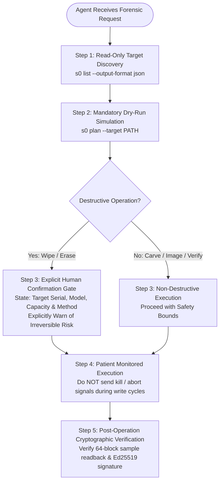

# Agentic AI & High-Risk Safety Guide

!!! info "Agentic Safety Specification"
    - **Scope:** Guidelines, Prompt Engineering, and Safety Guardrails for Autonomous Agentic AI Assistants executing `s0`.
    - **Skill Location:** [`skills/s0-forensics/SKILL.md`](https://github.com/kartik2005221/s0/tree/master/skills/s0-forensics)
    - **Core Operating Principle:** *Patience & Irreversible Risk Awareness*

---

## 1. The High-Risk Operational Reality

Autonomous AI coding agents (such as Antigravity, Claude Code, and OpenAI Operator) are increasingly entrusted with DevOps, system administration, and forensic tasks. However, digital forensic sanitization and evidence acquisition present **non-recoverable risk**:

1. **Irreversible Destruction:** Executing `s0 wipe` permanently purges all flash cell charges or magnetic domains on a physical disk. There is no "undo", no trash bin, and no cloud backup.
2. **Device Enumeration Discrepancies:** On Linux, drive letters (`/dev/sdb`, `/dev/nvme1n1`) can shift between reboots or USB replugs. An agent acting on stale path assumptions could wipe a live production array.
3. **Patience Required for Physical I/O:** Forensic operations on 1 TB – 16 TB media require significant wall-clock time (minutes to hours). If an impatient agent aborts, kills, or restarts an in-progress ATA Secure Erase or NVMe Sanitize command, the physical controller can enter a permanent **bricked or locked** security state.

---

## 2. Agentic Safety Protocols

Every autonomous AI agent operating `s0` must adhere strictly to these four mandatory guardrails:



### Protocol 1: Always Execute `s0 plan` Before Any Wipe
An agent must **never** execute `s0 wipe` directly. It must first run:

```bash
# Mandatory dry run: inspect selected method, NIST category, and warnings
s0 plan --target /dev/sdb
```

### Protocol 2: State Model, Serial Number & Capacity Explicitly
When communicating with the human operator, the agent must never say simply "I will wipe `/dev/sdb`". It must state the physical hardware details:

> *"Target: `/dev/sdb` — Model: Samsung SSD 870 EVO — Serial: `S5YANG0N123456K` — Capacity: 500.1 GB. This operation will irreversibly destroy all partitions and data using `NVME_SANITIZE_BLOCK_ERASE` (NIST Purge). Please confirm before I proceed."*

### Protocol 3: Counsel Operator Patience
For large drives, whole-disk wipes and carving scans take time. The agent must counsel patience and never send termination signals (`SIGINT`, `SIGTERM`, `kill -9`) to a running `s0 wipe` process:

> *"Sanitization of this 1 TB NVMe volume is underway. Hardware controller commands are executing. Please be patient — interrupting or unpowering the controller during an active erase cycle can permanently brick the drive."*

### Protocol 4: Verify Every Issued Certificate
Following any operation, the agent must automatically verify the resulting cryptographic certificate:

```bash
# Verify the newly minted certificate against trusted authority key
s0 verify ./certificate_8f21bc90.json --key core/keys/demo_issuer_public.pem
```

---

## 3. Integrating the Agent Skill (`skills/s0-forensics/`)

`s0` provides a native, first-class agentic skill specification adhering to the **Skill Creator** progressive disclosure standard, located in the repository root at:

```text
# Main agentic skill definition
skills/s0-forensics/SKILL.md
```

### Skill Architecture & Bundled Resources

The skill is modularized into specialized domain references, executable scripts, and evaluation test cases:

```text
skills/s0-forensics/
├── SKILL.md                          # Primary operating instructions & safety invariants
├── references/
│   ├── nist-800-88-mapping.md        # Exact method-to-tier mappings & DRAT/RZAT rules
│   ├── device-safety-rules.md        # Mount guards, OS device paths, and HPA/DCO handling
│   ├── carving-signatures.md         # Magic bytes, headers, footers & entropy scoring
│   └── audit-and-crypto.md           # Canonical JSON v1, Ed25519 signing & hash chain formulas
├── scripts/
│   └── verify_cert.py                # Standalone certificate verification helper
└── evals/
    └── evals.json                    # Benchmark evaluation prompts & expected agent behavior
```

When invoking subagents or utilizing AI coding assistants (such as Antigravity, Claude Code, or custom forensic agents), point the agent directly to `skills/s0-forensics/SKILL.md`. The agent will automatically load the critical patience directives, execute dry-runs before destructive operations, select optimal parameters, and verify issued certificates.
