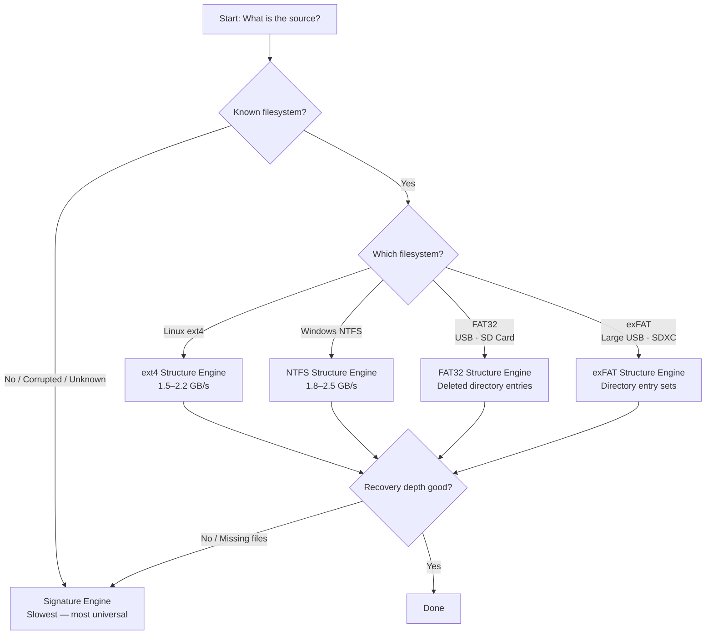
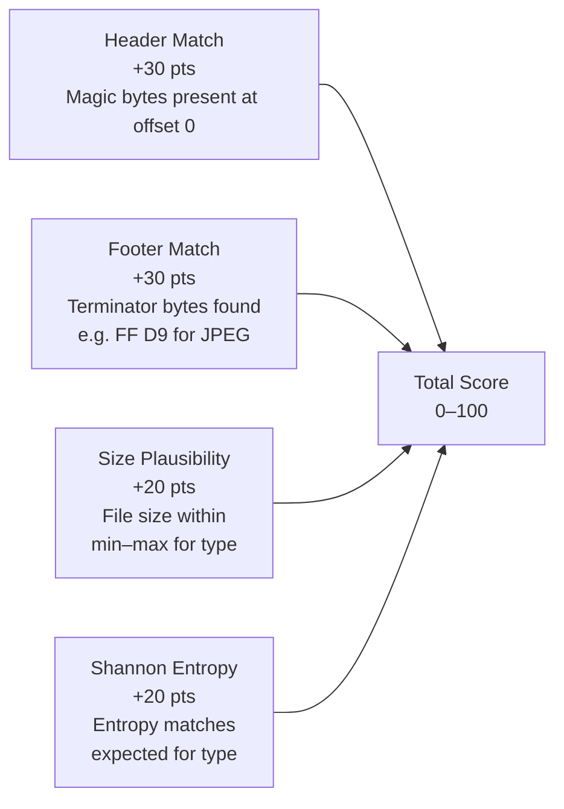

# Forensic Carving Guide

File carving is the process of recovering files from raw storage media — disk images, block devices, memory dumps — **without relying on the filesystem's own metadata**. When a file is deleted, the filesystem typically marks its directory entry as free and releases its cluster chain, but the underlying bytes are rarely zeroed immediately. Those bytes remain on disk until new writes overwrite them. Carving finds those remnant byte patterns and reconstructs the original files.

`s0` implements five independent carving engines, each tuned for a different scenario. Whether you're recovering JPEGs from a formatted USB drive, salvaging Office documents from a BitLocker-decrypted partition, or extracting ELF binaries from a corrupted Linux volume, the right engine choice dramatically affects both speed and recovery depth.

---

## Supported File Types

s0 recognizes the following file types by their binary signatures:

| Extension | Description | Magic Bytes (hex) | Max Carve Size |
|-----------|-------------|-------------------|----------------|
| `jpg` | JPEG Image | `FF D8 FF` | 30 MB |
| `png` | PNG Image | `89 50 4E 47 0D 0A 1A 0A` | 30 MB |
| `pdf` | PDF Document | `25 50 44 46 2D` (`%PDF-`) | 50 MB |
| `zip` | ZIP / Office OpenXML | `50 4B 03 04` (`PK\x03\x04`) | 100 MB |
| `gif` | GIF Image | `47 49 46 38` (`GIF8`) | 20 MB |
| `gz` | GZIP Archive | `1F 8B 08` | 50 MB |
| `bmp` | BMP Image | `42 4D` (`BM`) | 30 MB |
| `elf` | ELF Executable | `7F 45 4C 46` (`\x7fELF`) | 50 MB |
| `sqlite` | SQLite Database | `53 51 4C 69 74 65 20 66 6F 72 6D 61 74 20 33 00` | 100 MB |
| `mp3` | MP3 Audio | `49 44 33` (`ID3`) | 15 MB |

!!! note "ZIP covers more than ZIP"
    The `zip` signature covers **any format built on the ZIP container**: `.zip`, `.docx`, `.xlsx`, `.pptx`, `.jar`, `.apk`. A recovered `*.zip` file may in fact be a Word document — rename and inspect if the contents show XML entries like `word/document.xml`.

---

## Custom File Signatures

When investigating proprietary forensic evidence, specialized container formats, or uncataloged file types, `s0` allows investigators to define **custom binary file signatures** with arbitrary magic header and footer bytes.

### Signature Definition Format

Custom signatures can be provided as a JSON file or inline JSON object with the following schema:

```json
[
  {
    "name": "Proprietary Encrypted Vault",
    "extension": "psv",
    "category": "archive",
    "header_hex": "53 45 43 56 41 55 4C 54",
    "footer_hex": "45 4E 44 56 41 55 4C 54",
    "min_size": 64,
    "max_size": 104857600
  }
]
```

#### Field Specifications:
- **`name`** *(string, required)*: Descriptive label for the artifact (appears in forensic reports and audit logs).
- **`extension`** *(string, required)*: Target file extension without leading dot (e.g. `psv`, `dat`, `kdbx`).
- **`category`** *(string, optional)*: Categorization enum (`document`, `image`, `archive`, `audio`, `video`, `executable`, or `custom`).
- **`header_hex`** *(string or bytes, required)*: Hexadecimal magic header bytes (spaces or `0x` prefixes optional, e.g. `FF D8 FF` or `ffd8ff`).
- **`footer_hex`** *(string or bytes, optional)*: Hexadecimal trailer/footer bytes indicating end-of-file boundary.
- **`min_size`** *(integer, optional, default: 32)*: Minimum candidate byte length to consider valid.
- **`max_size`** *(integer, optional, default: 50MB)*: Maximum allocation window to search for footers.

### Invocation via CLI & Web Dashboard

=== "CLI Flag (`--custom-sig`)"
    ```bash
    # Supply a custom signatures JSON file
    s0 carve --target /dev/sdb --out-dir ./recovered --custom-sig ./my_sigs.json

    # Or provide inline JSON directly on the command line
    s0 carve --target evidence.raw --out-dir ./out \
             --custom-sig '{"name":"CustomDB","extension":"cdb","header_hex":"43 44 42 01"}'
    ```

=== "Web Dashboard"
    In the **Forensic File Carver** tab, expand **➕ Custom File Signatures (Magic Bytes Header / Footer)**:
    1. Click **+ Add Custom Signature**.
    2. Enter the format name, extension, category, and raw hexadecimal header/footer bytes.
    3. The extension is automatically synced into the active extension filter.
    4. Click **Start Forensic Carving Scan** — the engine injects custom signatures into the scanning loop automatically.

---

## The Five Carving Engines

### Engine Overview

| Engine | Filesystem | Strategy | Speed |
|--------|-----------|----------|-------|
| **Signature** | Any / Unknown / Corrupted | Raw byte scan for magic bytes | 160–175 MB/s |
| **ext4 Structure** | Linux ext4 | Reads inode tables directly | 1.5–2.2 GB/s |
| **NTFS Structure** | Windows NTFS | Parses `$MFT`, handles multi-fragment runlists | 1.8–2.5 GB/s |
| **FAT32 Structure** | USB / SD card (FAT32) | Scans deleted directory entries | — |
| **exFAT Structure** | Large USB / SDXC | Parses directory entry sets | — |

### Auto-Detection Logic

s0 probes the image automatically. The detection order is:

```
Offset 1080 (byte offset in image)  → superblock magic 0xEF53 → ext4
Boot sector offset 3                → OEM ID "NTFS    "        → NTFS
BPB + cluster count calculation     → FAT type determination   → FAT32
Offset 3                            → OEM ID "EXFAT   "        → exFAT
No match                            → Signature engine (fallback)
```

You can bypass auto-detection and force the Signature engine with `--engine signature`.

### Choosing the Right Engine



!!! tip "Always follow up with the Signature engine"
    Structure engines skip allocated (live) files and focus on deleted entries. If a structure carve misses expected files, run a Signature scan on the same image as a second pass — it operates entirely independently and may recover fragments the structure engine cannot locate.

---

## Step-by-Step: Carving from a Forensic Image

This is the most common workflow. You have a `.dd`, `.raw`, `.img`, or `.E01` image acquired from the target drive.

### 1. Verify the image integrity first

```bash
# Compute SHA-256 integrity hash of forensic image
sha256sum suspect_drive.dd
```

Compare against the acquisition hash. Never carve from an unverified image — a corrupt image produces corrupt output.

### 2. Run s0 carve

```bash
# Carve deleted files with auto-detected filesystem parsing
s0 carve --target suspect_drive.dd --out-dir ./recovered/
```

s0 auto-detects the filesystem and selects the appropriate engine. Output:

```text
[s0] Probing filesystem...
[s0] Detected: NTFS (OEM ID at offset 3)
[s0] Engine: NTFS Structure + Signature fallback
[s0] Scanning $MFT...
[s0] 2,847 deleted MFT entries found
...
[s0] Carve complete: 1,203 files recovered
[s0] Output: ./recovered/
[s0] Manifest: carving_manifest_a3f2bc91.json
```

### 3. Restrict target file extensions (optional)

=== "Office & Archives"
    ```bash
    # Focus acquisition on documents, spreadsheets, and archives
    s0 carve --target image.dd --extensions zip,pdf,sqlite --out-dir ./recovered/
    ```

=== "Images & Media"
    ```bash
    # Extract photographic and audio evidence
    s0 carve --target image.dd --extensions jpg,png,gif,bmp,mp3 --out-dir ./recovered/
    ```

=== "Executables & Binaries"
    ```bash
    # Extract ELF executables and compressed packages
    s0 carve --target image.dd --extensions elf,gz --out-dir ./recovered/
    ```

=== "All Signatures"
    ```bash
    # Scan for all 10 supported forensic formats
    s0 carve --target image.dd --out-dir ./recovered/
    ```

### 4. Adjust confidence threshold

By default, s0 saves any file scoring ≥ 50 confidence points. For court-quality evidence, raise this:

```bash
# Carve with high confidence threshold for court-admissible evidence
s0 carve --target image.dd --out-dir ./recovered/ --min-confidence 75
```

For maximum recovery at the cost of more false positives (e.g., exploring an unknown image):

```bash
# Carve with lowered threshold to maximize recovery of damaged media
s0 carve --target image.dd --out-dir ./recovered/ --min-confidence 30
```

### 5. Review the output table

```text
ID      EXT     SIZE        CONF%   SHA256          FILENAME
0001    jpg     2.4 MB      94%     a3f2bc91...     file_0001.jpg
0002    pdf     512 KB      87%     d94e1200...     file_0002.pdf
0003    zip     18.2 MB     72%     f00ba300...     file_0003.zip
0004    jpg     31 KB       48%     ...             file_0004.jpg  ← below default threshold unless lowered
```

---

## Step-by-Step: Carving from a Live Block Device

!!! warning "Write-blocking is mandatory"
    Always attach the target drive through a **hardware write blocker** before connecting it to your forensic workstation. Mounting a device read-write, even briefly, can alter access times, trigger journal commits, and overwrite the very data you are trying to recover. s0 does not substitute for a write blocker.

### 1. Identify the device node

```bash
# Enumerate storage devices, sizes, filesystems, and mountpoints
lsblk -o NAME,SIZE,FSTYPE,LABEL,MOUNTPOINT
```

Example output:
```text
NAME   SIZE  FSTYPE   LABEL       MOUNTPOINT
sda    1.0T  ext4     system      /
sdb    64G   vfat     EVIDENCE
```

Here `sdb` is the target.

### 2. Carve directly from the block device

```bash
# Carve deleted files directly from unmounted block device
sudo s0 carve --target /dev/sdb --out-dir ./usb_recovery/
```

!!! danger "Do not mount the device"
    Do not run `mount /dev/sdb` before carving. On FAT32/exFAT, the Linux kernel's mount operation can modify directory entry timestamps and the FAT allocation table, destroying the forensic state.

### 3. Optionally image first, then carve

For repeatable, auditable evidence collection, capture the image first:

```bash
# Acquire image (read-only pass)
sudo dd if=/dev/sdb of=evidence.dd bs=4M status=progress conv=noerror,sync

# Verify
sha256sum evidence.dd > evidence.dd.sha256

# Carve the image (not the live device)
s0 carve evidence.dd --out-dir ./recovered/
```

This preserves the original device state and gives you a permanent artifact.

---

## Understanding Confidence Scores

Every recovered file receives a score from 0–100. The score is additive across four independent criteria:



### Score Interpretation Guide

| Score Range | Meaning | Recommended Action |
|-------------|---------|-------------------|
| **85–100** | High-confidence — header, footer, size, and entropy all match | Treat as reliable evidence |
| **65–84** | Good — 3 of 4 criteria met, or all 4 with partial matches | Inspect file; likely valid |
| **50–64** | Marginal — typically missing footer or entropy anomaly | Manually verify before relying on it |
| **30–49** | Low — only header matched reliably | Use only for exploration; do not use as primary evidence |
| **< 30** | Very low — likely a false positive or truncated fragment | Discard unless critical |

### Entropy and what it tells you

Shannon entropy measures the randomness of the byte distribution in the file:

- **High entropy (> 7.5 bits/byte)**: expected for JPEG, PNG, ZIP, GIF, MP3 — already compressed or encrypted. A high-entropy block claiming to be a JPEG scores full entropy points.
- **Medium entropy (4–7 bits/byte)**: expected for PDF, ELF, SQLite — structured binary with repeated patterns.
- **Low entropy (< 2 bits/byte)**: typical of zero-filled blocks, slack space, or uninitialized sectors. s0 penalizes these heavily because they are almost certainly not real files.

!!! tip "When to lower `--min-confidence`"
    Lower the threshold to 30–40 when:

    - Recovering from heavily used consumer SD cards where wear-leveling has scattered file footers
    - Investigating JPEG fragments where the file was truncated mid-stream (footer missing)
    - Doing exploratory triage before you know what file types to expect

    Keep the default (50) or raise it for formal evidence submission.

---

## Understanding `recovery_index.json`

Every carving session produces a `recovery_index.json` in the output directory. This is a machine-readable catalogue of every recovered file.

```json
{
  "session_id": "a3f2bc91-...",
  "carved_at": "2026-09-09T13:44:02Z",
  "source": "suspect_drive.dd",
  "engine": "ntfs_structure",
  "files": [
    {
      "id": "0001",
      "extension": "jpg",
      "size_bytes": 2516582,
      "confidence": 94,
      "sha256": "a3f2bc91d4e500fa...",
      "filename": "file_0001.jpg",
      "offset": 2147483648
    },
    {
      "id": "0002",
      "extension": "pdf",
      "size_bytes": 524288,
      "confidence": 87,
      "sha256": "d94e1200c31ab7...",
      "filename": "file_0002.pdf",
      "offset": 3758096384
    }
  ]
}
```

**Key fields:**

| Field | Description |
|-------|-------------|
| `session_id` | UUID linking this index to its signed manifest |
| `source` | Path of the image or device carved |
| `engine` | Which carving engine was used |
| `id` | Sequential identifier; matches the filename prefix |
| `offset` | Byte offset within the source where the file was found |
| `sha256` | Hash of the carved file — use for deduplication and integrity checks |
| `confidence` | The 0–100 scoring result |

!!! note "Linking index to manifest"
    The `session_id` in `recovery_index.json` matches the UUID suffix in `carving_manifest_<UUID8>.json`. The manifest is Ed25519-signed, making the entire session tamper-evident. See the [Security Model](security-model.md) for details.

---

## Scenario-Specific Tips

### Recovering Office Documents from NTFS

Office Open XML formats (`.docx`, `.xlsx`, `.pptx`) use the ZIP container. s0 carves them as `.zip` files.

```bash
# Carve ZIP containers (including Word/Excel/PowerPoint) with confidence >= 65
s0 carve --target ntfs_image.dd --out-dir ./office_recovery/ --extensions zip --min-confidence 65
```

After recovery:

```bash
# Rename .zip to .docx and verify
mv file_0042.zip recovered_doc.docx
python3 -c "import zipfile; z=zipfile.ZipFile('recovered_doc.docx'); print(z.namelist())"
```

Look for `word/document.xml` (Word), `xl/workbook.xml` (Excel), or `ppt/presentation.xml` (PowerPoint) in the ZIP listing to confirm the type.

### Recovering JPEGs from a Formatted USB Drive

FAT32 format operations typically zero only the FAT tables and directory entries — raw data clusters are untouched. The FAT32 Structure engine reads deleted directory entries to find the original cluster chain, while the Signature engine catches anything the directory scan misses.

```bash
# First pass: structure-aware (fast)
s0 carve /dev/sdc --engine fat32 --out-dir ./usb_photos/ --min-confidence 60

# Second pass: signature scan for orphaned clusters
s0 carve /dev/sdc --engine signature --out-dir ./usb_photos_sig/ --min-confidence 50
```

Compare the two output directories — the signature pass often recovers additional partial JPEGs.

### Extracting Evidence from an NTFS Partition

For a specific partition within a multi-partition drive:

```bash
# Find partition offsets
mmls suspect_drive.dd

# Carve only the NTFS partition (e.g., starting at sector 2048, 512-byte sectors)
s0 carve suspect_drive.dd --offset $((2048 * 512)) --out-dir ./ntfs_evidence/
```

The NTFS engine parses the `$MFT` and handles multi-fragment runlists — files spread across non-contiguous clusters are reassembled correctly, something raw signature carving cannot do.

---

## Limitations of File Carving

Understanding what carving **cannot** do is as important as knowing what it can.

### Heavily Fragmented Files

The Signature engine carves contiguous byte runs. A file that was fragmented into many non-adjacent clusters before deletion will produce a **truncated or corrupt output** — the engine stops at the end of the first contiguous run unless a valid footer appears.

Structure engines (ext4, NTFS) handle fragmentation better because they read the original cluster maps. But once those maps are overwritten or the inode/MFT entry is reused, fragmented recovery fails for structure engines too.

!!! warning "Fragmentation is the primary failure mode"
    On heavily used volumes with frequent write-delete cycles (application temp directories, browser caches, virtual machine storage), expect significant fragmentation. Confidence scores for fragmented files will be low — size plausibility will fail because only a fragment was captured.

### Overwritten Sectors

If new data has been written over the sectors where a deleted file resided, the original data is gone at the application layer. Carving cannot recover data from overwritten sectors.

!!! danger "No carving tool recovers overwritten data"
    Despite marketing claims by some commercial tools, carving does not perform magnetic remanence recovery (that technique has been proven ineffective at modern track densities). If the sectors have been overwritten, the data is unrecoverable without specialized hardware that is beyond the scope of any software tool.

### Encrypted Volumes

On volumes encrypted with VeraCrypt, BitLocker, or LUKS, s0 sees a uniform stream of high-entropy bytes. The Signature engine finds no magic bytes; no files are carved. This is correct and expected behavior — encryption is working as designed.

!!! tip "Decrypt first, then carve"
    If you have the decryption key, decrypt the volume to a plaintext image first, then run s0 carve on the plaintext image.

### Copy-on-Write Filesystems

On **Btrfs**, **ZFS**, and **APFS**, deleting a file does not overwrite its blocks — it merely removes the reference. The blocks are returned to the free pool and reclaimed lazily by the CoW engine. A "deleted" file's blocks may remain physically intact for an extended period, **but** s0 cannot predict when a CoW filesystem reclaimed them.

!!! warning "CoW snapshot artifacts"
    Files that appear deleted may still exist in filesystem snapshots. Check for snapshots before carving:

    ```bash
    # Btrfs
    btrfs subvolume list /mnt/target

    # ZFS
    zfs list -t snapshot
    ```

    Snapshot enumeration often yields complete, intact files faster than carving.

### Journaling Remnants

ext4 and NTFS maintain journals for crash recovery. The journal may contain metadata (inode records, directory entries, MFT entries) for recently deleted files even after the filesystem has committed the deletion. s0 does not specifically parse journal structures — use dedicated journal forensics tools for this layer.

### Network-Mounted Paths

If the suspect path is on a network share (NFS, SMB/CIFS), s0's write patterns do not translate to physical sector operations. The network filesystem layer mediates all I/O, and the actual physical layout on the remote server is inaccessible. Carve the remote server's storage directly.
