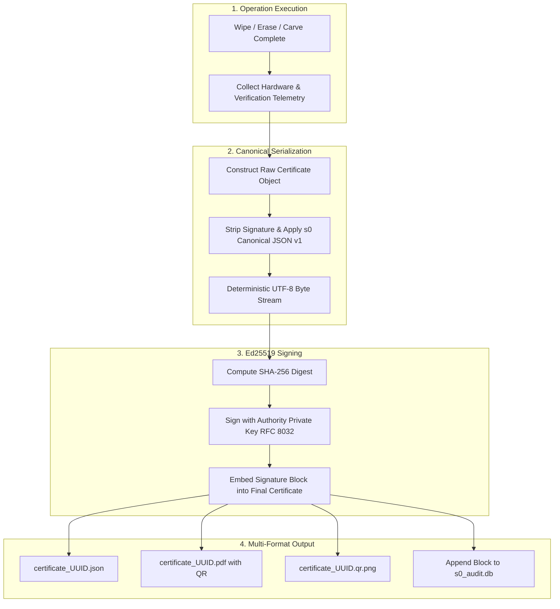

# Certificate Schema & Canonical JSON v1 Specification

> **Standard Identifier:** `s0-cert-v1.0.0`  
> **Signature Algorithm:** Pure Ed25519 (RFC 8032)  
> **Payload Serialization:** s0 Canonical JSON v1 (Deterministic UTF-8)  
> **Schema Definition:** [`src/s0/data/cert_schema.json`](https://github.com/kartik2005221/s0/blob/master/src/s0/data/cert_schema.json)

---

## 1. Executive Overview

Every sanitization, file erasure, and forensic recovery action executed by s0 culminates in the issuance of a **tamper-evident, mathematically non-repudiable certificate**. 

Unlike conventional PDF or CSV wipe reports that can be edited in any text or document editor without detection, an s0 certificate binds the hardware identity, operator identity, method applied, NIST sanitization tier, and post-operation verification telemetry into an asymmetric cryptographic signature.



Any modification to a single character in the certificate payload — such as modifying the sanitized byte count, altering the timestamp, or changing `OVERWRITE_ZERO_1PASS` to `NVME_SANITIZE_BLOCK_ERASE` — alters the SHA-256 digest and renders the Ed25519 signature mathematically invalid.

---

## 2. s0 Canonical JSON v1 Specification

### The Canonicalization Challenge

In digital signatures, two logically identical JSON payloads can produce completely different byte streams due to:
1. Object key ordering (`{"a": 1, "b": 2}` vs `{"b": 2, "a": 1}`)
2. Whitespace variation (spaces after colons, newlines, indentation)
3. Floating-point number representations (`1.0` vs `1` vs `1.0000000000000001`)
4. Unicode character escaping (`\u00e9` vs `é`)

If the verifier and signer disagree on a single byte of serialization, the signature check fails even if the underlying data is genuine.

### The Seven Rules of s0 Canonical JSON v1

Every component that signs or verifies an s0 certificate — the Python core (`src/s0/canonical.py`) and the static verification portal (`site/verify/verify.js`) — MUST produce a byte-identical canonical form for the same logical object. Each implementation is tested against the golden vectors in `tests/core/data/canonical_vectors.json`.

Given a parsed JSON value, serialize as follows:

1. **Encoding:** UTF-8, no BOM (Byte Order Mark).
2. **Objects:** Keys sorted lexicographically by Unicode code point, recursively at every nesting depth.
3. **Whitespace:** None beyond required syntax: separators `,` between items and `:` between key and value; no newlines, no indentation, no trailing newline.
4. **Strings:** Minimal escaping: `"` -> `\"`, `\` -> `\\`, and control characters U+0000 through U+001F using `\b`, `\f`, `\n`, `\r`, `\t` for those five and `\u00XX` (lowercase hex) for the rest. All other characters appear literally (non-ASCII characters are NOT `\uXXXX`-escaped). This matches ECMAScript `JSON.stringify` and Python `json.dumps(ensure_ascii=False)` for all well-formed strings.
5. **Numbers (Integer-Only Discipline):**

**Schema-Level Float Prohibition:**
Schema v1 defines no float fields anywhere. All file sizes and capacities are integer bytes; durations are integer seconds; timestamps are ISO-8601 strings. If a canonicalizer encounters a floating-point value, it **must refuse rather than guess** a format. This rule exists because float formatting is where independent cross-language implementations diverge; removing floats removes the entire problem class (a deliberate deviation from RFC 8785/JCS).

6. **Literals:** Lowercase `true`, `false`, and `null`.
7. **Arrays:** Sequence order preserved as-is.

### Reference Implementation & Test Invariants

The reference implementation resides at `src/s0/canonical.py`.

Tamper property: any change to any signed field — one byte, one key name, or whitespace inside a string value — changes the canonical payload and invalidates the signature. Re-serializing the same object with different key order produces identical bytes, so legitimate re-encoding never breaks verification. Both properties are enforced by automated tests: `tests/core/test_tamper.py` walks every leaf of a valid certificate, mutates each, and asserts failure.

---

## 3. Annotated JSON Schema Reference

Every certificate validates strictly against `src/s0/data/cert_schema.json`.

```json
{
  "$schema": "https://json-schema.org/draft/2020-12/schema",
  "title": "s0 Wipe Certificate",
  "type": "object",
  "required": [
    "schema_version",
    "cert_uuid",
    "issued_at",
    "issuer",
    "tool",
    "device",
    "wipe",
    "result",
    "signature"
  ],
  "additionalProperties": false
}
```

### Field-by-Field Breakdown

| JSON Pointer | Type | Required | Description & Constraints |
|---|---|---|---|
| `/schema_version` | String | **Yes** | Constant `"1.0.0"`. |
| `/cert_uuid` | String | **Yes** | Unique UUID v4 identifier for the certificate. |
| `/issued_at` | String | **Yes** | RFC 3339 / ISO 8601 UTC timestamp (`YYYY-MM-DDTHH:MM:SSZ`). |
| `/issuer/organization` | String | **Yes** | Identity of the accredited organization or forensics lab. |
| `/issuer/operator_id` | String | **Yes** | ID or badge number of the operating engineer. |
| `/tool/name` | String | **Yes** | Tool identifier, e.g. `"s0"` or `"s0-cli"`. |
| `/tool/version` | String | **Yes** | Semantic version of the s0 suite. |
| `/tool/platform` | String | **Yes** | One of `["linux", "windows", "macos", "android"]`. |
| `/tool/os_kernel` | String | No | OS kernel release string (e.g. `Linux 6.8.0-45-generic`). |
| `/device/device_id` | String | **Yes** | Primary physical ID: Drive Serial Number, WWN, IMEI, or SHA-256 of image. |
| `/device/device_type` | String | **Yes** | `["internal_disk", "removable_disk", "image_file", "phone"]`. |
| `/device/storage_type` | String | **Yes** | `["NVMe", "SSD", "HDD", "eMMC", "UFS", "SDCARD", "IMAGE_FILE", "UNKNOWN"]`. |
| `/device/model` | String | No | Hardware device model string reported by controller. |
| `/device/serial_number` | String | No | Hardware serial number extracted from controller. |
| `/device/capacity_bytes` | Integer | **Yes** | Total storage capacity in integer bytes. |
| `/device/sector_size` | Integer | No | Logical sector size in bytes (typically 512 or 4096). |
| `/wipe/method` | String | **Yes** | Recognized s0 method identifier. |
| `/wipe/nist_category` | String | **Yes** | `["Clear", "Purge", "Destroy", "N/A"]`. |
| `/wipe/passes` | Integer | No | Number of overwrite passes executed (minimum 1). |
| `/wipe/pattern` | String | No | `["zero", "random", "firmware", "key_destruction", "carving"]`. |
| `/wipe/start_time` | String | **Yes** | UTC start timestamp. |
| `/wipe/end_time` | String | **Yes** | UTC completion timestamp. |
| `/wipe/bytes_processed` | Integer | **Yes** | Total bytes addressed during sanitization. |
| `/result/status` | String | **Yes** | `["success", "failure", "partial", "reset_triggered"]`. |
| `/result/errors` | Array[String]| No | Array of error messages if status is not success. |
| `/result/verification` | Object | No | Post-wipe sampled readback telemetry. |

#### What the verification block does and does not assert

`all_samples_match_wipe_pattern: true` means the blocks that were sampled read
back as zeros. It does **not** mean the medium is blank, and a verifier must not
present it that way.

Four fields make the strength of the claim explicit:

| Field | Meaning |
| --- | --- |
| `sample_strategy` | How the sampled locations were drawn (`uniform_pseudorandom`, `first_and_last_plus_spread`, `full_readback`). `full_readback` is a stronger claim than sampling, so the field distinguishes them. |
| `population_blocks` | Size of the addressable population the sample was drawn from, in blocks. |
| `confidence_percent` | Integer percent confidence that the residue is below the stated bound. Integer rather than float because Canonical JSON v1 forbids float fields. |
| `residual_fraction_upper_bound_ppm` | Upper bound in parts-per-million on the fraction of the medium that could still hold residual data. |

With the defaults (`population_blocks` roughly 488 million, `confidence_percent`
95, 64 blocks sampled), a fully clean sample bounds residual data at about
**45,730 ppm (4.573%)**. That is a bound, not zero. Reading `samples_checked: 64`
on its own and concluding "the drive was erased" is the specific error this block
exists to prevent.

`attestation` carries firmware-reported evidence where the method supports it,
for example `nvme_log_0x81_global_data_erased=1` or
`ata_sanitize_status_succeeded=1`. It is absent for plain overwrite methods,
which have no firmware evidence to report.

Two further optional fields round out the block:

| Field | Meaning |
| --- | --- |
| `planted_pattern_hits_after` | Forensic grep hits remaining after the wipe on demo or test targets with planted data. Present only where s0 planted known content; on real hardware the pre-wipe content is unknown, so the field is **absent** rather than reported as zero. |
| `smart_delta` | Device health counters captured before and after the operation, so a verifier can show whether the media itself changed during the wipe. |

Both are optional and their absence is meaningful. A verifier must treat a missing
`planted_pattern_hits_after` as "not applicable", never as "zero hits found".
| `/notes` | Array[String]| No | Signed notes (CoW warnings, HPA/DCO findings, elapsed time). |
| `/signature` | Object | **Yes** | Ed25519 signature envelope. |

---

## 4. Production Certificate Example

Below is an authentic certificate issued following an NVMe Purge operation:

```json
{
  "schema_version": "1.0.0",
  "cert_uuid": "a8f3b201-9c42-4f1e-8e77-5d2a938c110e",
  "issued_at": "2026-09-09T14:22:15Z",
  "issuer": {
    "organization": "National Cyber Forensics Laboratory",
    "operator_id": "investigator-409"
  },
  "tool": {
    "name": "s0",
    "version": "2.4.4",
    "platform": "linux",
    "os_kernel": "Linux 6.8.0-generic x86_64"
  },
  "device": {
    "device_id": "S464NX0M123456K",
    "device_type": "internal_disk",
    "storage_type": "NVMe",
    "model": "Samsung SSD 980 PRO 1TB",
    "serial_number": "S464NX0M123456K",
    "capacity_bytes": 1000204886016,
    "sector_size": 512
  },
  "wipe": {
    "method": "NVME_SANITIZE_BLOCK_ERASE",
    "nist_category": "Purge",
    "passes": 1,
    "pattern": "firmware",
    "start_time": "2026-09-09T14:21:40Z",
    "end_time": "2026-09-09T14:22:10Z",
    "bytes_processed": 1000204886016
  },
  "result": {
    "status": "success",
    "errors": [],
    "verification": {
      "method": "sampled_readback",
      "samples_checked": 64,
      "sample_bytes_each": 4096,
      "all_samples_match_wipe_pattern": true,
      "pre_wipe_sample_hash": "e3b0c44298fc1c149afbf4c8996fb92427ae41e4649b934ca495991b7852b855",
      "sample_strategy": "uniform_pseudorandom",
      "population_blocks": 488281250,
      "confidence_percent": 95,
      "residual_fraction_upper_bound_ppm": 45730,
      "attestation": "nvme_log_0x81_global_data_erased=1"
    }
  },
  "notes": [
    "Firmware sanitize command completed with status 0x00 (SUCCESS)",
    "HPA/DCO probe: Not detected on NVMe controller",
    "Elapsed execution time: 30.2 seconds"
  ],
  "signature": {
    "algorithm": "Ed25519",
    "public_key_fingerprint": "sha256:d8a264a93c94f09d846b9ec14389df0398bb2c954627d37a5b39922e339d251a",
    "signature_base64url": "cQ7aH9_N6rYvP0-3E7yZ9M81XwK5dF3sA2qR1jL0tV-8uY5wP3mN9bV8cX1zQ4eR",
    "signed_payload_hash": "sha256:4b227777d4dd1fc61c6f884f48641d02b4d121d3fd328cb08b5531fcacdabf8a"
  }
}
```

---

## 5. Signature Computation & Verification Algorithm

### The Signing Procedure

```python
import hashlib
import json
from base64 import urlsafe_b64encode
from s0.canonical import canonicalize

cert_dict = {...}  # full certificate object
cert_payload = {k: v for k, v in cert_dict.items() if k != "signature"}

canonical_bytes = canonicalize(cert_payload)

payload_hash = "sha256:" + hashlib.sha256(canonical_bytes).hexdigest()

raw_signature = private_key.sign(canonical_bytes)
sig_b64url = urlsafe_b64encode(raw_signature).decode("ascii").rstrip("=")

cert_dict["signature"] = {
    "algorithm": "Ed25519",
    "public_key_fingerprint": "sha256:" + hashlib.sha256(der_public_key).hexdigest(),
    "signature_base64url": sig_b64url,
    "signed_payload_hash": payload_hash,
}
```

### The Verification Procedure

```python
sig_block = cert_dict.get("signature")
raw_sig = urlsafe_b64decode(sig_block["signature_base64url"] + "==")

unsigned_dict = {k: v for k, v in cert_dict.items() if k != "signature"}

recomputed_canonical_bytes = canonicalize(unsigned_dict)

public_key.verify(raw_sig, recomputed_canonical_bytes)
```


**Display Annotation vs Evidence:**
The field `signature.signed_payload_hash` is strictly a human-readable display convenience. Verifiers **must never** verify the signature against `signed_payload_hash`. Verifiers must recompute `canonicalize(unsigned_dict)` directly from the certificate body.


---

## 6. Output Artifact Formats

Every completed operation creates three linked artifacts in the specified `--out-dir`:

1. **Machine-Readable JSON (`certificate_<uuid8>.json`):**  
   The primary forensic record suitable for programmatic parsing, automated SIEM ingestion, or offline audit via the Verification Portal.
2. **Human-Readable PDF (`certificate_<uuid8>.pdf`):**  
   An official sanitization certificate rendered using ReportLab with the forensic color theme, device metadata tables, operator signatures, NIST compliance declaration, and an embedded optical QR code.
3. **Standalone QR Code (`certificate_<uuid8>.qr.png`):**  
   A high-density QR code encoding the verification portal URL with the certificate UUID preloaded (`https://sector-zero.pages.dev/verify/?cert=<uuid>`), allowing instant optical verification via a mobile camera.
