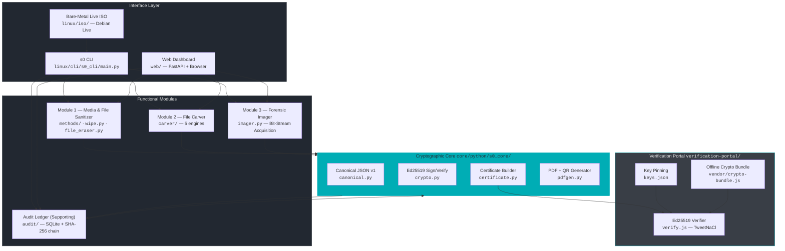
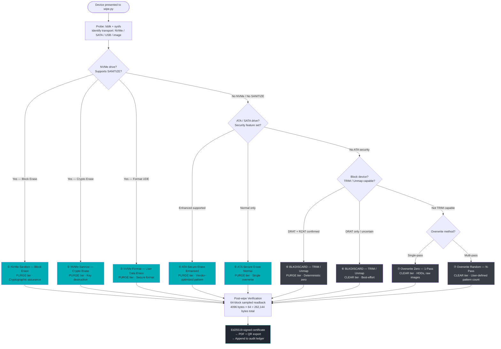
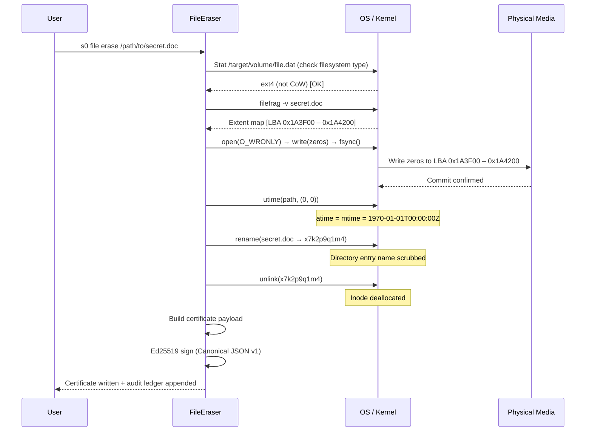
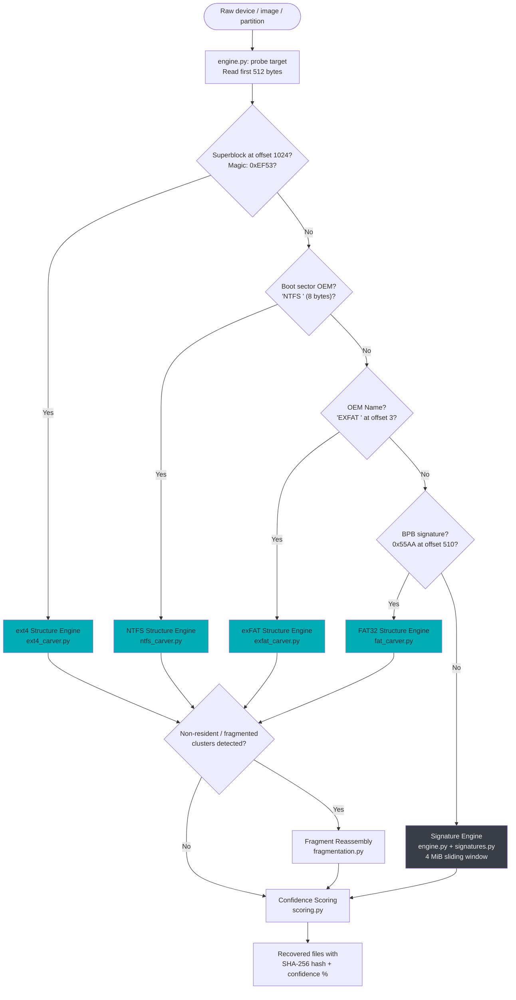
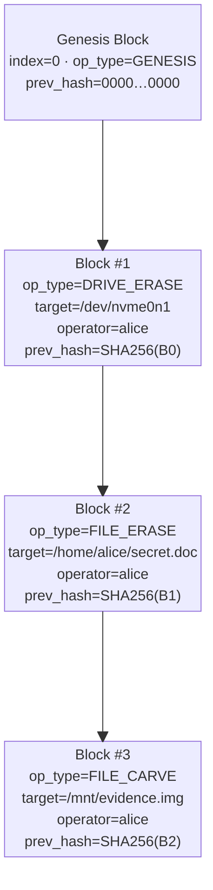
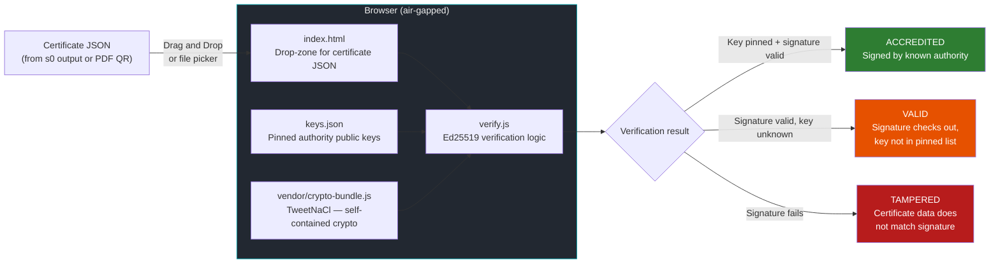

# System Architecture & Engineering

**s0 (Sector Zero)** is a dual-capability forensic suite that unites two traditionally disjoint disciplines — **secure data sanitization** and **deleted-file recovery** — under a single, cryptographically anchored audit framework. Every operation, whether destroying or recovering data, produces an immutable, Ed25519-signed record that can be independently verified by anyone, anywhere, with no server and no trust.

The design principle is **mathematical non-repudiation over operational convenience**: rather than producing log files that could be edited, every event is hashed into a chain where tampering at any point instantly invalidates every record that follows. s0 is built to answer the hardest question in digital forensics — *can you prove it?* — with a signature, not a promise.

---

## High-Level Architecture

s0 is organized around three vertical layers that cut across all four functional modules.



### Repository Layout

```
s0/
├── core/python/s0_core/          # Shared cryptographic core (Ed25519, Canonical JSON, PDF/QR)
│   ├── canonical.py              #   Deterministic JSON serializer — signing contract
│   ├── crypto.py                 #   Ed25519 key-pair management, sign, verify
│   ├── certificate.py            #   Certificate construction and schema validation
│   └── pdfgen.py                 #   ReportLab PDF with embedded QR code
│
├── linux/cli/s0_cli/             # Linux CLI — primary delivery vehicle
│   ├── main.py                   #   Click entrypoint, subcommand dispatch
│   ├── devices.py                #   Device enumeration (lsblk, sysfs, /proc)
│   ├── wipe.py                   #   Module 1 orchestrator
│   ├── methods/                  #   Module 1 hardware erasure backends
│   │   ├── nvme.py               #     NVMe Sanitize + Format commands
│   │   ├── ata.py                #     ATA Secure Erase (Enhanced + Normal)
│   │   ├── blkdiscard.py         #     BLKDISCARD / TRIM / Unmap
│   │   └── overwrite.py          #     Multi-pass overwrite engine
│   ├── file_eraser.py            #   File/folder sanitization engine (routed via s0 wipe)
│   ├── carver/                   #   Forensic file carving (5 engines)
│   │   ├── engine.py             #     Dispatcher: routes to correct carver
│   │   ├── signatures.py         #     Magic-byte signature table
│   │   ├── ext4_carver.py        #     ext4 structure parser
│   │   ├── ntfs_carver.py        #     NTFS $MFT parser
│   │   ├── fat_carver.py         #     FAT32 BPB + deleted entry scanner
│   │   ├── exfat_carver.py       #     exFAT VBR + cluster heap walker
│   │   ├── fragmentation.py      #     Non-resident cluster run reassembly
│   │   └── scoring.py            #     Multi-factor confidence scoring
│   └── audit/                    #   Hash-chained audit ledger
│
├── windows/                      #   Windows file/folder sanitizer (Win32 API, ADS scrubbing, ReFS)
├── macos/                        #   macOS file/folder sanitizer (F_FULLFSYNC, xattr, APFS)
├── web/                          #   Unified FastAPI web dashboard (4 tabs)
├── linux/iso/                    #   Debian Live ISO build scripts
└── verification-portal/          #   100% static Ed25519 verifier
    ├── verify.js
    ├── keys.json
    └── vendor/crypto-bundle.js
```

---

## Module 1 — Secure Drive Eraser

Module 1 translates the NIST SP 800-88 Rev.1 **Clear / Purge** taxonomy into hardware-native commands. It is not a single algorithm — it is a waterfall of methods tried in strict priority order, each more broadly applicable than the last.

### Method Selection Waterfall



### NIST Tier Mapping

| Priority | Method | Hardware Command | NIST Tier | IEEE 2883 | Notes |
|:---:|---|---|:---:|:---:|---|
| 1 | NVMe Sanitize — Block Erase | `NVME_SANITIZE_BLOCK_ERASE` | **Purge** | Purge | Physically erases every cell |
| 2 | NVMe Sanitize — Crypto Erase | `NVME_SANITIZE_CRYPTO_ERASE` | **Purge** | Purge | Destroys encryption key |
| 3 | NVMe Format — User Data Erase | `NVME_FORMAT_UDE` | **Purge** | Purge | Controller-level secure format |
| 4 | ATA Secure Erase Enhanced | `SECURITY_ERASE_UNIT (ENHANCED)` | **Purge** | Purge | Vendor-optimized, hits HPA |
| 5 | ATA Secure Erase Normal | `SECURITY_ERASE_UNIT` | **Purge** | Purge | Single-pass controller erase |
| 6 | BLKDISCARD (DRAT+RZAT) | `BLKDISCARD` ioctl | **Purge** | Purge | Deterministic zero guarantee |
| 6 | BLKDISCARD (DRAT only) | `BLKDISCARD` ioctl | **Clear** | Clear | No zero guarantee after discard |
| 7 | Overwrite Zero 1-Pass | `write()` + `fsync()` | **Clear** | Clear | HDD, USB, raw images |
| 7 | Overwrite Random N-Pass | `write()` + `fsync()` | **Clear** | Clear | User-configurable pass count |


**DRAT and RZAT**
**Deterministic Read After Trim (DRAT)** guarantees the controller returns a deterministic value (but not necessarily zero) after a TRIM. **Read Zero After Trim (RZAT)** further guarantees that value is zero. Only when both are confirmed does BLKDISCARD achieve Purge-tier assurance. s0 reads these flags from the NVMe Identify or ATA IDENTIFY DEVICE response and adjusts the certificate tier accordingly.



**USB Flash Drives**
USB-attached flash drives typically report neither SANITIZE support nor ATA security features. The controller firmware may silently remap sectors rather than erase them. s0 falls to BLKDISCARD and documents the uncertainty in the certificate. Physical destruction is the only way to achieve Purge-tier certainty for low-cost USB media.


### Post-Wipe Verification

After every erasure, s0 performs a **sampled readback** to provide statistical assurance that the wipe completed:

```python
SAMPLE_COUNT = 64
SAMPLE_BYTES = 4096

offsets = [i * (device_size // SAMPLE_COUNT) for i in range(SAMPLE_COUNT)]
for offset in offsets:
    data = read_block(device, offset, SAMPLE_BYTES)
    assert all(b == expected_byte for b in data)  # 0x00 for overwrites
```

The verification result, including any failed blocks, is embedded in the signed certificate payload.


**Scope of Readback**
Sampled verification is a probabilistic check, not a 100% full-surface scan. For NVMe Sanitize and ATA Secure Erase, the controller's own completion status is the primary integrity signal; readback is a secondary sanity check. Performing a full surface scan on a multi-terabyte drive would take hours and is outside the scope of standard NIST 800-88 compliance checking.


---

## Secure File & Folder Erasure (Unified in `s0 wipe`)

Simple deletion (`rm`, `del`, `Trash`) removes the directory entry but leaves file data on disk, recoverable by any carving tool. `s0 wipe` eliminates recovery at every layer: **data clusters**, **filesystem metadata**, **alternate data streams**, **extended attributes**, and **directory entry filenames** are all sanitized.

### Platform Implementation




| Step | Mechanism | Purpose |
|---|---|---|
| 1. Strip attributes | `os.chmod()`, `os.chflags()` | Remove immutable/append-only flags |
| 2. Detect CoW | `/proc/mounts` — detect btrfs, ZFS | Warn; CoW breaks overwrite guarantees |
| 3. Extent inspection | `filefrag -v` | Map physical extents of file data |
| 4. Overwrite | POSIX `open()` + `write()` | Overwrite every data byte in-place |
| 5. Hardware flush | `fsync(fd)` | Force controller commit to media |
| 6. Timestamp zero | `os.utime(path, (0, 0))` | Set atime + mtime → epoch 0 |
| 7. Filename scramble | `os.rename()` → random string | Erase directory entry name |
| 8. Unlink | `os.unlink()` | Release inode |



| Step | Win32 API | Purpose |
|---|---|---|
| 1. Strip attributes | `SetFileAttributesW` | Remove READ_ONLY, HIDDEN, SYSTEM |
| 2. Detect CoW | `GetVolumeInformationW` → ReFS | Warn if ReFS CoW detected |
| 3. Open for write | `CreateFileW(GENERIC_WRITE\|GENERIC_READ)` | Exclusive overwrite handle |
| 4. Overwrite | `WriteFile()` | In-place cluster overwrite |
| 5. Hardware flush | `FlushFileBuffers()` | Bypass write cache, commit to media |
| 6. ADS enumeration | `FindFirstStreamW` / `FindNextStreamW` | Enumerate Alternate Data Streams |
| 7. ADS destruction | `DeleteFileW(path:streamname)` | Destroy `:Zone.Identifier` and all ADS |
| 8. Timestamp zero | `SetFileTime(0, 0, 0)` | Zero creation, access, write times |
| 9. Filename scramble | `MoveFileW()` → random name | Scrub directory entry |
| 10. Delete | `DeleteFileW()` | Release file table entry |



| Step | API / Tool | Purpose |
|---|---|---|
| 1. Detect CoW | Mount table inspection → APFS | Warn; APFS CoW breaks overwrite |
| 2. Strip quarantine | `xattr -c` (all extended attributes) | Remove `com.apple.quarantine` and all xattrs |
| 3. Open for write | `open()` with `O_WRONLY` | Standard POSIX write handle |
| 4. Overwrite | `write()` | In-place data overwrite |
| 5. Hardware flush | `fcntl(fd, F_FULLFSYNC, 0)` | Bypass HFS+ journal, hardware-level commit |
| 6. Timestamp zero | `os.utime(path, (0, 0))` | Set atime + mtime → epoch 0 |
| 7. Filename scramble | `os.rename()` → random string | Erase directory entry name |
| 8. Unlink | `os.unlink()` | Release inode |



### Copy-on-Write Filesystem Warning


**CoW Filesystems Break Overwrite Guarantees**
On **Btrfs**, **ZFS** (Linux), **APFS** (macOS), and **ReFS** (Windows), write operations do not overwrite the original data blocks. Instead, the filesystem writes new data to a fresh location and atomically updates the pointer. The original data blocks remain allocated to snapshots or the extent tree until garbage-collected.

**In practice:** calling `write()` on a file on these filesystems will overwrite the *logical* data the OS presents, but the *physical* old blocks remain on disk and are recoverable with structure-aware carvers — including s0's own Module 2.

s0 detects CoW filesystems at runtime and issues a `WARNING` in the certificate. The only reliable file sanitization on CoW filesystems is to **wipe the entire volume** with Module 1.


### Erasure Flow



---

## Module 2 — File Carver & Recovery Engine

Module 2 is the forensic counterpart to Module 1: it recovers what sanitization tools fail to reach. It implements **five distinct carving strategies**, selected by the engine dispatcher based on device characteristics and user configuration.

### Engine Selection Logic



### Engine 1 — Signature Carver (`engine.py` + `signatures.py`)

Applied to unrecognized filesystems and raw block devices. Scans the device as a byte stream using a **4 MiB sliding window**, searching for known magic byte sequences.

**Supported signatures:**

| Format | Header Magic | Footer | Max Extract Size |
|---|---|---|---|
| JPEG | `FF D8 FF` | `FF D9` | 30 MB |
| PNG | `89 50 4E 47 0D 0A 1A 0A` | `49 45 4E 44 AE 42 60 82` | 30 MB |
| PDF | `25 50 44 46 2D` (`%PDF-`) | `%%EOF` | 50 MB |
| ZIP | `50 4B 03 04` (`PK\x03\x04`) | `50 4B 05 06` | 100 MB |
| GIF | `47 49 46 38` (`GIF8`) | `00 3B` | 15 MB |
| GZIP | `1F 8B 08` | — (length-bounded) | 50 MB |
| BMP | `42 4D` (`BM`) | — (length from header) | 30 MB |
| ELF | `7F 45 4C 46` (`\x7FELF`) | — (ELF header size) | 15 MB |
| SQLite3 | `53 51 4C 69 74 65...` (`SQLite format 3\0`) | — | 100 MB |
| MP3 | `49 44 33` (`ID3`) | — | 15 MB |


**Footer Matching**
Where a format defines an unambiguous end-of-file marker (JPEG `FF D9`, PNG IEND, ZIP central directory end), s0 uses **bounded extraction** — it carves exactly from header to footer. For formats with no footer (ELF, BMP), extraction is bounded by the value embedded in the format's own header (e.g., ELF `e_shoff + e_shentsize × e_shnum`).


### Engine 2 — ext4 Structure Engine (`ext4_carver.py`)

Directly parses ext4 filesystem internals from the raw block device, bypassing the OS mount layer entirely.

```
Byte 1024:  Superblock
  └── s_magic:        0xEF53         ← filesystem verification
  └── s_block_size:   1024 << s_log_block_size
  └── s_blocks_per_group, s_inodes_per_group

Block Group 0+n:  Block Group Descriptor (at block 1 or 2)
  └── bg_inode_table   ← byte offset of inode table for this group

Inode Table:
  └── For each inode: i_mode, i_size, i_links_count, i_dtime
      └── i_dtime != 0  →  DELETED inode candidate
      └── i_block[0..14]:  EXT4_EXTENT_HEADER magic (0xF30A)
          └── Extent tree: (ee_block, ee_len, ee_start_hi/lo) tuples
              └── Physical block addresses → read data clusters
```

**What it recovers:** Deleted files whose inode has `i_dtime` set (deletion timestamp populated by the OS at unlink time) but whose data blocks have not yet been reallocated. The extent tree gives direct physical cluster addresses, enabling content recovery without directory traversal.

### Engine 3 — NTFS Structure Engine (`ntfs_carver.py`)

Parses the Master File Table ($MFT) directly from the NTFS volume.

```
Boot Sector (offset 0):
  └── OEM ID: "NTFS    " (8 bytes, padded with spaces)
  └── Bytes Per Sector, Sectors Per Cluster
  └── $MFT cluster offset  →  $MFT start byte

$MFT Records (1024 bytes each):
  └── FILE signature: 0x46 0x49 0x4C 0x45
  └── Attribute list:
      ├── $FILE_NAME (0x30)  →  filename, timestamps, parent dir ref
      ├── $DATA (0x80):
      │   ├── Resident (data embedded in record, size < ~900 bytes)
      │   └── Non-resident → RunList (VCN→LCN mapping tuples)
      └── $STANDARD_INFORMATION (0x10) → permissions, timestamps
```

**Runlist decoding:** Non-resident data is stored as a sequence of `(length, offset_delta)` pairs. s0 iterates the runlist, accumulating the LCN (Logical Cluster Number) to reconstruct the ordered list of physical clusters that make up the file, then concatenates them.

### Engine 4 — FAT32 Structure Engine (`fat_carver.py`)

Parses the BPB (BIOS Parameter Block) from the boot sector and scans the root directory and FAT chains.

```
Boot Sector (offset 0, signature 0x55AA at offset 510):
  └── BPB_BytsPerSec, BPB_SecPerClus
  └── BPB_RsvdSecCnt, BPB_NumFATs, BPB_FATSz32
  └── BPB_RootClus  →  root directory cluster

Directory Entry (32 bytes):
  ├── Name[0] == 0xE5  →  DELETED entry
  ├── DIR_Name[1..10]  →  8.3 filename (first char was replaced by 0xE5)
  ├── DIR_FstClusHI + DIR_FstClusLO  →  starting cluster
  └── DIR_FileSize
```

s0 reassembles the FAT chain from the starting cluster, reading each cluster's next-cluster pointer from the FAT table, until encountering `0x0FFFFFF8` (end-of-chain). Data for deleted entries is read from the chain even though the FAT entries may have been zeroed, using the starting cluster from the directory entry.

### Engine 5 — exFAT Structure Engine (`exfat_carver.py`)

Handles modern SD cards, large USB drives, and cameras that use exFAT (no 4 GB file limit).

```
VBR (Volume Boot Record, offset 3):
  └── OEM Name: "EXFAT   " (8 bytes)
  └── ClusterHeapOffset, ClusterCount, FirstClusterOfRootDirectory

Directory Entry Sets (32 bytes each):
  ├── Type 0x85 / 0x05 (File)       →  file attributes, timestamps
  ├── Type 0xC0 / 0x40 (Stream Ext) →  data length, first cluster
  └── Type 0xC1 / 0x41 (File Name)  →  Unicode filename (15 chars/entry)
```

Entry types with the high bit set (e.g., `0x85`) are **in-use**; types with the high bit clear (e.g., `0x05`) are **deleted**. s0 scans for deleted entry sets and recovers files whose cluster data is still intact.

### Fragment Reassembly (`fragmentation.py`)

When a file's data was stored in non-contiguous clusters — common on heavily fragmented drives — s0 uses **bifragment heuristic reassembly**:

1. Collect all candidate cluster runs from the structure engine (ext4 extent tree, NTFS runlist, FAT chain).
2. For each gap between consecutive runs, probe adjacent clusters using signature continuity (does the data look like a plausible continuation of the preceding content?).
3. Assemble the best-scoring candidate sequence into the output file.


**Fragmentation Limits**
Bifragment reassembly works reliably for **two-fragment** files (the most common case). Files split into three or more fragments across non-adjacent regions may be reassembled incorrectly or incompletely. The confidence score reflects this uncertainty.


### Confidence Scoring (`scoring.py`)

Every carved file receives a **0–100% confidence score** composed of four independently weighted factors:

$$
\text{confidence} = 0.30 \cdot H + 0.30 \cdot F + 0.20 \cdot S + 0.20 \cdot E
$$

| Factor | Weight | Signal |
|---|:---:|---|
| **H** — Header match | 30% | Magic bytes at offset 0 match the expected signature exactly |
| **F** — Footer match | 30% | End-of-file marker found at the predicted position |
| **S** — Size plausibility | 20% | File size falls within the format's known valid range |
| **E** — Shannon entropy | 20% | Entropy sampled at **3 points** (start, middle, end); pattern matches expected entropy for this format (e.g., compressed data ≈ 7.9 bits/byte; executable code ≈ 6.0 bits/byte) |


**Interpreting Scores**
- **≥ 85%** — High confidence. Header + footer + plausible size + entropy all consistent. Files at this threshold are typically complete and valid.
- **60–84%** — Moderate confidence. Typically missing a footer (truncated file) or minor entropy anomaly. Content is likely recoverable but should be validated by format-specific tools.
- **< 60%** — Low confidence. Only the header was found. Treat as a fragment or false positive.


---

## Hash-Chained Audit Ledger

The audit ledger provides the chain of custody infrastructure that transforms s0's operations from "I ran a tool" into cryptographically provable events.

### Architecture

The audit ledger lives at `~/.s0/s0_audit.db` — a single SQLite file shared by both the CLI and the FastAPI web dashboard. There is **one ledger per operator identity**, and every operation — regardless of which interface initiated it — appends to the same chain.



### Block Hash Formula

Every block's hash is computed over the pipe (`|`) concatenation of **all semantically significant fields** from that block:

```
block_hash = SHA256(
    block_index  || "|" ||  # Block sequence number (integer as string)
    timestamp    || "|" ||  # ISO 8601 UTC timestamp
    op_type      || "|" ||  # DRIVE_ERASE | FILE_ERASE | FILE_CARVE | FORENSIC_IMAGING
    target_id    || "|" ||  # Device serial / file path hash
    operator_id  || "|" ||  # Operator identity string
    organization || "|" ||  # Organization / issuing authority name
    cert_uuid    || "|" ||  # Certificate UUID (links to signed cert)
    payload_hash || "|" ||  # SHA-256 of the full operation payload JSON
    signature    || "|" ||  # Ed25519 signature (base64url) of the certificate
    prev_hash               # Hash of the immediately preceding block
)
```

The `||` operator denotes byte-level concatenation of UTF-8 encoded strings separated by `|`. The result is a 64-character lowercase hex digest stored in the `block_hash` column.

### Tamper Detection Example

Suppose an adversary modifies Block #1 in the SQLite database to change the target device from `/dev/nvme0n1` to `/dev/sdb`:

```
Original Block #1:  target_id = "SERIAL:WD-WX12345678"
Tampered Block #1:  target_id = "SERIAL:WD-WX99999999"
```

Because `target_id` is an input to `SHA256(…)`, the computed hash of Block #1 changes. Block #2's `prev_hash` now **does not match** the recomputed hash of Block #1. The verification engine, which iterates the chain from the genesis block forward, detects this at Block #2:

```
s0 audit verify

  Block #0 (GENESIS)        [OK] hash verified
  Block #1 (DRIVE_ERASE)    [FAIL] INTEGRITY FAILURE
                              stored:   9f8e7d...
                              computed: 000000... (prev_hash mismatch)
  Block #2 (FILE_ERASE)     [SKIP] skipped (upstream failure)
  Block #3 (FILE_CARVE)     [SKIP] skipped (upstream failure)

  Chain integrity: BROKEN at block 1
```


**No Silent Tampering or Deletion**
Because `prev_hash` is an input to every subsequent block's hash, **it is not possible to surgically alter a past record** without recomputing every downstream block. Furthermore, each block's `block_hash` is signed with the operator's Ed25519 private key (`block_signature`). An adversary who attempts to delete an intermediate block and recompute subsequent block hashes forward will fail verification because they cannot forge valid Ed25519 block signatures without the authority private key. For maximum security, operators can also periodically export or anchor the tip hash to external, write-once storage.


### Operation Types

| `op_type` | Triggered by | `payload_hash` covers |
|---|---|---|
| `DRIVE_ERASE` | Module 1 wipe completion | Method, passes, verification results, device serial |
| `FILE_ERASE` | File/folder erasure via `s0 wipe` | File path hash, size, platform, CoW status |
| `FILE_CARVE` | Module 2 carving session | Target image, engines used, recovered file hashes, confidence scores |
| `IMAGE_ACQUIRE`| Module 3 forensic acquisition | Source device, destination, dual hashes, bad sectors |

---

## Cryptographic Core (`core/python/s0_core/`)

The cryptographic core is the sole source of truth for all signing, serialization, and certificate construction. No module signs anything independently — all cryptographic operations route through this library.

### s0 Canonical JSON v1 (`canonical.py`)

Standard `json.dumps()` is **not deterministic** across implementations: key ordering varies, float formatting diverges, and whitespace handling differs. If two implementations produce different byte sequences for the same logical object, Ed25519 signature verification fails between them. Canonical JSON v1 solves this with seven inviolable rules:

| Rule | Specification |
|---|---|
| **Encoding** | UTF-8, no BOM |
| **Object keys** | Sorted by Unicode code point, recursively at every depth |
| **Whitespace** | None — separators are `,` and `:` only; no newlines, no spaces |
| **String escaping** | Minimal: `"` → `\"`, `\` → `\\`, control chars U+0000–U+001F via standard escapes; non-ASCII is **not** `\uXXXX`-escaped |
| **Numbers** | Integers only, base-10, no leading zeros, no fractions, no exponents |
| **Literals** | `true`, `false`, `null` verbatim |
| **Array order** | Preserved as-is (arrays are intentionally ordered) |


**Why no floats?**
Float-to-string formatting is the single most common source of inter-implementation divergence in JSON signing schemes. ES6's `JSON.stringify` and Python's `json.dumps` format the same float differently in edge cases. s0 eliminates the problem at the schema level: **every numeric field in a certificate is an integer** (sizes in bytes, durations in seconds). An implementation encountering a float in a certificate payload must refuse, not guess.


```python
def canonicalize(obj: Any) -> bytes:
    if isinstance(obj, dict):
        return b"{" + b",".join(
            canonicalize(k) + b":" + canonicalize(v)
            for k, v in sorted(obj.items())
        ) + b"}"
    elif isinstance(obj, list):
        return b"[" + b",".join(canonicalize(i) for i in obj) + b"]"
    elif isinstance(obj, str):
        return json.dumps(obj, ensure_ascii=False).encode("utf-8")
    elif isinstance(obj, int) and not isinstance(obj, bool):
        return str(obj).encode("utf-8")
    ...
```

### Ed25519 Signing (`crypto.py`)

s0 uses **pure Ed25519** (RFC 8032) — not the prehash (`Ed25519ph`) or context (`Ed25519ctx`) variants.

```
Signing pipeline:
  1. Construct certificate object (all fields except "signature")
  2. payload_bytes  =  canonicalize(cert_minus_signature)   ← deterministic bytes
  3. sig            =  ed25519.sign(private_key, payload_bytes)
  4. cert["signature"] = {
         "algorithm":              "Ed25519",
         "public_key_fingerprint": "sha256:<hex of DER-encoded SubjectPublicKeyInfo>",
         "signature_base64url":    base64url_unpadded(sig),
         "signed_payload_hash":    "sha256:<sha256hex(payload_bytes)>"
     }

Verification pipeline:
  1. Extract cert["signature"]["signature_base64url"] → sig_bytes
  2. Remove cert["signature"] from object → cert_minus_sig
  3. payload_bytes = canonicalize(cert_minus_sig)
  4. ed25519.verify(pinned_public_key, payload_bytes, sig_bytes)
     → True | raise InvalidSignature
```


**signed_payload_hash is informational**
The `signed_payload_hash` field in the signature block is a human-readable annotation for auditors who want to confirm what was signed without running full verification. Verifiers **must** recompute the canonical payload and check the Ed25519 signature directly — the hash field is not a shortcut.


### Certificate Construction (`certificate.py`)

A certificate is a self-describing JSON document that bundles the operation record, the operator identity, the tool version, and the cryptographic proof into a single portable object:

```json
{
  "schema_version": 1,
  "cert_uuid": "550e8400-e29b-41d4-a716-446655440000",
  "issued_at": "2026-09-09T13:33:57Z",
  "tool_version": "2.0.0",
  "operator": {
    "id": "alice@example.com",
    "key_fingerprint": "sha256:a1b2c3d4..."
  },
  "operation": {
    "type": "DRIVE_ERASE",
    "target": { "serial": "WD-WX12345678", "model": "WDC WD40EZRZ" },
    "method": "NVMe Sanitize — Block Erase",
    "nist_tier": "Purge",
    "verification": { "blocks_sampled": 64, "blocks_passed": 64 }
  },
  "signature": {
    "algorithm": "Ed25519",
    "public_key_fingerprint": "sha256:a1b2c3d4...",
    "signature_base64url": "U29tZVNpZ25hdHVyZUJ5dGVz...",
    "signed_payload_hash": "sha256:deadbeef..."
  }
}
```

### PDF + QR Generation (`pdfgen.py`)

For human-facing deliverables, s0 exports each certificate as a **formatted PDF** containing:

1. **Operation summary** — method, device, timestamp, NIST tier, operator
2. **Machine-readable QR code** — encodes the full certificate JSON
3. **Signature block** — algorithm, public key fingerprint, base64url signature
4. **Verification instructions** — URL to the verification portal + air-gap instructions

The QR code is generated with `qrcode` and embedded as a vector path in the ReportLab PDF canvas, making it resolution-independent for print.

---

## Verification Portal (`verification-portal/`)

The verification portal is a **100% static website** — no server, no API, no cloud dependency. It can be opened directly from a USB drive in any modern browser with `file:///path/to/index.html`.

### Architecture



### Key Pinning (`keys.json`)

```json
{
  "trusted_authorities": [
    {
      "name": "s0 Authority — Production",
      "fingerprint": "sha256:a1b2c3d4e5f6...",
      "public_key_pem": "-----BEGIN PUBLIC KEY-----\nMCowBQ...\n-----END PUBLIC KEY-----",
      "accredited": true
    }
  ]
}
```

The portal checks the certificate's `public_key_fingerprint` against every entry in `keys.json`. The result mapping:

| Condition | Indicator | Meaning |
|---|:---:|---|
| Signature valid AND key in `keys.json` | [ACCREDITED] | Certificate is authentic and issued by a recognized operator |
| Signature valid AND key NOT in `keys.json` | [UNVERIFIED] | Cryptographically intact but operator is unknown to this portal instance |
| Signature invalid (any reason) | [INVALID] | Certificate data was modified after signing |


**Adding Custom Authorities**
Organizations running their own s0 deployments can fork the portal and add their operators' public key fingerprints to `keys.json`. The portal is intentionally static — there is no backend to compromise and no CDN to hijack.



**Offline / Air-Gap Usage**
The `vendor/crypto-bundle.js` file contains a fully self-contained build of TweetNaCl with no external fetches. Download the portal repository once, move it to a read-only USB drive, and carry it to the air-gapped machine. Verification works identically with `file://` URLs and without any network connection.


---

## Threat Model

| Threat | Actor | Mitigation | Residual Risk |
|---|---|---|---|
| **Incomplete erasure leaving data residue** | Passive recovery, forensic competitor | Module 1 waterfall selects the strongest available hardware-native erase method; post-wipe sampled readback; certificate documents tier explicitly | CoW filesystems; HPA/DCO hidden areas; remapped bad sectors (SMART) — all documented in [Limitations](../compliance/limitations.md) |
| **Evidence tampering — certificate forgery** | Adversary with file access | Ed25519 signature over Canonical JSON v1; forging requires the private key | If the operator's private key is compromised, certificates can be forged — key management is the operator's responsibility |
| **Audit ledger falsification** | Insider with DB access | SHA-256 hash chain with Ed25519 block signing; modifying any block breaks downstream hashes; deleting or replacing blocks fails block signature verification against pinned authority keys | An adversary with local root DB access who completely wipes the database file causes a loss of records; rebuilding a valid forward chain is prevented by Ed25519 block signatures; external tip anchoring provides independent verification |
| **Verification portal compromise (supply chain)** | CDN hijack, MITM | All crypto runs from vendored `crypto-bundle.js` — no CDN, no external fetch; portal is fully auditable static HTML | If the portal files themselves are replaced on disk before use, integrity is broken — verify portal file hashes out-of-band |
| **CoW filesystem bypass — file data survives** | Forensic examiner on the same volume | `s0 wipe` detects CoW filesystems at runtime and warns; certificate annotates the limitation | Physical CoW snapshots may retain the original data; file erasure cannot solve this without whole-volume wipe access |
| **Directory entry name reconstruction** | Filesystem journal / log analysis | Filename scrambled to random string before unlink; timestamps zeroed to epoch 0 | Journal-enabled filesystems (ext4 `data=journal`, NTFS) may retain the original name in journal entries not yet overwritten |
| **Partial readback verification miss** | Physical media defect hiding data | 64-block sampled readback; any mismatching block is a certificate failure | Non-sampled blocks are not verified; statistical, not exhaustive |
| **Carving evidence chain of custody break** | Defense challenge to carved evidence | Every carved artifact SHA-256 hashed at extraction; session manifest Ed25519-signed; block appended to audit ledger | Confidence score < 100% on reassembled fragments; operator must document scoring threshold policy |
| **Air-gap isolation failure during wipe** | Network exfiltration during operation | s0 is fully offline; the Live ISO has no network-mounted filesystems by default; no telemetry | Operator is responsible for network isolation at the hardware level |
| **Private key on compromised system** | Malware key theft | Key management is outside s0's scope; operators should use hardware tokens (YubiKey) for signing | Stolen key = broken non-repudiation; s0 cannot defend against this without HSM integration |
