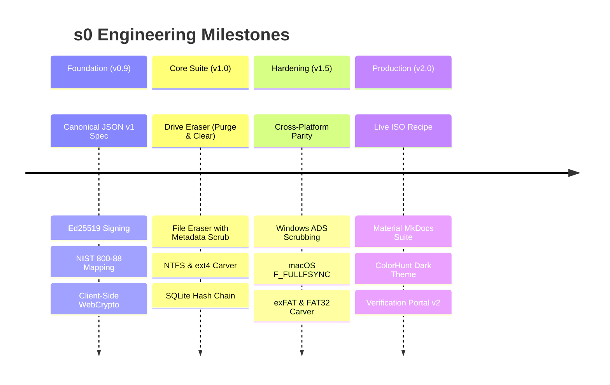

# Changelog & Engineering Release History

All notable changes to the **s0 (Sector Zero)** suite are documented in this file. The project adheres to [Semantic Versioning](https://semver.org/spec/v2.0.0.html) and [Keep a Changelog](https://keepachangelog.com/en/1.0.0/) standards.

---

## [2.1.0] — 2026-09-10

### Added
- **Custom File Signatures in Carver (CLI & GUI):** Added support for arbitrary user-defined magic byte signatures (`--custom-sig` on CLI and interactive Signature Builder on Web Dashboard) supporting hex headers, optional footers, extensions, categories, and max carving sizes across NTFS, ext4, FAT32, exFAT, and raw carving engines.
- **Central Workspace Configuration (`s0_config.json`):** Unified default operator, organization, documentation URLs, and key paths automatically loaded across Linux, macOS, and Windows CLIs, Web Dashboard, and Verification Portal.
- **Persistent Light & Dark Theme Mode:** Implemented accessible, high-contrast light and dark mode toggles with zero-flicker `<head>` initialization and `localStorage` persistence across both Web Dashboard and Verification Portal.
- **Offline Typography Consolidation:** Strictly consolidated Web Dashboard and Verification Portal on self-hosted Rubik (sans-serif) and JetBrains Mono (monospace) `.woff2` font assets, eliminating external CDN dependencies.
- **Verification Portal QR & PDF Verification:** Added direct PDF certificate upload support with embedded QR code extraction and immediate cryptographically verified payload rendering.
- **Carver Output Directory Option:** Added custom extraction output directory selection to both GUI and CLI carving workflows.

### Changed
- **Drive Sanitizer Form Refinement:** Streamlined drive wipe options in Web Dashboard, providing explicit operator and organization fields and harmonizing overwrite pattern standards with pass counts.

### Fixed
- **Verification Portal Background Flare:** Constrained top radial gradient and removed fixed card minimum height constraints, eliminating viewport blowout and mid-screen visual artifacts.

---

## [2.0.0] — 2026-09-09

### Added
- **Production Documentation Suite:** Deployed complete Material for MkDocs technical documentation at [s0-docs-ten.vercel.app](https://s0-docs-ten.vercel.app/) with automated Vercel CI/CD via standalone `uv` runner.
- **Forensic Color Theme:** Integrated the ColorHunt `#222831` `#393E46` `#00ADB5` `#EEEEEE` palette with customized code blocks, admonitions, and typography.
- **Bare-Metal Bootable Live ISO (`linux/iso/`):** Complete Debian 12 (Bookworm) `live-build` recipe with automated Chromium kiosk, loopback FastAPI wipe daemon (`127.0.0.1:8000`), and QEMU virtual smoke-test harness (`qemu-test.sh`).
- **Offline Asset Bundling:** Bundled local Fira Sans and Fira Code fonts in the verification portal and live ISO to guarantee 100% air-gapped styling without external web requests.
- **One-Line Cross-Platform Installers & Uninstallers:** Added streamlined `install.sh`, `install.ps1`, `install.cmd`, `uninstall.sh`, and `uninstall.ps1` scripts with PATH registration and virtualenv bootstrapping.

### Changed
- **Unified Progress Bar & Thermal Telemetry:** Standardized real-time ANSI terminal progress bars across drive wiping, file erasing, and carving, with a 2-second rate-limited thermal sensor query via Linux `hwmon` and SMART telemetry.
- **Standardized Certificate Identifiers:** Standardized tool naming to `s0` across all output JSON payloads, PDF certificates, and audit blocks.
- **Complete README Overhaul:** Redesigned project README with clean comparative matrices, quickstart examples, and architecture maps.

### Fixed
- **Windows Startup Crash (`fcntl`):** Implemented lazy-import guards for POSIX-only `fcntl` calls in `blkdiscard.py`, resolving startup failures on Windows systems.
- **Stored XSS Remediation:** Hardened the Web Dashboard audit ledger and Verification Portal against stored cross-site scripting by strictly sanitizing operator metadata, device serial numbers, and notes before DOM insertion.
- **Portal Layout Stability:** Fixed flexbox layout blowout in `verification-portal/index.html` when rendering large multi-fragment certificate payloads.

---

## [1.5.0] — 2026-08-28

### Added
- **Native Cross-Platform File Eraser (Module 2):**
  - **Windows (`windows/`):** Win32 direct file I/O with `FlushFileBuffers`, Alternate Data Stream (`:Zone.Identifier`) discovery and destruction, and ReFS CoW volume detection.
  - **macOS (`macos/`):** Darwin direct hardware cache synchronization via `fcntl(fd, F_FULLFSYNC, 0)`, Extended Attribute (`xattr -c`) quarantine stripping, and APFS snapshot warnings.
- **Removable Media & Partition Sanitization:** Added native USB flash drive and secondary partition wiping capabilities to Windows and macOS CLI utilities.
- **FAT32 & exFAT Carving Engines (`linux/cli/s0_cli/carver/`):**
  - **FAT32 (`fat_carver.py`):** BPB boot sector parsing, `0xE5` deleted directory entry scanning, and contiguous cluster recovery.
  - **exFAT (`exfat_carver.py`):** VBR parsing, 32-byte directory entry set reconstruction (`0x05`/`0x85`, `0x40`/`0xC0`, `0x41`/`0xC1`), and Cluster Heap allocation extraction.
- **Fragmented Reconstruction Heuristics (`fragmentation.py`):** Implemented non-resident cluster runlist reassembly and bifragment stream recovery across cluster gaps.

### Changed
- **Project Standardization:** Scrubbed all legacy hackathon and institutional problem statement identifiers; unified repository and binary nomenclature under **s0 (Sector Zero)**.
- **Strict Key Pinning Enforcement:** Updated the Verification Portal to classify certificates into three unambiguous tiers: Green (Accredited Authority), Amber (Valid Math / Unregistered Key), and Red (Tamper Detected).

### Security
- Strengthened verification portal download boundary policies and restricted file path resolution to prevent directory traversal during evidence extraction.

---

## [1.0.0] — 2026-08-15

### Added
- **Module 1: Secure Drive Eraser (`s0_cli/methods/`):**
  - ATA Secure Erase (`ATA_SECURE_ERASE`, `ATA_SECURE_ERASE_ENHANCED`) via controller firmware commands.
  - NVMe Sanitize (`NVME_SANITIZE_BLOCK_ERASE`, `NVME_SANITIZE_CRYPTO_ERASE`) and NVMe Format (`NVME_FORMAT_CRYPTO_ERASE`).
  - Kernel Discard (`BLKDISCARD`) with DRAT/RZAT deterministic readback checks.
  - Logical multi-pass and single-pass zero/random overwriting with 64-block post-wipe verification.
  - Host Protected Area (HPA) and Device Configuration Overlay (DCO) probe detection.
- **Module 2: Secure File & Folder Eraser (`file_eraser.py`):**
  - In-place cluster overwriting, inode timestamp zeroing (`1970-01-01T00:00:00Z`), and filename scrambling before unlinking.
  - Batch file erasure issuance with consolidated Ed25519 certificates.
- **Module 3: Advanced Multi-Filesystem File Carver (`carver/`):**
  - Signature engine supporting JPEG, PNG, PDF, ZIP/Office, GIF, GZIP, BMP, ELF, SQLite3, and MP3.
  - Direct ext4 superblock, block group descriptor, and inode extent tree parser (`ext4_carver.py`).
  - Direct NTFS Master File Table ($MFT) parser extracting resident attributes and non-resident runlists (`ntfs_carver.py`).
  - 4-factor confidence scoring (header 30%, footer 30%, size 20%, 3-point Shannon entropy 20%).
- **Module 4: Blockchain Audit Ledger (`audit/`):**
  - Append-only SQLite database (`~/.s0/s0_audit.db`) with SHA-256 block hash chaining:
    $$\text{block\_hash} = \text{SHA256}(\text{index} \parallel \text{timestamp} \parallel \text{op\_type} \parallel \text{target\_id} \parallel \text{cert\_uuid} \parallel \text{payload\_hash} \parallel \text{signature} \parallel \text{prev\_hash})$$
  - Built-in `s0 audit verify` command confirming unbroken mathematical continuity from genesis to tip.
- **Unified 4-Tab Web Dashboard (`gui/`):** FastAPI backend providing visual controls for wiping, file erasure, evidence carving, and blockchain ledger inspection.

---

## [0.9.0] — 2026-08-01

### Added
- **Core Cryptography Engine (`core/python/s0_core/`):**
  - Pure Ed25519 asymmetric digital signatures per RFC 8032.
  - `s0 Canonical JSON v1` deterministic serializer (`canonical.py`) forbidding float values to eliminate multi-language formatting divergences.
  - Official certificate schema definition (`core/cert_schema.json`).
  - High-resolution ReportLab PDF certificate generator with embedded optical QR codes (`pdfgen.py`).
- **Static Verification Portal (`verification-portal/`):**
  - Zero-backend, 100% client-side WebCrypto / TweetNaCl verification engine.
  - Drag-and-drop certificate JSON verification.
  - Pinned trusted public key registry (`keys.json`).
- **Master Test Orchestrator (`scripts/build_all.sh`):**
  - Automated virtual environment setup and pytest execution across 120+ test cases.
  - Tamper matrix verification tests asserting signature rejection upon single-byte payload corruption.
