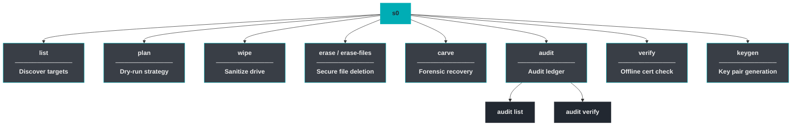
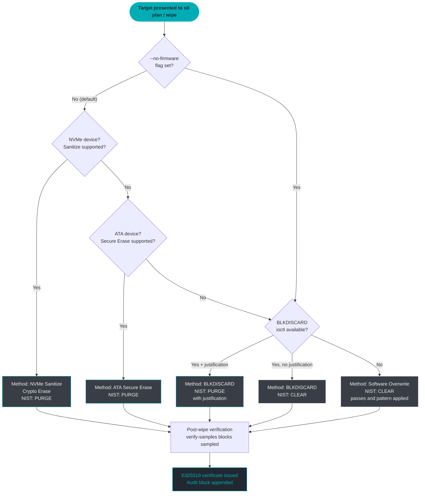

# CLI Reference

<p style="font-size: 1.1rem; color: #00adb5; font-weight: 600; margin-top: -0.4rem;">
  Complete flag-level documentation for every <code>s0</code> subcommand.
</p>

`s0` is a single unified binary that exposes eight subcommands covering the full lifecycle of forensic media sanitization, file carving, and certificate management. Every subcommand follows the same structural contract: human-readable defaults, `--json` machine-readable output where applicable, and cryptographically signed audit trails for every destructive operation.

---

## Command Hierarchy

```
s0 [--version] <subcommand> [flags]
```



---

## Global Flags

| Flag | Description |
|------|-------------|
| `--version` | Print the `s0` version string and exit. |

---

## s0 list

List all block-device targets visible to the system, with metadata useful for selecting a wipe target. Image files (`.raw`, `.img`, `.dd`) are also valid targets for every other subcommand and require no root privileges.

=== "Synopsis"

    ```
    s0 list [--output-format {text,json}]
    ```

=== "Flags"

    | Flag | Type | Default | Description |
    |------|------|---------|-------------|
    | `--output-format` | `text` \| `json` | `text` | Render output as a human-readable table or machine-readable JSON array. |

    **Output columns (text mode)**

    | Column | Description |
    |--------|-------------|
    | `PATH` | Kernel device path (e.g. `/dev/sda`, `/dev/nvme0n1`) |
    | `TYPE` | Bus/interface type: `NVMe`, `ATA`, `SCSI`, `USB`, `loop`, … |
    | `STORAGE` | Storage medium: `SSD`, `HDD`, `eMMC`, `SD`, `unknown` |
    | `CAPACITY` | Human-formatted size (e.g. `512.1 GB`) |
    | `MODEL` | Drive model string from kernel |
    | `SERIAL` | Drive serial number from kernel |
    | `MOUNTED?` | `yes` / `no` — whether any partition is currently mounted |

=== "Examples"

    **Human-readable table (default)**
    ```bash
    s0 list
    ```
    ```
    PATH            TYPE   STORAGE  CAPACITY   MODEL                  SERIAL        MOUNTED?
    /dev/sda        ATA    HDD      1.0 TB     WDC WD10EZEX-00BN5A0   WD-WCC3F...   no
    /dev/nvme0n1    NVMe   SSD      512.1 GB   Samsung SSD 980 PRO    S5GXNX...     yes
    /dev/sdb        USB    SSD      64.0 GB    SanDisk Extreme        AA010...       no
    ```

    **JSON output for scripting**
    ```bash
    s0 list --output-format json | jq '.[] | select(.mounted == false)'
    ```
    ```json
    [
      {
        "path": "/dev/sda",
        "type": "ATA",
        "storage": "HDD",
        "capacity_bytes": 1000204886016,
        "capacity_human": "1.0 TB",
        "model": "WDC WD10EZEX-00BN5A0",
        "serial": "WD-WCC3F1234567",
        "mounted": false
      }
    ]
    ```

    **Filter unmounted drives and feed into a wipe loop**
    ```bash
    TARGETS=$(s0 list --output-format json | jq -r '.[] | select(.mounted == false) | .path')
    for DEV in $TARGETS; do
        s0 wipe --target "$DEV" --yes --operator "batch-job-01"
    done
    ```

!!! tip "No root required for image files"
    `s0 list` enumerates block devices and may require root to show all entries. However, any `.raw`, `.img`, or `.dd` image file works as a `--target` in `plan`, `wipe`, `erase`, and `carve` without elevated privileges — ideal for CI/CD test pipelines.

---

## s0 plan

Perform a complete dry-run analysis: s0 inspects the target, selects the optimal erasure method, and prints the full execution plan. **No bytes are written. No audit entry is created.** This is the mandatory first step before any destructive operation in production workflows.

=== "Synopsis"

    ```
    s0 plan --target PATH \
            [--passes N] \
            [--pattern zero|random] \
            [--no-firmware] \
            [--discard-purge-justification TEXT] \
            [--force]
    ```

=== "Flags"

    | Flag | Type | Default | Required | Description |
    |------|------|---------|----------|-------------|
    | `--target` | path | — | **yes** | Block device (e.g. `/dev/sda`) or image file path. |
    | `--passes` | integer | `1` | no | Number of overwrite passes to plan for. |
    | `--pattern` | `zero` \| `random` | `zero` | no | Overwrite byte pattern for software passes. |
    | `--no-firmware` | flag | off | no | Skip NVMe Sanitize / ATA Secure Erase; plan software overwrite only. |
    | `--discard-purge-justification` | string | — | no | Free-text evidence that allows `BLKDISCARD` to be classed as NIST *Purge* rather than *Clear*. |
    | `--force` | flag | off | no | Override refusals for mounted or root devices. |

    **Reported output fields**

    | Field | Description |
    |-------|-------------|
    | `method` | Selected erasure method identifier (e.g. `nvme_sanitize`, `ata_secure_erase`, `blkdiscard`, `overwrite`) |
    | `nist_category` | NIST SP 800-88 Rev.1 tier: `Clear` or `Purge` |
    | `summary` | One-line human description of the chosen plan |
    | `commands` | Exact system commands / ioctl calls that `wipe` will execute |
    | `warnings` | Any caveats or limitations (e.g. HPA/DCO detected, mounted partitions, CoW filesystem) |
    | `alternatives` | Other methods considered and why they were ranked lower |
    | `hpa_dco` | Whether a Host Protected Area or Device Configuration Overlay was detected |

=== "Examples"

    **Inspect an NVMe drive**
    ```bash
    s0 plan --target /dev/nvme0n1
    ```
    ```
    ┌─────────────────────────────────────────────────────────┐
    │  s0 · Wipe Plan                                         │
    ├─────────────────────────────────────────────────────────┤
    │  Target       : /dev/nvme0n1                            │
    │  Model        : Samsung SSD 980 PRO 512GB               │
    │  Serial       : S5GXNX0T123456                          │
    │  Capacity     : 512.1 GB                                │
    │  Method       : nvme_sanitize (Crypto Erase)            │
    │  NIST Category: PURGE                                   │
    │  Summary      : NVMe Sanitize (Crypto Erase) will be    │
    │                 issued via nvme-cli. Estimated time: 3s  │
    │  Commands     : nvme sanitize /dev/nvme0n1 --sanact=4   │
    │  Warnings     : None                                    │
    │  Alternatives : NVMe Format FW, BLKDISCARD, overwrite   │
    │  HPA/DCO      : Not applicable (NVMe)                   │
    └─────────────────────────────────────────────────────────┘
    ```

    **Force software-only plan with 3 random passes**
    ```bash
    s0 plan --target /dev/sda --no-firmware --passes 3 --pattern random
    ```

    **Promote BLKDISCARD to Purge with justification**
    ```bash
    s0 plan --target /dev/sdb \
        --discard-purge-justification "Manufacturer TLC NAND with FTL-backed discard; confirmed in datasheet Rev.C §4.2"
    ```

!!! warning "plan does not guarantee execution"
    The method selected by `plan` is the method `wipe` will use given the same flags. If you change flags (e.g. add `--no-firmware`) between `plan` and `wipe`, the execution plan changes accordingly.

!!! info "HPA/DCO Detection"
    If `plan` reports a Host Protected Area (HPA) or Device Configuration Overlay (DCO), sectors outside the reported capacity may exist and will **not** be erased by software overwrite. Firmware-based methods (NVMe Sanitize, ATA Secure Erase) cover the full physical capacity including HPA/DCO regions.

---

## s0 wipe

The primary sanitization engine. `s0 wipe` executes the method selected by the planning logic, runs post-wipe verification sampling, records a tamper-evident audit block, and issues an **Ed25519-signed certificate** in JSON and PDF form.

!!! danger "Destructive — data is permanently unrecoverable"
    `s0 wipe` destroys all data on the target device. The interactive confirmation prompt (`WIPE`) exists specifically to prevent accidents. In automated pipelines, pass `--yes` only after prior human review of `s0 plan` output.

=== "Synopsis"

    ```
    s0 wipe --target PATH \
            [--yes] \
            [--key PEM] \
            [--out-dir DIR] \
            [--operator ID] \
            [--organization NAME] \
            [--no-pdf] \
            [--verify-samples N] \
            [--passes N] \
            [--pattern zero|random] \
            [--no-firmware] \
            [--force] \
            [--json] \
            [--portal-url URL] \
            [--qr-url-template TMPL] \
            [--plant-markers] \
            [--discard-purge-justification TEXT]
    ```

=== "Flags"

    | Flag | Type | Default | Required | Description |
    |------|------|---------|----------|-------------|
    | `--target` | path | — | **yes** | Block device or image file to sanitize. |
    | `--yes` | flag | off | no | Skip the interactive `WIPE` confirmation prompt. |
    | `--key` | path | auto | no | Path to issuer Ed25519 private key PEM. Auto-discovers demo key from `core/keys/` if omitted. |
    | `--out-dir` | path | `.` | no | Directory where certificate files are written. |
    | `--operator` | string | `unknown-operator` | no | Operator identity recorded in the certificate payload. |
    | `--organization` | string | `Digital Forensics & Data Sanitization Lab` | no | Issuing organization name recorded in the certificate. |
    | `--no-pdf` | flag | off | no | Skip PDF certificate generation (JSON and QR are still produced). |
    | `--verify-samples` | integer | `64` | no | Number of 4 096-byte blocks to sample and check post-wipe. |
    | `--passes` | integer | `1` | no | Number of overwrite passes (relevant for software overwrite method). |
    | `--pattern` | `zero` \| `random` | `zero` | no | Byte pattern written during software overwrite passes. |
    | `--no-firmware` | flag | off | no | Skip NVMe/ATA firmware erase; use software overwrite only. |
    | `--force` | flag | off | no | Override safety refusals for mounted or root devices. |
    | `--json` | flag | off | no | Emit structured JSON to stdout throughout execution (for CI/CD pipelines). |
    | `--portal-url` | URL | `https://s0-vp.vercel.app/` | no | Base URL embedded in the certificate QR code for online verification. |
    | `--qr-url-template` | string | — | no | Full URL template with `{cert_uuid}` placeholder. Overrides `--portal-url` when set. |
    | `--plant-markers` | flag | off | no | Write known marker patterns before wiping, then assert zero hits after. Intended for demo/test validation. |
    | `--discard-purge-justification` | string | — | no | Evidence text that lets `BLKDISCARD` be classified as NIST *Purge* rather than *Clear*. |

    **Output files**

    | File | Description |
    |------|-------------|
    | `certificate_<UUID8>.json` | Signed certificate in s0 Canonical JSON v1 format. |
    | `certificate_<UUID8>.pdf` | Human-readable PDF with embedded QR code. |
    | `certificate_<UUID8>.qr.png` | Standalone QR code image linking to the verification portal. |

=== "Examples"

    **Minimal interactive wipe**
    ```bash
    sudo s0 wipe --target /dev/sdb
    # Prompts: Type WIPE to confirm:
    ```

    **Non-interactive with operator metadata**
    ```bash
    sudo s0 wipe \
        --target /dev/sda \
        --yes \
        --operator "jane.doe@forensics.lab" \
        --organization "Acme Forensics Ltd." \
        --out-dir /mnt/evidence/certs/
    ```

    **3-pass random overwrite, software-only (e.g. USB thumb drive)**
    ```bash
    sudo s0 wipe \
        --target /dev/sdc \
        --no-firmware \
        --passes 3 \
        --pattern random \
        --yes
    ```

    **JSON output for CI/CD integration**
    ```bash
    sudo s0 wipe --target /dev/nvme0n1 --yes --json 2>&1 | tee wipe.log
    ```
    ```json
    {"event": "start",     "target": "/dev/nvme0n1", "method": "nvme_sanitize"}
    {"event": "progress",  "stage": "sanitize",       "elapsed_s": 1.2}
    {"event": "progress",  "stage": "verify",         "samples": 64, "hits": 0}
    {"event": "complete",  "nist_category": "PURGE",  "cert_uuid": "a1b2c3d4",
     "cert_path": "/tmp/certs/certificate_a1b2c3d4.json"}
    ```

    **Custom QR URL template**
    ```bash
    sudo s0 wipe --target /dev/sda --yes \
        --qr-url-template "https://verify.myorg.internal/cert/{cert_uuid}"
    ```

    **Demo / test mode with marker planting**
    ```bash
    s0 wipe --target disk_image.raw \
        --plant-markers \
        --yes \
        --operator "qa-pipeline"
    ```

!!! tip "Auto-key discovery"
    When `--key` is omitted, `s0 wipe` walks `core/keys/` looking for a PEM file matching the pattern `*_private.pem`. The demo keypair ships in that directory so out-of-the-box usage works without any key management. For production deployments, always supply your own authority key via `--key`.

!!! note "Verification sampling"
    Post-wipe, s0 reads `--verify-samples` × 4 096-byte blocks from random LBA offsets. Each block is checked against the expected overwrite pattern. The sample count, hit count (must be `0`), and sampled LBA list are all recorded in the certificate payload for auditability.

---

## s0 erase

Securely erase individual files and directories with full metadata scrubbing. Unlike `rm`, `s0 erase` overwrites file data in-place before unlinking, zeroes timestamps and directory entry metadata, and — on Windows — purges Alternate Data Streams. A signed certificate is produced by default.

!!! info "Alias"
    `s0 erase` and `s0 erase-files` are identical. The alias exists for ergonomic clarity in scripts that make the operation type explicit.

=== "Synopsis"

    ```
    s0 erase --targets PATH... \
             [--passes N] \
             [--pattern zero|random] \
             [--out-dir DIR] \
             [--operator ID] \
             [--organization NAME] \
             [--key PEM] \
             [--no-certificate] \
             [--no-pdf] \
             [--portal-url URL] \
             [--qr-url-template TMPL]
    ```

=== "Flags"

    | Flag | Type | Default | Required | Description |
    |------|------|---------|----------|-------------|
    | `--targets` | path(s) | — | **yes** | One or more file or directory paths to erase. Directories are recursed. |
    | `--passes` | integer | `1` | no | Number of overwrite passes per file. |
    | `--pattern` | `zero` \| `random` | `zero` | no | Byte pattern for overwrite passes. |
    | `--out-dir` | path | `.` | no | Directory where the erasure certificate is written. |
    | `--operator` | string | *(empty)* | no | Operator identity recorded in the certificate. |
    | `--organization` | string | `Digital Forensics & Data Sanitization Lab` | no | Issuing organization name. |
    | `--key` | path | auto | no | Signing key PEM path. |
    | `--no-certificate` | flag | off | no | Skip certificate generation entirely. |
    | `--no-pdf` | flag | off | no | Skip PDF rendering; produce JSON certificate only. |
    | `--portal-url` | URL | `https://s0-vp.vercel.app/` | no | Portal URL embedded in QR code. |
    | `--qr-url-template` | string | — | no | Full URL template with `{cert_uuid}` placeholder. |

=== "Examples"

    **Erase a single sensitive file**
    ```bash
    s0 erase --targets /home/user/secret_report.pdf
    ```

    **Erase multiple files and an entire directory**
    ```bash
    s0 erase \
        --targets /tmp/staging/ /var/log/audit.log /home/user/.ssh/id_rsa \
        --passes 3 \
        --operator "alice@forensics.org"
    ```

    **Erase without generating a certificate (quick cleanup)**
    ```bash
    s0 erase --targets /tmp/scratch/ --no-certificate
    ```

    **Use random pattern and save cert to evidence folder**
    ```bash
    s0 erase \
        --targets /data/case_work/temp/ \
        --pattern random \
        --out-dir /evidence/2026-09-09/ \
        --operator "investigator-7"
    ```

!!! warning "Filesystem and OS limitations"
    On **Copy-on-Write filesystems** (Btrfs, ZFS, APFS), the overwrite pass writes to a new block rather than the original LBA. The old data blocks may remain in the CoW snapshot tree. `s0 erase` documents this limitation explicitly in its output. See [`LIMITATIONS.md`](LIMITATIONS.md) for the full boundary specification.

---

## s0 carve

Forensic file carving and recovery from raw disk images or live block devices. `s0 carve` combines two complementary techniques: **filesystem-aware inode/MFT/FAT traversal** (for fragmented or deleted inodes) and **header–footer magic carving** with Shannon entropy filtering for unrecognized or overwritten filesystem structures.

=== "Synopsis"

    ```
    s0 carve --target PATH \
             --out-dir DIR \
             [--extensions EXT,...] \
             [--min-confidence N] \
             [--operator ID] \
             [--organization NAME] \
             [--key PEM] \
             [--no-certificate]
    ```

=== "Flags"

    | Flag | Type | Default | Required | Description |
    |------|------|---------|----------|-------------|
    | `--target` | path | — | **yes** | Raw disk image (`.raw`, `.img`, `.dd`) or block device (e.g. `/dev/sda`). |
    | `--out-dir` | path | — | **yes** | Directory to write carved files and the recovery index into. |
    | `--extensions` | comma-separated | all | no | Restrict carving to specific types. See supported types below. |
    | `--min-confidence` | 0–100 | `50` | no | Discard recovered files scoring below this threshold. |
    | `--operator` | string | *(empty)* | no | Forensic operator identity for the manifest certificate. |
    | `--organization` | string | `Digital Forensics & Data Sanitization Lab` | no | Issuing organization name. |
    | `--key` | path | auto | no | Signing key PEM for the manifest certificate. |
    | `--no-certificate` | flag | off | no | Skip manifest certificate generation. |

    **Supported file types**

    | Extension | Format | Detection Method |
    |-----------|--------|-----------------|
    | `jpg` | JPEG image | `FF D8 FF` header + `FF D9` footer |
    | `png` | PNG image | `89 50 4E 47` header + `49 45 4E 44` footer |
    | `pdf` | PDF document | `%PDF-` header + `%%EOF` footer |
    | `zip` | ZIP archive (+ `.docx` / `.xlsx` / `.pptx`) | `PK\x03\x04` header |
    | `gif` | GIF image | `GIF87a` / `GIF89a` header + `00 3B` footer |
    | `gz` | Gzip archive | `1F 8B` header |
    | `bmp` | BMP image | `42 4D` header; length field cross-checked |
    | `elf` | ELF binary | `7F 45 4C 46` header |
    | `sqlite` | SQLite database | `53 51 4C 69 74 65 20 66 6F 72 6D 61 74 20 33` header |
    | `mp3` | MP3 audio | `FF FB` / `49 44 33` (ID3) header |

    **Output files**

    | File | Description |
    |------|-------------|
    | `<out-dir>/<type>/carved_<offset>.ext` | Recovered file at the given LBA offset |
    | `<out-dir>/recovery_index.json` | Machine-readable index of all recovered files with confidence scores and offsets |
    | `<out-dir>/carving_manifest_<UUID8>.json` | Signed carving manifest certificate |

=== "Examples"

    **Carve all supported types from an image**
    ```bash
    s0 carve \
        --target /evidence/seized_disk.raw \
        --out-dir /evidence/recovered/
    ```

    **Carve only JPEGs and PDFs with high confidence**
    ```bash
    s0 carve \
        --target /dev/sdb \
        --out-dir /tmp/carve_out/ \
        --extensions jpg,pdf \
        --min-confidence 80
    ```

    **Full forensic carve with operator identity, skip certificate**
    ```bash
    s0 carve \
        --target /evidence/usb_001.img \
        --out-dir /evidence/case_42/recovered/ \
        --operator "examiner.jane@dfir.lab" \
        --organization "DFIR Lab Unit 7" \
        --no-certificate
    ```

    **Inspect the recovery index**
    ```bash
    s0 carve --target disk.raw --out-dir ./out/
    cat ./out/recovery_index.json | jq '.files[] | select(.confidence >= 90)'
    ```

!!! info "Filesystem-aware vs. magic carving"
    `s0 carve` first attempts **filesystem-aware traversal**: it reads the ext4 inode table, NTFS `$MFT`, FAT32 directory entries, or exFAT Cluster Heap to reconstruct fragmented deleted files. Only when no recognizable filesystem superblock is found does it fall back to sequential magic-byte header/footer scanning. Both paths record LBA offsets in `recovery_index.json`.

!!! tip "Confidence scoring"
    The confidence score (0–100) is a composite of: header/footer match quality, entropy profile (compressed/encrypted data scores lower for typed formats), cross-validated length fields, and whether a complete footer was found. A score ≥ 70 generally indicates a complete, intact file.

---

## s0 audit

The `audit` namespace exposes the append-only, SHA-256 block-hash-chained audit ledger stored at `~/.s0/s0_audit.db`. Every destructive operation (`wipe`, `erase`) appends a ledger block; `carve` operations append a read-only forensic record.

### s0 audit list

Display the most recent entries in the audit ledger.

=== "Synopsis"

    ```
    s0 audit list [--limit N]
    ```

=== "Flags"

    | Flag | Type | Default | Description |
    |------|------|---------|-------------|
    | `--limit` | integer | `50` | Maximum number of audit blocks to display, most-recent first. |

    **Output columns**

    | Column | Description |
    |--------|-------------|
    | `IDX` | Sequential block index (0-based, monotonically increasing) |
    | `TIMESTAMP` | ISO 8601 UTC timestamp of the operation |
    | `OPERATION` | Operation type: `wipe`, `erase`, `carve` |
    | `OPERATOR` | Operator identity string recorded at operation time |
    | `TARGET_ID` | Device path, serial number, or file path |
    | `BLOCK_HASH` | SHA-256 of this block's content chained over the previous block hash |

=== "Examples"

    **Show last 50 entries**
    ```bash
    s0 audit list
    ```
    ```
    IDX  TIMESTAMP                OPERATION  OPERATOR              TARGET_ID         BLOCK_HASH
    0    2026-09-09T07:12:33Z     wipe       alice@forensics.lab   /dev/sda          a1b2c3d4...
    1    2026-09-09T08:44:01Z     erase      bob@forensics.lab     /home/bob/sec...  9f8e7d6c...
    2    2026-09-09T10:03:17Z     carve      alice@forensics.lab   /evidence/01.raw  3b2a1c0d...
    ```

    **Show last 5 entries**
    ```bash
    s0 audit list --limit 5
    ```

---

### s0 audit verify

Cryptographically verify the integrity of the entire audit chain. Each block's stored hash is recomputed and compared; the chain linkage (each block incorporates the previous block's hash) is also validated.

=== "Synopsis"

    ```
    s0 audit verify
    ```

=== "Flags"

    *No flags. Operates on the full chain in `~/.s0/s0_audit.db`.*

=== "Examples"

    **Verify chain integrity**
    ```bash
    s0 audit verify
    ```
    ```
    Verifying 3 audit blocks...
    ✅ VALID & CONTINUOUS — all 3 blocks intact, chain unbroken.
    ```

    **Detect tampering**
    ```bash
    s0 audit verify
    ```
    ```
    Verifying 3 audit blocks...
    ❌ BROKEN / TAMPER DETECTED — block 1 hash mismatch.
       Expected : 9f8e7d6c...
       Got      : 00000000...
    ```

    **Use in shell scripts**
    ```bash
    if s0 audit verify; then
        echo "Chain intact — proceeding."
    else
        echo "ALERT: Audit chain compromised!" | mail -s "s0 Integrity Alert" soc@org.internal
        exit 1
    fi
    ```

**Exit codes for `audit verify`:**

| Code | Meaning |
|------|---------|
| `0` | Chain is valid and continuous. |
| `1` | One or more blocks fail hash verification or chain linkage is broken. |

!!! danger "Tamper indication is definitive"
    A non-zero exit from `s0 audit verify` means at minimum one audit record has been modified after it was written. This may indicate database tampering, filesystem corruption, or an unauthorized edit. Treat all subsequent certificates from that host as untrustworthy until the incident is investigated.

---

## s0 verify

Offline verification of a signed sanitization or carving certificate. No network connection is required. The signature is verified against a trusted Ed25519 public key, and the certificate payload is re-canonicalized to confirm the signature covers the exact bytes on disk.

=== "Synopsis"

    ```
    s0 verify CERTIFICATE [--key PEM]
    ```

=== "Flags"

    | Argument / Flag | Type | Default | Required | Description |
    |-----------------|------|---------|----------|-------------|
    | `CERTIFICATE` | path | — | **yes** | Path to the `certificate_<UUID8>.json` file to verify. |
    | `--key` | path | demo key | no | Path to a trusted Ed25519 public key PEM. If omitted, the bundled demo public key from `core/keys/` is used. |

    **Output on success**

    | Field | Description |
    |-------|-------------|
    | `UUID` | Certificate UUID |
    | `Status` | `✅ VALID` or `❌ INVALID` |
    | `NIST tier` | `Clear` or `Purge` |
    | `Device` | Target device path and serial |
    | `Issuer` | Operator and organization |
    | `Fingerprint` | SHA-256 fingerprint of the signing public key |

=== "Examples"

    **Verify with bundled demo key**
    ```bash
    s0 verify certificate_a1b2c3d4.json
    ```
    ```
    UUID         : a1b2c3d4-e5f6-7890-abcd-ef1234567890
    Status       : ✅ VALID
    NIST tier    : PURGE
    Device       : /dev/nvme0n1  (S5GXNX0T123456)
    Issuer       : jane.doe@forensics.lab / Acme Forensics Ltd.
    Fingerprint  : sha256:3d4e5f6a7b8c9d0e1f2a3b4c5d6e7f80...
    ```

    **Verify with a custom authority public key**
    ```bash
    s0 verify certificate_a1b2c3d4.json --key /etc/s0/authority_public.pem
    ```

    **Batch-verify all certificates in a directory**
    ```bash
    for cert in /evidence/certs/*.json; do
        echo -n "$cert: "
        s0 verify "$cert" --key /etc/s0/authority_public.pem \
            | grep "Status" || echo "FAILED"
    done
    ```

!!! note "What 'valid' actually means"
    `✅ VALID` means: (1) the Ed25519 signature bytes are cryptographically correct for the given public key, (2) the payload re-canonicalized to s0 Canonical JSON v1 is byte-for-byte identical to what was signed, and (3) the certificate schema version is recognized. It does **not** attest to the physical condition of the drive — only that the certificate was not tampered with after issuance.

---

## s0 keygen

Generate an Ed25519 keypair for use as a signing authority or per-operator key. The private key is written with mode `0600`; the public key with mode `0644`.

=== "Synopsis"

    ```
    s0 keygen [--out-dir DIR] [--name PREFIX]
    ```

=== "Flags"

    | Flag | Type | Default | Description |
    |------|------|---------|-------------|
    | `--out-dir` | path | `.` | Directory where the keypair files are written. |
    | `--name` | string | `operator_key` | Filename prefix. Produces `PREFIX_private.pem` and `PREFIX_public.pem`. |

    **Output files**

    | File | Description |
    |------|-------------|
    | `<name>_private.pem` | Ed25519 private key in PEM format (`mode 0600`) |
    | `<name>_public.pem` | Ed25519 public key in PEM format (`mode 0644`) |

    Additionally prints the **SHA-256 fingerprint** of the public key to stdout for out-of-band distribution.

=== "Examples"

    **Generate a default keypair in the current directory**
    ```bash
    s0 keygen
    # → operator_key_private.pem  (0600)
    # → operator_key_public.pem   (0644)
    # → Fingerprint: sha256:3d4e5f6a7b8c...
    ```

    **Generate a named authority keypair**
    ```bash
    s0 keygen \
        --out-dir /etc/s0/keys/ \
        --name acme_forensics_authority
    # → /etc/s0/keys/acme_forensics_authority_private.pem
    # → /etc/s0/keys/acme_forensics_authority_public.pem
    ```

    **Generate a per-operator key and use it immediately**
    ```bash
    s0 keygen --out-dir ~/.s0/ --name jane_doe
    sudo s0 wipe \
        --target /dev/sdb \
        --key ~/.s0/jane_doe_private.pem \
        --operator "jane.doe@forensics.lab" \
        --yes
    ```

!!! warning "Protect private keys"
    Anyone with access to `_private.pem` can issue certificates that will verify as valid under the corresponding public key. Store private keys in a hardware token (YubiKey, TPM) for production use. Never commit private keys to version control.

---

## Method Selection Logic

`s0` applies a strict hardware-capability waterfall when selecting an erasure method. The first method that is both **supported by the hardware** and **not excluded by flags** is chosen. This waterfall maps directly to NIST SP 800-88 Rev. 1 tiers.



### Method Detail

| Priority | Method | NIST Category | Prerequisite | Covers HPA/DCO |
|----------|--------|---------------|--------------|----------------|
| 1 | **NVMe Sanitize** (Crypto Erase) | **Purge** | NVMe drive, Sanitize command supported | ✅ Yes |
| 2 | **NVMe Format** (Crypto Erase fallback) | **Purge** | NVMe drive, Format NVM with crypto erase | ✅ Yes |
| 3 | **ATA Secure Erase** (Enhanced) | **Purge** | ATA/SATA drive, Security Feature Set supported | ✅ Yes |
| 4 | **BLKDISCARD** + justification | **Purge** | Block device with discard support; justification provided | ❌ No |
| 5 | **BLKDISCARD** (no justification) | **Clear** | Block device with discard support | ❌ No |
| 6 | **Software Overwrite** | **Clear** | Any writable block device or file | ❌ No |

!!! note "NVMe Format vs. NVMe Sanitize"
    NVMe Sanitize is preferred because it operates in the background on the controller (survives host power cycles) and is the operation explicitly called out in NIST SP 800-88 Rev. 1 §2.4. NVMe Format with Crypto Erase is used when Sanitize is not supported — it is still a Purge-tier operation but must complete in a single controller session.

---

## Exit Codes

All `s0` subcommands follow a consistent three-value exit code contract, compatible with standard shell `&&` / `||` chaining and CI/CD pass/fail gates.

| Code | Symbolic | Meaning | Typical Triggers |
|------|----------|---------|-----------------|
| `0` | `SUCCESS` | Operation completed successfully. | Wipe done, cert issued; audit chain valid; verification passed. |
| `1` | `OPERATION_FAILURE` | Operation was attempted but failed at runtime. | Hardware command rejected; signature mismatch; post-wipe verification found non-zero blocks. |
| `2` | `USAGE_SAFETY_ERROR` | Refused to run due to bad arguments or a safety interlock. | Missing required flag; target is mounted (without `--force`); target is the root device; invalid flag value. |

```bash
# Gate on exit code in a shell pipeline
s0 wipe --target /dev/sdb --yes && echo "Wipe succeeded" || echo "Wipe FAILED (exit $?)"
```

---

## Environment & Files

`s0` uses a small set of well-known paths for persistent state and key material.

| Path | Purpose |
|------|---------|
| `~/.s0/s0_audit.db` | SQLite database storing the append-only, hash-chained audit ledger. Created automatically on first use. |
| `core/keys/*_private.pem` | Demo/development Ed25519 private key. Auto-discovered when `--key` is not specified. |
| `core/keys/*_public.pem` | Corresponding demo public key. Used by `s0 verify` when `--key` is not specified. |
| `<out-dir>/certificate_<UUID8>.json` | Signed certificate output from `s0 wipe` and `s0 erase`. |
| `<out-dir>/certificate_<UUID8>.pdf` | PDF certificate with embedded QR code. |
| `<out-dir>/certificate_<UUID8>.qr.png` | Standalone QR code PNG. |
| `<out-dir>/recovery_index.json` | Carving session index (from `s0 carve`). |
| `<out-dir>/carving_manifest_<UUID8>.json` | Signed carving manifest certificate. |

!!! tip "Relocating the audit database"
    `~/.s0/s0_audit.db` is the fixed default location. In multi-user or shared-lab environments, consider running `s0` under a dedicated service account so the audit DB is written to a protected system path (e.g. `/var/lib/s0/s0_audit.db`), preventing per-user fragmentation of audit records.

!!! warning "Demo keys are public"
    The keys in `core/keys/` are committed to the open-source repository and are known to the public. Certificates signed with the demo key provide **integrity** (tamper-evidence) but **not authenticity** (anyone can reproduce the signature). Generate a private authority keypair with `s0 keygen` before any production or legal-hold use.

---

## Scripting & Automation

### Machine-readable output

`s0 wipe` and `s0 list` emit structured output for pipeline consumption.

```bash
# Enumerate unmounted drives and wipe each one non-interactively
s0 list --output-format json \
  | jq -r '.[] | select(.mounted == false) | .path' \
  | while read -r DEV; do
      echo "[*] Wiping $DEV ..."
      sudo s0 wipe \
          --target "$DEV" \
          --yes \
          --json \
          --operator "automated-sanitization-pipeline" \
          --out-dir "/var/lib/s0/certs/$(date +%F)/" \
        | tee -a /var/log/s0/wipe-$(date +%F).ndjson
  done
```

### Validate every certificate after issuance

```bash
CERT_DIR="/var/lib/s0/certs/$(date +%F)"
PUB_KEY="/etc/s0/authority_public.pem"
FAIL=0

for cert in "$CERT_DIR"/*.json; do
    if s0 verify "$cert" --key "$PUB_KEY" > /dev/null 2>&1; then
        echo "OK: $cert"
    else
        echo "INVALID: $cert"
        FAIL=1
    fi
done

exit $FAIL
```

### Audit chain health check (cron-friendly)

```bash
#!/usr/bin/env bash
# /etc/cron.daily/s0-audit-check
set -euo pipefail

if ! s0 audit verify > /tmp/s0_audit_result.txt 2>&1; then
    mail -s "[ALERT] s0 audit chain broken on $(hostname)" \
         soc@org.internal < /tmp/s0_audit_result.txt
    exit 1
fi
```

### Forensic carve + immediate index query

```bash
s0 carve \
    --target /evidence/seized.raw \
    --out-dir /evidence/recovered/ \
    --extensions jpg,pdf,sqlite \
    --min-confidence 70 \
    --operator "examiner@dfir.lab"

# Query carved SQLite databases
jq -r '.files[] | select(.extension == "sqlite") | .path' \
    /evidence/recovered/recovery_index.json \
  | while read -r db; do
      echo "=== $db ==="
      sqlite3 "$db" ".tables"
  done
```

### --json event stream schema

When `--json` is passed to `s0 wipe`, each event is a newline-delimited JSON object (ndjson):

| `event` value | Additional fields | Description |
|---------------|-------------------|-------------|
| `"start"` | `target`, `method`, `nist_category` | Emitted before the erase command runs. |
| `"progress"` | `stage`, `elapsed_s`, and method-specific fields | Periodic progress updates. |
| `"verify"` | `samples`, `hits`, `lba_list` | Post-wipe verification result. |
| `"complete"` | `nist_category`, `cert_uuid`, `cert_path` | Emitted after certificate is written. |
| `"error"` | `code`, `message` | Emitted on any failure; exit code will be non-zero. |

```bash
# Extract the certificate path from a completed wipe log
grep '"event":"complete"' wipe.log | jq -r '.cert_path'
```

---

*CLI Reference · s0 (Sector Zero) · NIST SP 800-88 Rev. 1 Compliant Forensic Sanitization Suite*
