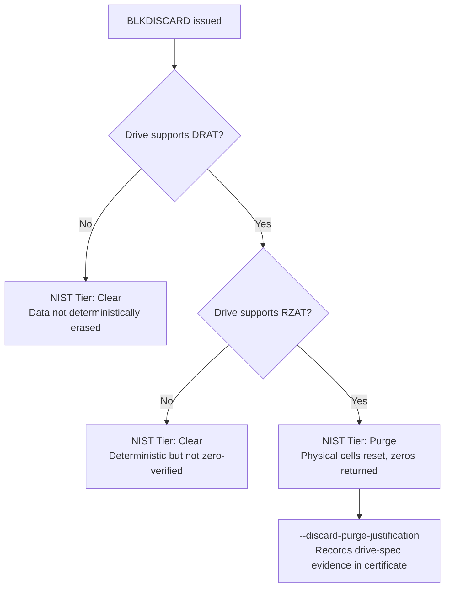
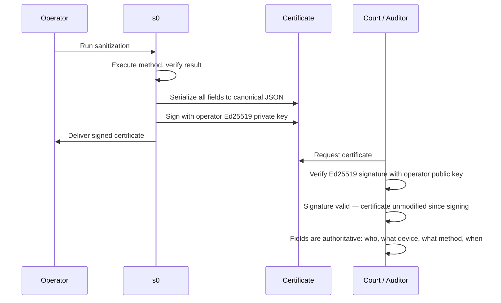

# NIST SP 800-88 & Legal Compliance

s0 (Sector Zero) is designed from the ground up to produce **cryptographically verifiable, standards-aligned data sanitization records**. Whether you are a compliance officer preparing for a regulatory audit, an IT administrator decommissioning a fleet of drives, or a digital forensics investigator establishing chain of custody, this page gives you the complete technical and procedural picture.

---

## Executive Summary: What s0 Delivers for Compliance

| Regulatory Framework | What s0 Provides |
|---|---|
| **NIST SP 800-88 Rev. 1** | Automated method selection, honest Clear vs Purge categorization, signed certificate |
| **DoD 5220.22-M** | 3-pass overwrite pattern support (`OVERWRITE_RANDOM_3PASS`) |
| **ISO/IEC 27001 / 27040** | Audit trail, cryptographic proof of sanitization, tamper-evident certificate chain |
| **HIPAA Security Rule § 164.310(d)(2)(i)** | Media disposal verification with operator identity and hardware serial numbers |
| **PCI DSS v4.0 Requirement 9.4.6** | Hardcopy/electronic certificate of media destruction with Ed25519 digital signature |
| **GDPR Article 17 / Article 32** | Proof of data erasure (Right to Erasure compliance) with SHA-256 pre/post verification |
| **DPDPA 2023 (India)** | Verifiable sanitization records for personal data storage media |

Data sanitization compliance has two interlocking concerns: **what you did** (the sanitization method) and **how you can prove it** (the certificate and audit trail). s0 addresses both — every supported method maps to a published NIST tier, and every operation produces an Ed25519-signed certificate that is mathematically tamper-evident.

---

## Standards Coverage at a Glance

| Standard | Role in s0 |
|---|---|
| **NIST SP 800-88 Rev. 1** | Tier classification of every sanitization method |
| **IEEE 2883-2022** | Aligns Sanitize / Clear / Purge definitions |
| **ISO/IEC 27037:2012** | Forensic evidence handling and chain-of-custody integrity |
| **DPDPA 2023 (India)** | Verifiable sanitization records for personal data storage media |

---

## NIST SP 800-88 Rev. 1

NIST Special Publication 800-88 Revision 1, *Guidelines for Media Sanitization*, is the authoritative U.S. federal standard for data destruction. It defines three sanitization tiers based on the adversary model: how capable is an attacker trying to recover data after you have sanitized the device?

### The Three Tiers — Plain Language




**What it means:** Data recovery is infeasible using *keyboard attacks* — that is, an attacker using standard software tools and the device's normal read interface cannot recover the data.

**What it does NOT prevent:** A sophisticated lab-based attacker using magnetic force microscopy, chip-off techniques, or firmware manipulation may still have a residual probability of recovery.

**When to use it:** Reuse within the same security domain; devices that will not leave organizational control.

**s0 methods at this tier:**

- `OVERWRITE_ZERO_1PASS` — single-pass zero overwrite
- `SHRED_RANDOM_NPASS` — multi-pass random overwrite
- `WINDOWS_CLEAN_ALL` — Windows Format /p:N equivalent
- `WINDOWS_CIPHER_W` — `cipher /W` free-space overwriting



**What it means:** Data recovery is infeasible even using *state-of-the-art laboratory techniques* — electron microscopy, firmware extraction, and other advanced forensic methods cannot reconstruct the original data.

**What it does NOT prevent:** Physical destruction (that is the Destroy tier).

**When to use it:** Cross-domain reuse; devices leaving organizational control; regulated data (PHI, PII, classified). This is the standard required by most compliance frameworks.

**s0 methods at this tier:**

- `NVME_SANITIZE_BLOCK_ERASE`, `NVME_SANITIZE_CRYPTO_ERASE`
- `NVME_FORMAT_CRYPTO_ERASE`, `NVME_FORMAT_USER_DATA_ERASE`
- `ATA_SECURE_ERASE`, `ATA_SECURE_ERASE_ENHANCED`
- `BLKDISCARD` (conditional — see [BLKDISCARD section](#blkdiscard-and-the-purge-condition))
- `WINDOWS_SED_KEY_DESTROY`, `ANDROID_FACTORY_RESET_FBE`



**What it means:** The physical storage medium is rendered unreadable and unusable — shredding, incineration, degaussing beyond recovery, disintegration.

**s0 scope:** s0 is a software and firmware-level tool. Physical destruction is outside its scope. This is intentional and correctly disclosed — physical destruction must be performed and documented separately through a certified physical destruction vendor.


**Physical Destruction Is Out of Scope**
s0 does not implement Destroy-tier sanitization. If your security policy requires physical destruction (e.g., NSA/CSS EPL-listed devices, TS/SCI environments), use a certified physical destruction service and attach their certificate alongside the s0 certificate.




### Technical Depth: Why Purge Methods Work


**NVMe Sanitize vs. ATA Secure Erase vs. Overwrite**
The key distinction between Clear and Purge is *where* the erase command is executed.

- **Overwrite (Clear):** The host operating system writes patterns over the logical block address (LBA) space. The drive's firmware, wear-leveling algorithms, and reserved cells are not touched. Data in remapped bad blocks or spare areas may survive.
- **ATA Secure Erase / NVMe Sanitize (Purge):** The drive's *own controller* executes the erase. It has access to all physical NAND cells, including remapped blocks, spare areas, and over-provisioning regions invisible to the host LBA space. The controller resets cell voltages (block erase) or destroys the encryption key (crypto erase), guaranteeing the entire physical medium is addressed.


---

## Method → NIST Tier Mapping

The following table is the authoritative mapping between s0 sanitization methods and their NIST SP 800-88 Rev. 1 classification, as encoded in `cert_schema.json`.

| Method | NIST Tier | Technical Basis |
|---|---|---|
| `NVME_SANITIZE_BLOCK_ERASE` | **Purge** | NVMe controller resets flash cell voltage across all physical NAND, including spare and remapped regions |
| `NVME_SANITIZE_CRYPTO_ERASE` | **Purge** | NVMe controller destroys the internal encryption key; ciphertext on NAND is permanently unrecoverable |
| `NVME_FORMAT_CRYPTO_ERASE` | **Purge** | NVMe Format (NVMe 1.x) with Crypto Erase Secure Erase Setting |
| `NVME_FORMAT_USER_DATA_ERASE` | **Purge** | NVMe Format with User Data Erase; controller addresses all user data regions |
| `ATA_SECURE_ERASE_ENHANCED` | **Purge** | ATA Enhanced Security Erase overwrites all user data, including Host Protected Area (HPA) |
| `ATA_SECURE_ERASE` | **Purge** | ATA Normal Security Erase; controller-level erase of all user-accessible LBAs |
| `BLKDISCARD` | **Purge** *or* **Clear** | Purge **only if** the drive supports DRAT + RZAT; otherwise Clear. See [below](#blkdiscard-and-the-purge-condition) |
| `OVERWRITE_ZERO_1PASS` | **Clear** | Single-pass zero write over LBA space via host OS |
| `SHRED_RANDOM_NPASS` | **Clear** | Multi-pass random-pattern overwrite (DoD 5220.22-M inspired) |
| `WINDOWS_CLEAN_ALL` | **Clear** | Windows `format /p:N` equivalent; host-level overwrite |
| `WINDOWS_CIPHER_W` | **Clear** | `cipher /W` overwrites free space; host-level |
| `WINDOWS_SED_KEY_DESTROY` | **Purge** | Self-Encrypting Drive (SED / Opal 2.0) key destruction via TCG Opal revert |
| `ANDROID_FACTORY_RESET_FBE` | **Purge** | Android File-Based Encryption key destruction + factory reset; encrypted data permanently inaccessible |
| `FORENSIC_CARVING` | **N/A** | Data *recovery* method, not sanitization; included for completeness in forensic workflows |


**FORENSIC_CARVING Is Not a Sanitization Method**
`FORENSIC_CARVING` appears in the s0 method taxonomy because s0 supports both sanitization *and* forensic acquisition workflows. When used, it is not assigned a NIST tier in the certificate — its presence in a certificate indicates a recovery operation, not a destruction operation.


---

## BLKDISCARD and the Purge Condition

`BLKDISCARD` issues a TRIM/UNMAP command to the storage device, signaling that a range of LBAs is no longer needed. Whether this qualifies as **Purge** or only **Clear** depends entirely on the drive's implementation of two ATA/NVMe capabilities:

### DRAT — Deterministic Read After Trim

When DRAT is set, the drive guarantees that any LBA that has been trimmed will return a **deterministic value** (typically all zeros) on subsequent reads — rather than undefined data. DRAT alone does not prove the underlying NAND has been erased.

### RZAT — Return Zeros After Trim

RZAT is a stronger assertion: when set, trimmed LBAs return **all zeros**, and this is backed by the drive's guarantee that the physical cells have been reset. A drive advertising RZAT is asserting Purge-equivalent behavior for TRIM operations.



### Documenting BLKDISCARD as Purge

To record a BLKDISCARD operation as **Purge** in the s0 certificate, you must use the `--discard-purge-justification` flag. This causes s0 to:

1. Query `hdparm -I` (or NVMe Identify) to extract the drive's DRAT and RZAT capability bits
2. Record the raw drive specification response in the certificate's `evidence` field
3. Set the `nist_tier` field to `Purge` in the signed certificate only if both DRAT and RZAT are confirmed


**Do Not Assume BLKDISCARD = Purge**
Many consumer SSDs advertise TRIM support but do **not** implement DRAT or RZAT. Issuing `BLKDISCARD` on these drives and claiming Purge compliance without the `--discard-purge-justification` evidence is a compliance violation. s0 defaults `BLKDISCARD` to **Clear** unless the evidence is explicitly gathered and recorded.


---

## HPA and DCO — Hidden Data Regions

### What Are HPA and DCO?

Modern ATA/SATA drives support two mechanisms that allow a portion of the drive's physical capacity to be hidden from the host operating system:

| Region | Full Name | Who Sets It | Typical Use |
|---|---|---|---|
| **HPA** | Host Protected Area | Host BIOS/UEFI | Boot code, diagnostics, recovery partitions |
| **DCO** | Device Configuration Overlay | Drive firmware or OEM | Reduce visible drive capacity to match a product tier |

HPA and DCO regions exist **outside the normal LBA address range** reported by the OS. A standard `lsblk` or `fdisk -l` will show a smaller drive than the physical capacity. Data stored in HPA/DCO is invisible to — and untouched by — any host-level overwrite command.


**Overwrite-only sanitization does not touch HPA/DCO**
If a user stores data in the HPA (deliberately or via malware), a `OVERWRITE_ZERO_1PASS` or `SHRED_RANDOM_NPASS` pass will **not** erase it. This is a well-documented attack vector in forensic investigations.


### How s0 Handles HPA/DCO

s0 detects HPA and DCO using `hdparm`:

```bash
hdparm -N /dev/sdX    # Reports native max sectors vs. current max (HPA)
hdparm -I /dev/sdX    # Reports DCO capabilities
```

If an HPA or DCO region is detected, s0:

1. **Reports the discrepancy** — logs the native capacity vs. reported capacity delta
2. **Issues a restore command recommendation** — prints the exact `hdparm` command needed to restore full LBA visibility
3. **Blocks Purge-tier certification** — the certificate `nist_tier` will be downgraded or flagged until the user confirms HPA/DCO removal

```bash
hdparm -N p<native_sectors> /dev/sdX   # Remove HPA (temporarily)
```


**ATA_SECURE_ERASE_ENHANCED and HPA**
The `ATA_SECURE_ERASE_ENHANCED` method is specifically designed to erase data including the HPA region. If you cannot remove the HPA before sanitization, use Enhanced Secure Erase rather than the Normal variant.


### Compliance Implication

Any sanitization certificate issued without confirming HPA/DCO absence (or using Enhanced Erase) cannot truthfully claim full-drive sanitization. s0's pre-flight HPA/DCO check is a mandatory step in the Purge-tier workflow — see the [Compliance Checklist](#compliance-checklist-purge-tier-certification) below.

---

## IEEE 2883-2022

IEEE Standard 2883-2022, *IEEE Standard for Sanitizing Storage*, is the industry standard that formalizes and extends the NIST SP 800-88 framework. It provides:

- Formal definitions of **Sanitize**, **Clear**, and **Purge** consistent with NIST SP 800-88 Rev. 1
- Technology-specific guidance for SSDs, HDDs, hybrid drives, and emerging memory types
- Verification procedures for confirming sanitization completeness

**s0 alignment with IEEE 2883-2022:**

- The Clear, Purge, and Destroy tier definitions used in s0 certificates are semantically consistent with IEEE 2883-2022 §4
- Method classifications in `cert_schema.json` were validated against IEEE 2883-2022 Annex A (Technology-Specific Guidelines)
- Post-wipe read-back verification (where applicable) aligns with IEEE 2883-2022 verification procedures


**IEEE 2883-2022 vs. NIST SP 800-88**
IEEE 2883-2022 is not a replacement for NIST SP 800-88; it is a complementary standard. NIST SP 800-88 is the U.S. federal policy document; IEEE 2883 is the engineering standard that specifies *how* to implement those policies. s0 is designed to satisfy both simultaneously.


---

## ISO/IEC 27037 — Forensic Chain of Custody

ISO/IEC 27037:2012, *Guidelines for Identification, Collection, Acquisition and Preservation of Digital Evidence*, defines how digital evidence must be handled to remain admissible. s0's forensic acquisition capabilities are built around three core ISO/IEC 27037 requirements:

### 1. Verifiable Preservation

Every artifact recovered by `FORENSIC_CARVING` receives a **SHA-256 hash at extraction time**. This hash is:

- Computed before any analysis or post-processing
- Recorded in the signed manifest alongside the artifact's byte offset, file type signature, and confidence score
- Reproducible: re-hashing the artifact file must produce the same digest to confirm the artifact has not been modified

```
Artifact Record (in signed manifest):
  offset:     0x1A4F800
  type:       JPEG/EXIF
  sha256:     e3b0c44298fc1c149afb...
  confidence: 0.94
  extracted:  2026-09-09T13:33:00Z
```

### 2. Audit Logging

Every s0 operation — sanitization or forensic — records a tamper-evident audit entry containing:

| Field | Content |
|---|---|
| `timestamp` | ISO 8601 UTC timestamp of the event |
| `operator_id` | Identity of the user/process initiating the operation |
| `tool_version` | s0 binary version and commit hash |
| `target_media_hash` | SHA-256 of the target device (sector-range or full) at start of operation |
| `method` | Sanitization or acquisition method used |
| `confidence_score` | (Forensic carving only) Per-artifact confidence |

These records are committed to s0's **blockchain-backed ledger**, providing an append-only, cryptographically-linked chain of custody that is independently verifiable.

### 3. Non-Repudiation via Ed25519 Signatures

The final manifest for every s0 operation is signed with an **Ed25519 private key** unique to the operator. Ed25519 provides:

- **256-bit security** — equivalent to RSA-3072 in strength
- **Compact signatures** — 64 bytes, easily embeddable in certificates
- **Mathematical tamper-evidence** — modifying even a single byte of the manifest (timestamp, hash, method, operator) invalidates the signature, detectable by anyone with the public key

```bash
s0 verify-cert --cert ./sanitization_cert.json --pubkey operator_public.pem
```


**Chain of Custody for Court Proceedings**
ISO/IEC 27037 compliance means that evidence collected by s0 meets the standards typically required by courts in evidence admissibility hearings. The SHA-256 artifact hashes and Ed25519-signed manifests provide the "best evidence" documentation required under rules of evidence in most jurisdictions.


---

## DPDPA 2023 — India Digital Personal Data Protection Act

The Digital Personal Data Protection Act 2023 (DPDPA) is India's primary data protection legislation. Section 8(7) places a statutory obligation on **Data Fiduciaries** to ensure that personal data is **erased** once the purpose for which it was collected has been fulfilled and it is no longer needed.

### How s0 Supports DPDPA Compliance

| DPDPA Requirement | s0 Capability |
|---|---|
| Verifiable erasure of personal data | Purge-tier sanitization with post-wipe verification |
| Record of destruction | Ed25519-signed certificate with device serial, method, timestamps |
| Audit trail | Blockchain-committed audit log with operator identity |
| Demonstrable completeness | Bytes-processed field + post-wipe read-back results in certificate |


**DPDPA and Decommissioned Storage Media**
DPDPA's erasure obligations apply specifically to *decommissioned* personal data storage media — hard drives, SSDs, and removable storage that have processed personal data and are being retired, resold, or returned to a leasing company. The s0 certificate provides the documentary evidence required to demonstrate that erasure occurred before the media left organizational control.


**Recommended DPDPA workflow:**

```
1. Identify storage media containing personal data
2. Run s0 with a Purge-tier method (NVME_SANITIZE_* or ATA_SECURE_ERASE)
3. Retain the signed certificate in your Records of Processing Activities (RoPA)
4. Log the destruction event in your Data Protection register
```

---

## Certificate as Legal Evidence

The s0 sanitization certificate is not merely a report — it is a **digitally signed evidentiary document** designed to withstand legal scrutiny.

### Certificate Contents

Every certificate produced by s0 contains the following signed fields:

```json
{
  "certificate_version": "1.0",
  "operator": {
    "identity": "<operator ID>",
    "organization": "<organization name>"
  },
  "target_device": {
    "serial_number": "<drive serial>",
    "model": "<drive model>",
    "capacity_bytes": 512110190592
  },
  "sanitization": {
    "method": "NVME_SANITIZE_BLOCK_ERASE",
    "nist_tier": "Purge",
    "bytes_processed": 512110190592,
    "start_time": "2026-09-09T13:00:00Z",
    "end_time": "2026-09-09T13:47:22Z"
  },
  "verification": {
    "post_wipe_read_result": "all_zeros_confirmed",
    "sample_lbas_checked": 10000
  },
  "hpa_dco_check": {
    "hpa_detected": false,
    "dco_detected": false
  },
  "signature": {
    "algorithm": "Ed25519",
    "public_key": "<operator public key>",
    "value": "<64-byte signature>"
  }
}
```

### Why Ed25519 Signatures Survive Court Scrutiny




**Tamper Evidence**
The Ed25519 signature covers **every byte** of the canonical JSON payload. There is no way to alter the operator name, timestamp, method, or device serial without producing an invalid signature — detectable by anyone with the operator's public key. This is a mathematically stronger guarantee than document seals or notary stamps.


### Certificate Retention Recommendations

| Regulation / Policy | Recommended Retention Period |
|---|---|
| General corporate policy | 3–5 years |
| DPDPA 2023 (India) | Duration of any litigation hold + 2 years |
| HIPAA (US, if applicable) | 6 years from date of creation |
| PCI DSS (if applicable) | 1 year minimum |
| Government / classified | Per agency retention schedule |

---

## Compliance Checklist — Purge-Tier Certification

Use this checklist to ensure every step required for a **NIST SP 800-88 Purge-tier** certificate is completed. Each item maps to a field in the signed certificate.


**Complete All Steps in Order**
Skipping pre-flight checks (especially HPA/DCO) can result in a certificate that does not accurately reflect full-drive sanitization. Auditors and courts may reject incomplete certificates.


### Pre-Operation

- [ ] **Identify the device** — Confirm make, model, serial number, and interface (NVMe / SATA / USB)
- [ ] **Select a Purge-tier method** — Choose from `NVME_SANITIZE_*`, `ATA_SECURE_ERASE_ENHANCED`, `ATA_SECURE_ERASE`, `WINDOWS_SED_KEY_DESTROY`, or `ANDROID_FACTORY_RESET_FBE`
- [ ] **Check HPA** — Run `hdparm -N /dev/sdX` and confirm native sectors == current max sectors
- [ ] **Check DCO** — Run `hdparm -I /dev/sdX` and confirm no DCO active
- [ ] **Remove HPA/DCO if present** — Or select `ATA_SECURE_ERASE_ENHANCED` which covers HPA
- [ ] **Confirm drive health** — Verify SMART status is healthy (failing drives may abort Secure Erase mid-operation)
- [ ] **For BLKDISCARD only** — Confirm DRAT + RZAT support and prepare `--discard-purge-justification` flag

### Operation

- [ ] **Run s0 with Purge-tier method** — Capture the operation log
- [ ] **Wait for controller confirmation** — Do not interrupt a Secure Erase or NVMe Sanitize in progress
- [ ] **Record operation exit code** — Non-zero exit indicates failure; repeat or escalate

### Post-Operation

- [ ] **Confirm post-wipe verification passed** — s0 reads back sample LBAs and confirms expected pattern
- [ ] **Retrieve the signed certificate** — Locate the `.json` certificate file produced by s0
- [ ] **Verify the certificate signature** — Run `s0 verify-cert` to confirm the Ed25519 signature is valid
- [ ] **Confirm `nist_tier: Purge`** — Check the certificate's `sanitization.nist_tier` field
- [ ] **Check `hpa_dco_check`** — Both fields must show `false` or record must document Enhanced Erase was used

### Documentation and Retention

- [ ] **Store certificate in secure records system** — Immutable storage preferred (WORM, signed repository)
- [ ] **Log the destruction event** in your asset management or data protection register
- [ ] **Link certificate to asset record** — Tie certificate to the device's lifecycle record
- [ ] **Retain per applicable regulation** — See retention table in [Certificate as Legal Evidence](#certificate-as-legal-evidence)
- [ ] **For DPDPA** — Add certificate reference to your Records of Processing Activities (RoPA)

---

## Standards References

| Standard | Full Title | Issuing Body |
|---|---|---|
| NIST SP 800-88 Rev. 1 | Guidelines for Media Sanitization | NIST (U.S.) |
| IEEE 2883-2022 | Standard for Sanitizing Storage | IEEE |
| ISO/IEC 27037:2012 | Guidelines for Identification, Collection, Acquisition and Preservation of Digital Evidence | ISO / IEC |
| DPDPA 2023 | Digital Personal Data Protection Act 2023 | Government of India |
| ATA/ATAPI Command Set (ACS-3) | ATA Secure Erase and DCO specification | INCITS T13 |
| NVMe Base Specification 2.0 | NVMe Sanitize and Format commands | NVM Express, Inc. |
| TCG Opal SSC 2.0 | Self-Encrypting Drive specification | Trusted Computing Group |
