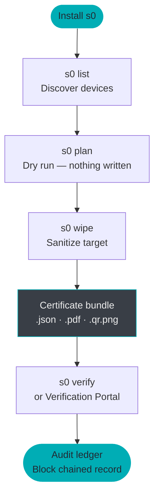

# Getting Started with s0

> [!NOTE] **Document Scope: 5-Minute Quickstart & Installation Guide**  
> This guide is intended for new users and evaluators who need to install s0, verify toolchain prerequisites, and execute their first safe dry-run in under 5 minutes.  
> For certified field sanitization procedures, bad-sector fault recovery, live bit-stream imaging, batch enterprise destruction, and legal audit chain management, consult the **[User & Forensic Operator Manual](USER_MANUAL.md)** or the **[Secure Data Erasure Guide](secure-erasure-guide.md)**.

---

**s0 (Sector Zero)** is a command-line suite that unifies two capabilities rarely found in a single open-source tool: *forensic-grade drive and file sanitization* and *deleted-file recovery from raw disk images*. Every operation it performs — wipe, erase, or carve — is automatically recorded into a SHA-256 block-chained audit ledger and sealed with an Ed25519 digital signature, giving you a tamper-evident chain of custody that holds up to forensic scrutiny.

This page takes you from a bare machine to completing your first wipe, erasure, and carve operation — in under ten minutes.

---

## Workflow at a Glance



---

## 1. Prerequisites

Before installing, confirm that the following are present on your system.

| Requirement | Minimum Version | Notes |
|---|---|---|
| **Python** | 3.10+ | Checked automatically by the install script |
| **Git** | Any recent | Required to clone the repository during install |
| **curl** | Any | Pre-installed on all modern Linux/macOS/Windows 10+ |

!!! warning "Privilege requirements by operation"
    Not all s0 operations need elevated privileges — only block-device wiping does:

    | Operation | Linux | macOS | Windows |
    |---|---|---|---|
    | Drive wipe (`s0 wipe`) | `sudo` / root | `sudo` | Administrator |
    | File erase (`s0 erase`) | No | No | No |
    | Image carve (`s0 carve`) | No | No | No |
    | List devices (`s0 list`) | No | No | No |
    | Audit / verify | No | No | No |

---

## 2. Installation

=== "Linux"

    Run the one-liner installer. It clones the repository, creates a Python virtual environment, installs all dependencies, and adds `s0` to your `PATH` automatically.

    ```bash
    # Execute universal Linux installer
    curl -sSL https://raw.githubusercontent.com/kartik2005221/s0/master/scripts/install.sh | bash
    ```

    !!! tip "What the installer does"
        The script places the `s0` launcher at `/usr/local/bin/s0` (or `~/.local/bin/s0` for non-root installs) alongside a self-contained `.venv` inside the cloned repository. You do **not** need to activate the virtual environment manually.

=== "macOS"

    The same installer script works unchanged on macOS (Apple Silicon and Intel):

    ```bash
    # Execute universal macOS installer
    curl -sSL https://raw.githubusercontent.com/kartik2005221/s0/master/scripts/install.sh | bash
    ```

    !!! warning "Homebrew Python"
        If you manage Python with Homebrew, ensure `python3 --version` reports 3.10 or newer before running the installer. The script respects the system's active `python3`.

=== "Windows — PowerShell"

    Open **PowerShell as Administrator** (right-click → *Run as administrator*) and run:

    ```powershell
    # Execute automated Windows PowerShell installer
    irm https://raw.githubusercontent.com/kartik2005221/s0/master/scripts/install.ps1 | iex
    ```

    !!! warning "Execution policy"
        If you receive a `cannot be loaded because running scripts is disabled` error, temporarily allow remote scripts:
        ```powershell
        # Temporarily enable execution of signed remote scripts
        Set-ExecutionPolicy -Scope CurrentUser RemoteSigned
        ```
        Restore it after install with `Set-ExecutionPolicy -Scope CurrentUser Restricted`.

=== "Windows — Command Prompt"

    Open **CMD as Administrator** and run:

    ```cmd
    :: Execute automated Windows CMD installer
    curl -sSL https://raw.githubusercontent.com/kartik2005221/s0/master/scripts/install.cmd | cmd
    ```

=== "Manual (All Platforms)"

    Use this approach when you need offline installation, want to audit the install script first, or intend to contribute to the codebase.

    ```bash
    # Clone repository and execute master bootstrap orchestrator
    git clone https://github.com/kartik2005221/s0.git
    cd s0
    bash scripts/build_all.sh   # (1)
    ```

    1. `build_all.sh` creates `.venv`, installs all Python dependencies, and runs the full test suite (180+ tests). Expect 1–3 minutes on first run.

    After `build_all.sh` completes, invoke s0 directly through the virtual environment:

    ```bash
    # Verify installation directly via virtualenv binary
    .venv/bin/s0 --version
    ```

    !!! tip "Add to PATH manually"
        To use `s0` without the `.venv/bin/` prefix, add the following to your shell profile (`~/.bashrc`, `~/.zshrc`, etc.):
        ```bash
        # Export s0 binary directory to PATH
        export PATH="/path/to/s0/.venv/bin:$PATH"
        ```

---

## 3. Verify Installation

Confirm the installation completed successfully:

```bash
# Print installed version string
s0 --version
```

Expected output (version numbers may differ):

```
# Output verification string
s0 version 2.0.0
```

!!! tip "Shell not finding s0?"
    If your shell reports `command not found`, open a **new terminal window** first — the installer modifies `PATH` in your shell profile, which only takes effect in new sessions. If the issue persists, check that the install location (e.g. `/usr/local/bin`) is in your `PATH`:
    ```bash
    # Inspect PATH entries for s0 binaries
    echo $PATH | tr ':' '\n' | grep -E "local/bin|s0"
    ```

---

## 4. Your First Wipe

This walkthrough sanitizes a USB drive or block device. Follow the three steps in sequence: **list → plan → wipe**.

!!! danger "This operation is irreversible"
    `s0 wipe` permanently destroys all data on the target device. Double-check the device path in each step before proceeding.

### Step 1 — Discover attached devices

```bash
# List all attached storage devices
s0 list
```

This command enumerates all block devices visible to the operating system and presents a formatted table:

```
┌───────────────────────────────────────────────────────────────────┐
│  s0 — Device Inventory                                            │
├─────────────┬─────────┬───────────────┬─────────────┬────────────┤
│  Device     │  Type   │  Size         │  Model      │  Removable │
├─────────────┼─────────┼───────────────┼─────────────┼────────────┤
│  /dev/sda   │  HDD    │  500.1 GB     │  Samsung …  │  No        │
│  /dev/sdb   │  USB    │   32.0 GB     │  SanDisk …  │  Yes       │
│  /dev/nvme0 │  NVMe   │    1.0 TB     │  WD Black … │  No        │
└─────────────┴─────────┴───────────────┴─────────────┴────────────┘
```

!!! note "Platform device paths"
    === "Linux"
        Devices appear as `/dev/sdb`, `/dev/nvme0n1`, `/dev/mmcblk0`, etc.
    === "macOS"
        Use raw disk paths for best performance: `/dev/rdisk1`, `/dev/rdisk2`, etc.
    === "Windows"
        Use physical drive notation: `\\.\PhysicalDrive1`, a drive letter like `E:`, or `\\.\PHYSICALDRIVE1`.

---

### Step 2 — Dry-run with `plan`

Before writing a single byte, run `plan` to see exactly which sanitization method s0 will apply:

```bash
# Dry run: view selected sanitization strategy without modifying data
s0 plan --target /dev/sdb
```

Sample output:

```
[s0 plan]  Target : /dev/sdb  (SanDisk Ultra, 32.0 GB, USB, Removable)
[s0 plan]  Method : OVERWRITE_ZERO_1PASS  (NIST SP 800-88 Clear)
[s0 plan]  Reason : USB mass storage — firmware Secure Erase not supported
[s0 plan]  Est.   : ~27 seconds at current throughput
[s0 plan]  No data written. Run `s0 wipe --target /dev/sdb --yes` to proceed.
```

`plan` resolves the best available sanitization method for the specific hardware — `NVME_SANITIZE` for NVMe, `ATA_SECURE_ERASE` for SATA, `BLKDISCARD` for SSD/discard-capable media, or multi-pass overwrite for HDDs and USB — without touching any data.

!!! tip "Why use plan?"
    For NVMe drives, the firmware-level `NVME_SANITIZE` command completes in under 30 seconds for any drive size. For a spinning HDD, zero-overwrite takes roughly 1 minute per 10 GB. `plan` shows you the exact method and time estimate before you commit.

---

### Step 3 — Execute the wipe

```bash
# Execute certified physical media sanitization
sudo s0 wipe --target /dev/sdb --yes \
    --operator "analyst-01" \
    --organization "Forensic Lab"
```

!!! warning "Root / Administrator required"
    Block device access requires elevated privileges. On Linux/macOS, prefix with `sudo`. On Windows, run from an Administrator terminal.

A live progress bar streams to the terminal throughout the operation:

```
# Real-time ANSI progress stream
[s0 wipe]  ████████████████░░░░  78.2%  22.6 GiB / 28.9 GiB  18.4 MB/s  ETA 05m 42s  44°C
```

When complete:

```
# Sanitization completion summary
[s0 wipe]  ✔  Sanitization complete
[s0 wipe]  Method   : OVERWRITE_ZERO_1PASS (NIST SP 800-88 Clear)
[s0 wipe]  Verified : 64-block sampled readback — PASS
[s0 wipe]  Duration : 29m 14s
[s0 wipe]  Certificate → ./certificate_a3f19c22.json
[s0 wipe]              → ./certificate_a3f19c22.pdf
[s0 wipe]              → ./certificate_a3f19c22.qr.png
[s0 wipe]  Ledger block #7 appended → SHA-256 continuity verified
```

---

## 5. Your First File Erasure

`s0 erase` operates on individual files and directories — no root access needed. It overwrites data in-place at the cluster level, zeroes filesystem timestamps, and scrambles directory entry names before unlinking.

```bash
# Execute in-place cluster sanitization on target files and directories
s0 erase \
    --targets /path/to/classified_report.pdf /path/to/sensitive_folder/ \
    --passes 1
```

| Flag | Purpose |
|---|---|
| `--targets` | Space-separated list of files and/or directories |
| `--passes` | Number of overwrite passes (1 = NIST Clear; 3 = additional assurance) |

!!! tip "Batch erasure"
    You can mix files and directories freely: `--targets file1.pdf dir1/ file2.docx dir2/nested/`. s0 recursively processes directories and emits a single consolidated certificate for the entire batch.

Sample output:

```
# File erasure progress output
[s0 erase]  Processing 2 target(s)...
[s0 erase]  ✔  classified_report.pdf   — 4.2 MB  overwritten (1 pass), timestamps zeroed, unlinked
[s0 erase]  ✔  sensitive_folder/       — 23 files / 81.4 MB  overwritten (1 pass), metadata scrubbed
[s0 erase]  Certificate → ./certificate_b88f4d01.json
[s0 erase]              → ./certificate_b88f4d01.pdf
[s0 erase]              → ./certificate_b88f4d01.qr.png
```

!!! warning "Copy-on-Write filesystems (Btrfs, ZFS, APFS, ReFS)"
    On CoW filesystems, in-place overwrite may not reach the original data blocks — the filesystem transparently redirects writes to new locations. s0 detects CoW filesystems and emits a warning. See [Limitations & Boundaries](LIMITATIONS.md) for the full engineering disclosure.

---

## 6. Your First Carve

The carver recovers deleted files from raw disk images — no root access needed, and it works entirely on image files, so your original evidence drive is never touched.

!!! info "What is a disk image?"
    A disk image (`.raw`, `.img`, `.dd`) is a byte-for-byte copy of a storage device. You can create one from a physical drive with standard forensic tools (`s0 image`, `dd`, `dcfldd`). s0's carver then operates on this image without any risk of modifying the original evidence.

```bash
# Extract deleted forensic evidence from raw image file
s0 carve \
    --target /evidence/suspect_drive.raw \
    --out-dir ./recovered_evidence \
    --extensions jpg,png,pdf,zip \
    --min-confidence 50
```

| Flag | Purpose |
|---|---|
| `--target` | Path to the disk image (or live block device with root) |
| `--out-dir` | Directory where carved files will be written |
| `--extensions` | Comma-separated list of file types to recover |
| `--min-confidence` | Score threshold 0–100; files scoring below this are discarded |

**Supported file types:** `jpg`, `png`, `pdf`, `zip`, `docx`, `xlsx`, `gif`, `bmp`, `elf`, `mp3`, `sqlite`, `gz`

**Supported filesystem structures:** ext4, NTFS (`$MFT`), FAT32, exFAT — plus raw signature carving that works on any filesystem (or no filesystem at all).

Live output streams a progress bar and a rolling found-file counter:

```
# Terminal status line output
[s0 carve]  ████████░░░░░░░░░░░░  35.4%  10.2 GiB / 28.9 GiB  142 MB/s   ETA 02m 10s  Found: 36,790
```

When complete:

```
# Evidence recovery completion summary
[s0 carve]  ✔  Carving complete
[s0 carve]  Files recovered : 1,247  (above 50% confidence)
[s0 carve]  Output          : ./recovered_evidence/
[s0 carve]  Manifest        : ./recovered_evidence/carve_manifest_9e4a1b77.json  (Ed25519-signed)
[s0 carve]  Ledger block #8 appended → SHA-256 continuity verified
```

!!! tip "Confidence score explained"
    Each recovered file is scored 0–100 based on four factors:

    | Factor | Weight | What it checks |
    |---|---|---|
    | Header magic match | 30% | File type byte signature at offset 0 |
    | Footer magic match | 30% | End-of-file marker presence |
    | Size plausibility | 20% | File size within expected bounds for the type |
    | Shannon entropy | 20% | Data randomness consistent with the file type |

    A score of 50 is a reasonable default. Raise to 70–80 for highest-confidence files only; lower to 30 to capture more fragments at the cost of some false positives.

---

## 7. Understanding the Output

Every `s0 wipe` and `s0 erase` operation produces a **certificate bundle** — three files tied to a single UUID:

```
# Certificate bundle files
certificate_a3f19c22.json      # (1) Machine-readable canonical payload
certificate_a3f19c22.pdf       # (2) Official printable PDF with QR
certificate_a3f19c22.qr.png    # (3) Standalone verification QR code
```

1. **Machine-readable** — Canonical JSON payload with Ed25519 signature. Submit to `s0 verify` or drag-and-drop into the [Verification Portal](https://s0-vp.vercel.app/).
2. **Human-readable** — Formatted PDF report: operator name, organization, target device, method, sectors verified, timestamp, and embedded QR code. Court-admissible artifact.
3. **Optical verification** — Standalone QR image. Scan with any smartphone camera → opens the certificate pre-loaded in the Verification Portal.

The `carve` command produces a **signed manifest** instead:

```
# Forensic carving manifest
carve_manifest_9e4a1b77.json   # Signed list of all recovered files + SHA-256 hashes
```

!!! info "Where are certificates saved?"
    By default, certificates are written to the **current working directory** from which you ran `s0`. Pass `--out-dir /path/to/output/` to any command to specify a custom location.

### Audit Ledger

Every operation also appends a cryptographic block to `~/.s0/s0_audit.db`:

```bash
# View the 25 most recent operations
s0 audit list --limit 25

# Verify the entire chain has not been tampered with
s0 audit verify
```

`audit verify` traverses from the genesis block to the latest tip and confirms that every `prev_hash` matches the preceding block's `block_hash`. Any alteration — even editing a single character in the SQLite file — breaks the chain and is immediately flagged.

---

## 8. Verifying a Certificate

You have three independent ways to verify any s0 certificate, all of which work completely offline:

=== "CLI"

    ```bash
    # Verify certificate signature against demo authority key
    s0 verify certificate_a3f19c22.json --key core/keys/demo_issuer_public.pem
    ```

    Expected output on a valid certificate:

    ```
    # Cryptographic verification summary
    [s0 verify]  ✔  Signature VALID
    [s0 verify]  Issuer    : s0 Demo Authority
    [s0 verify]  Target    : /dev/sdb  (SanDisk Ultra, 32.0 GB)
    [s0 verify]  Method    : OVERWRITE_ZERO_1PASS
    [s0 verify]  Operator  : analyst-01 / Forensic Lab
    [s0 verify]  Timestamp : 2026-09-09T13:31:00Z
    ```

=== "Browser (Drag & Drop)"

    1. Open [s0-vp.vercel.app](https://s0-vp.vercel.app/) — or open `verification-portal/index.html` locally for full air-gap operation.
    2. Drag and drop `certificate_a3f19c22.json` onto the portal.
    3. The portal verifies the Ed25519 signature using pure WebCrypto — **no data is ever uploaded to a server**.

=== "QR Code"

    Scan the QR code from the PDF certificate (or `certificate_a3f19c22.qr.png`) with any smartphone camera. The QR encodes a link that pre-loads the certificate data into the Verification Portal — still 100% client-side.

!!! tip "Air-gap verification"
    For classified environments with no internet access, copy the `verification-portal/` directory to your air-gapped machine and open `index.html` directly in any browser. The portal is a static single-page application with zero external dependencies.

---

## 9. Uninstallation

=== "Linux / macOS"

    ```bash
    # Download and run the automated uninstaller
    curl -sSL https://raw.githubusercontent.com/kartik2005221/s0/master/scripts/uninstall.sh | bash
    ```

    This removes the `s0` launcher from `PATH` and optionally removes the cloned repository. Your audit database at `~/.s0/s0_audit.db` is **not** deleted by default — preserve it for chain-of-custody records.

=== "Windows — PowerShell"

    ```powershell
    # Execute the Windows PowerShell automated uninstaller
    irm https://raw.githubusercontent.com/kartik2005221/s0/master/scripts/uninstall.ps1 | iex
    ```

!!! warning "Preserve your audit database"
    The ledger at `~/.s0/s0_audit.db` (Linux/macOS) or `%USERPROFILE%\.s0\s0_audit.db` (Windows) is the canonical chain-of-custody record for every operation s0 has performed. Back it up before uninstalling if you need to retain those records.

---

## 10. Next Steps

Now that you have s0 installed and have run your first operations, explore the deeper documentation:

<div class="grid cards" markdown>

-   :material-book-open-page-variant: __Full CLI Reference__

    ---

    Every flag, every subcommand, and every option — with examples covering NVMe Secure Erase, SATA Enhanced Erase, multi-pass patterns, and batch file sanitization.

    [:octicons-arrow-right-24: CLI Reference](cli-reference.md)

-   :material-shield-check: __Compliance & Standards__

    ---

    How each sanitization method maps to NIST SP 800-88 *Clear* and *Purge* tiers, IEEE 2883-2022, ISO/IEC 27037, and DPDPA 2023.

    [:octicons-arrow-right-24: Compliance Matrix](COMPLIANCE.md)

-   :material-layers: __System Architecture__

    ---

    Subsystem design, the cryptographic flow from raw operation to signed certificate, and the blockchain audit ledger block-hash formula.

    [:octicons-arrow-right-24: Architecture](ARCHITECTURE.md)

-   :material-disc: __Bare-Metal Live ISO__

    ---

    Build a bootable Debian Live ISO with s0 pre-installed — ideal for sanitizing machines that cannot boot their own OS.

    [:octicons-arrow-right-24: Live ISO Build Guide](LIVE_ISO_BUILD_GUIDE.md)

-   :material-alert-circle: __Limitations & Boundaries__

    ---

    Honest engineering disclosure: SSD FTL wear-leveling, Copy-on-Write filesystem caveats, journaling remnants, and hardware secure-erase command availability.

    [:octicons-arrow-right-24: Limitations](LIMITATIONS.md)

-   :material-web: __Verification Portal__

    ---

    Deploy the offline certificate verifier or understand how Ed25519 key pinning and air-gap verification work.

    [:octicons-arrow-right-24: Verification & Deployment](VERIFICATION_AND_DEPLOYMENT.md)

</div>
