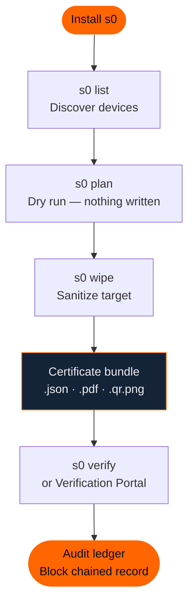

# Getting Started with s0


**Document Scope: 5-Minute Quickstart & Installation Guide**
This guide is intended for new users and evaluators who need to install s0, verify toolchain prerequisites, and execute their first safe dry-run in under 5 minutes.

For standard field sanitization procedures, bad-sector fault recovery, live bit-stream imaging, batch enterprise destruction, and legal audit chain management, consult the **[User & Forensic Operator Manual](../guides/user-manual.md)** or the **[Secure Data Erasure Guide](../guides/secure-erasure.md)**.


---

**s0 (Sector Zero)** is a command-line suite that unifies two capabilities rarely found in a single open-source tool: *forensic-grade drive and file sanitization* and *deleted-file recovery from raw disk images*. Every operation it performs — wipe, erase, or carve — is automatically recorded into a SHA-256 block-chained audit ledger and sealed with an Ed25519 digital signature, giving you a tamper-evident chain of custody that holds up to forensic scrutiny.

This page takes you from a bare machine to completing your first wipe, erasure, and carve operation — in under ten minutes.

---

## Workflow at a Glance



---

## 1. Prerequisites

Before installing, confirm that the following are present on your system.

| Requirement | Minimum Version | Notes |
|---|---|---|
| **Python** | 3.10+ | Checked automatically by the install script |
| **Git** | Any recent | Required to clone the repository during install |
| **curl** | Any | Pre-installed on all modern Linux/MacOS/Windows 10+ |


**Privilege requirements by operation**
Not all s0 operations need elevated privileges — only block-device wiping does:

| Operation | Linux | macOS | Windows |
|---|---|---|---|
| Drive wipe (`s0 wipe`) | `sudo` / root | `sudo` | Administrator |
| File erase (`s0 wipe --targets`) | No | No | No |
| Image carve (`s0 carve`) | No | No | No |
| List devices (`s0 list`) | No | No | No |
| Audit / verify | No | No | No |



**Legal & Responsible Use Requirement**
s0 is a digital forensic sanitization and recovery tool. You must **only** operate on storage media and files that you **legally own** or have **explicit, documented authorization** to process. Operating on unauthorized systems or drives may violate computer crime laws (e.g., CFAA 18 U.S.C. § 1030, Computer Misuse Act, IT Act 2000). See the [Legal FAQ](faq.md#0-legal-ethical-use).


---

## 2. Installation



Run the one-line installer in Bash or Zsh. It verifies prerequisites, sets up an isolated Python virtual environment at `~/.s0`, and registers the `s0` executable in your `PATH`:

```bash
curl -fsSL https://s0-install.pages.dev/sh | bash
```


**Apple Silicon & Intel support**
On macOS, the installer automatically detects Apple Silicon (M1–M4) and Intel architectures. Ensure Python 3.10+ is installed (e.g. via Homebrew: `brew install python3`).



Open **PowerShell** (run as administrator for direct physical drive access):

```powershell
irm https://s0-install.pages.dev/ps1 | iex
```


**Execution policy**
If you receive a `cannot be loaded because running scripts is disabled` error, temporarily allow remote scripts:
```powershell
Set-ExecutionPolicy -Scope CurrentUser RemoteSigned
```



Open **Command Prompt**:

```cmd
curl -fsSL https://s0-install.pages.dev/cmd -o s0-install.cmd && s0-install.cmd && del s0-install.cmd
```


For offline installation, auditing the codebase, or local development:

```bash
git clone https://github.com/kartik2005221/s0.git
cd s0
bash scripts/build_all.sh
```

After `build_all.sh` finishes, invoke s0 directly through the virtual environment:

```bash
.venv/bin/s0 --version
```


**Add to PATH manually**
To use `s0` without the `.venv/bin/` prefix, add the following to your shell profile (`~/.bashrc`, `~/.zshrc`, etc.):
```bash
export PATH="/path/to/s0/.venv/bin:$PATH"
```




---

## 3. Verify Installation

Confirm the installation completed successfully:

```bash
s0 --version
```

Expected output (version numbers may differ):

```
s0 2.4.4
```


**Shell not finding s0?**
If your shell reports `command not found`, open a **new terminal window** first — the installer modifies `PATH` in your shell profile, which only takes effect in new sessions. If the issue persists, check that the install location (e.g. `/usr/local/bin` or `~/.local/bin`) is in your `PATH`:
```bash
echo $PATH | tr ':' '\n' | grep -E "local/bin|s0"
```


---

## 4. Your First Wipe

This walkthrough sanitizes a USB drive or block device. Follow the three steps in sequence: **list → plan → wipe**.


**This operation is irreversible**
`s0 wipe` permanently destroys all data on the target device. Double-check the device path in each step before proceeding.


### Step 1 — Discover attached devices

```bash
s0 list
```

This command enumerates all block devices visible to the operating system and presents a formatted table:

```text
PATH           TYPE    STORAGE        CAPACITY  MODEL                    SERIAL           MOUNTED?  OS_DRIVE?
/dev/sda       block   SSD           465.8 GiB  Samsung SSD 870 EVO      S5YANG0N123456K  YES       -
/dev/nvme0n1   block   NVMe          931.5 GiB  Samsung SSD 980 PRO 1TB  S464NX0M789012A  YES       YES [OS]
/dev/sdb       block   USB            28.9 GiB  SanDisk Ultra Fit        4C5300012309181  -         -
```


**Platform device paths:**

* **Linux:** Devices appear as `/dev/sdb`, `/dev/nvme0n1`, `/dev/mmcblk0`, etc.
* **macOS:** Use raw disk paths for best performance: `/dev/rdisk1`, `/dev/rdisk2`, etc.
* **Windows:** Use physical drive notation: `\\.\PhysicalDrive1`, a drive letter like `E:`, or `\\.\PHYSICALDRIVE1`.


---

### Step 2 — Dry-run with `plan`

Before writing a single byte, run `plan` to see exactly which sanitization method s0 will apply:

```bash
s0 plan --target /dev/sdb
```

Sample output:

```
[s0 plan]  Target        : /dev/sdb (block, USB, 29.8 GiB)
[s0 plan]  Method        : OVERWRITE_ZERO_1PASS
[s0 plan]  NIST Category : Clear
[s0 plan]  Summary       : 1-pass zero overwrite of /dev/sdb; fsync each pass
[s0 plan]  Commands      :
[s0 plan]    - open(/dev/sdb, O_WRONLY) + sequential write + fsync
[s0 plan]  Warnings      :
[s0 plan]    ! Overwrite claims NIST Clear only — firmware erase would be required for Purge.
[s0 plan]  Alternatives  :
[s0 plan]    - [unavailable] firmware erase: USB mass storage does not expose controller sanitize

[s0 plan]  DRY RUN — nothing was written. Run `s0 wipe` when satisfied.
```

`plan` resolves the best available sanitization method for the specific hardware — `NVME_SANITIZE` for NVMe, `ATA_SECURE_ERASE` for SATA, `BLKDISCARD` for SSD/discard-capable media, or multi-pass overwrite for HDDs and USB — without touching any data.


**Why use plan?**
For NVMe drives, the firmware-level `NVME_SANITIZE` command completes in under 30 seconds for any drive size. For a spinning HDD, zero-overwrite takes roughly 1 minute per 10 GB. `plan` shows you the exact method and time estimate before you commit.


---

### Step 3 — Execute the wipe

```bash
sudo s0 wipe --target /dev/sdb --yes \
    --operator "analyst-01" \
    --organization "Forensic Lab"
```


**Root / Administrator required**
Block device access requires elevated privileges. On Linux/MacOS, prefix with `sudo`. On Windows, run from an Administrator terminal.


When complete:

```text
[s0 wipe]  Result        : success
[s0 wipe]  Verification  : {"samples": 64, "all_samples_match_wipe_pattern": true}
[s0 wipe]  Audit Ledger  : recorded block #7 (3a8f1b2c4d5e6f70...)
[s0 wipe]  Certificate   : ./certificate_a3f19c22.json
[s0 wipe]  PDF           : ./certificate_a3f19c22.pdf
```

---

## 5. Your First File & Folder Erasure

`s0 wipe` supports targeted file and directory sanitization without root access. Both single-path and batch-path invocations are supported:

- **Single file or directory:** Pass `--target <path>`. The engine auto-detects that the target is a file or directory rather than a block device and invokes file sanitization mode.
- **Batch files and directories:** Pass `--targets <path1> <path2> ...`.

The engine overwrites file extents in-place at the cluster level, resets inode/metadata timestamps to Unix epoch zero (1970-01-01), purges NTFS Alternate Data Streams (on Windows), flushes hardware caches, and scrambles directory entry filenames before unlinking.

```bash
s0 wipe --target /path/to/classified_report.pdf

s0 wipe \
    --targets /path/to/classified_report.pdf /path/to/sensitive_folder/ \
    --passes 1
```

| Flag | Purpose |
|---|---|
| `--target` | Single file, directory, or storage device |
| `--targets` | Multiple files and/or directories for batch sanitization |
| `--passes` | Number of overwrite passes (1 = NIST Clear; 3 = additional assurance) |


**Batch erasure**
You can mix files and directories freely: `--targets file1.pdf dir1/ file2.docx dir2/nested/`. s0 recursively processes directories and emits a single consolidated certificate for the entire batch.


Sample output:

```
[s0 wipe]  Auto-detected 2 file/directory target(s)
[s0 wipe]  Processing 2 target(s)...
[s0 wipe]  [OK]  classified_report.pdf   — 4.2 MB  overwritten (1 pass), timestamps zeroed, unlinked
[s0 wipe]  [OK]  sensitive_folder/       — 23 files / 81.4 MB  overwritten (1 pass), metadata scrubbed
[s0 wipe]  Certificate → ./certificate_b88f4d01.json
[s0 wipe]              → ./certificate_b88f4d01.pdf
[s0 wipe]              → ./certificate_b88f4d01.qr.png
```


**Copy-on-Write filesystems (Btrfs, ZFS, APFS, ReFS)**
On CoW filesystems, in-place overwrite may not reach the original data blocks — the filesystem transparently redirects writes to new locations. s0 detects CoW filesystems and emits a warning. See [Limitations & Boundaries](../compliance/limitations.md) for the full engineering disclosure.


---

## 6. Your First Forensic File Carve

The carver reconstructs deleted files from raw disk images or storage devices. Operating on disk images requires no root access and ensures original evidence media remains strictly write-blocked.


**Live Root Filesystem Advisory**
Carving against an actively running host operating system drive is strongly discouraged. Continuous OS background writes, journal updates, swap/paging activity, and automatic SSD TRIM commands overwrite deallocated clusters in real time, drastically reducing evidence recovery yield. Always acquire a bit-stream disk image (`s0 image`) or boot the bare-metal [s0 Live ISO](../guides/live-iso.md) for forensic recovery.


```bash
s0 carve \
    --target /evidence/suspect_drive.raw \
    --out-dir ./recovered_evidence \
    --extensions jpg,png,pdf,zip \
    --min-confidence 50
```

| Flag | Purpose |
|---|---|
| `--target` | Path to the disk image (`.raw`, `.img`, `.dd`) or block device |
| `--out-dir` | Directory where carved files will be written |
| `--extensions` | Comma-separated list of file extensions to recover (or omit to carve all supported types) |
| `--min-confidence` | Score threshold 0–100; files scoring below this are discarded |

**Supported file formats:** s0 includes 19 built-in binary signature definitions across 16 primary formats:
- **Documents & Data:** `pdf`, `zip` (covers Office OpenXML `.docx`, `.xlsx`, `.pptx`), `sqlite`
- **Images:** `jpg` (JPEG), `png` (PNG), `gif` (GIF87a/89a), `bmp` (Bitmap)
- **Audio:** `mp3` (ID3v2 & MPEG sync frames), `wav` (RIFF), `flac` (FLAC), `ogg` (OggS)
- **Archives & Binaries:** `7z` (7-Zip), `gz` (Gzip), `elf` (Linux ELF binaries)
- **Network Captures:** `pcap` (Wireshark/tcpdump capture), `pcapng` (Next-Gen capture)

Custom signature definitions can also be supplied via JSON with `--custom-signatures`.

**Filesystem structure parsing:** ext4 (extent trees), NTFS (`$MFT` runlists), FAT32, exFAT — plus raw sliding-window carving with 4-factor Shannon entropy scoring.

When complete:

```text
[s0 carve]  Bytes Scanned    : 32000000000
[s0 carve]  Candidates Found : 1247
[s0 carve]  Files Recovered  : 1247
[s0 carve]  Audit Ledger     : recorded block #8 (9a8b7c6d5e4f3a2b...)
[s0 carve]  Manifest File    : ./recovered_evidence/carve_manifest_9e4a1b77.json
```


**Confidence score explained**
Each recovered file is scored 0–100 based on four factors:

| Factor | Weight | What it checks |
|---|---|---|
| Header magic match | 30% | File type byte signature at offset 0 |
| Footer magic match | 30% | End-of-file marker presence |
| Size plausibility | 20% | File size within expected bounds for the type |
| Shannon entropy | 20% | Data randomness consistent with the file type |

A score of 50 is a reasonable default. Raise to 70–80 for highest-confidence files only; lower to 30 to capture more fragments at the cost of some false positives.


---

## 7. Understanding the Output

Every `s0 wipe` operation produces a **certificate bundle** — three files tied to a single UUID:

```
certificate_a3f19c22.json      # (1) Machine-readable canonical payload
certificate_a3f19c22.pdf       # (2) Official printable PDF with QR
certificate_a3f19c22.qr.png    # (3) Standalone verification QR code
```

1. **Machine-readable** — Canonical JSON payload with Ed25519 signature. Submit to `s0 verify` or drag-and-drop into the [Verification Portal](https://s0-verify.pages.dev/).
2. **Human-readable** — Formatted PDF report: operator name, organization, target device, method, sectors verified, timestamp, and embedded QR code. Court-admissible artifact.
3. **Optical verification** — Standalone QR image. Scan with any smartphone camera → opens the certificate pre-loaded in the Verification Portal.

The `carve` command produces a **signed manifest** instead:

```
carve_manifest_9e4a1b77.json   # Signed list of all recovered files + SHA-256 hashes
```


**Where are certificates saved?**
By default, certificates are written to the **current working directory** from which you ran `s0`. Pass `--out-dir /path/to/output/` to any command to specify a custom location.


---

## 8. Hash-Chained Audit Ledger

Every operation also appends a cryptographic block to `~/.s0/s0_audit.db`:

```bash
s0 audit list --limit 25

s0 audit verify
```

`audit verify` traverses from the genesis block to the latest tip and confirms that every `prev_hash` matches the preceding block's `block_hash`. Any alteration — even editing a single character in the SQLite file — breaks the chain and is immediately flagged.

---

## 9. Verifying a Certificate

You have three independent ways to verify any s0 certificate, all of which work completely offline:




```bash
s0 verify certificate_a3f19c22.json --key src/s0/data/keys/demo_issuer_public.pem
```

Expected output on a valid certificate:

```text
[s0 verify]  Status       : OK : CERTIFICATE AUTHENTIC & VERIFIED
[s0 verify]  Issuer       : s0 Demo Authority
[s0 verify]  Target       : /dev/sdb (SanDisk Ultra, 32.0 GB)
[s0 verify]  Method       : OVERWRITE_ZERO_1PASS
[s0 verify]  Operator     : analyst-01 / Forensic Lab
[s0 verify]  Timestamp    : 2026-09-09T13:31:00Z
```



1. Open [s0-verify.pages.dev](https://s0-verify.pages.dev/) — or open `verification-portal/index.html` locally for full air-gap operation.
2. Drag and drop `certificate_a3f19c22.json` onto the portal.
3. The portal verifies the Ed25519 signature using pure WebCrypto — **no data is ever uploaded to a server**.



Scan the QR code from the PDF certificate (or `certificate_a3f19c22.qr.png`) with any smartphone camera. The QR encodes a link that pre-loads the certificate data into the Verification Portal — still 100% client-side.




**Air-gap verification**
For classified environments with no internet access, copy the `verification-portal/` directory to your air-gapped machine and open `index.html` directly in any browser. The portal is a static single-page application with zero external dependencies.


---

## 10. Upgrade & Uninstallation

### Upgrading s0



```bash
curl -fsSL https://s0-install.pages.dev/upgrade-sh | bash
```

Alternatively, from within an existing git clone:
```bash
s0 upgrade
```


```powershell
irm https://s0-install.pages.dev/upgrade-ps1 | iex
```


```cmd
curl -fsSL https://s0-install.pages.dev/upgrade-cmd -o s0-upgrade.cmd && s0-upgrade.cmd && del s0-upgrade.cmd
```



### Uninstalling s0



```bash
curl -fsSL https://s0-install.pages.dev/uninstall-sh | bash
```

This removes the `s0` launcher from `PATH` and removes the local virtual environment. Your audit database at `~/.s0/s0_audit.db` is **not** deleted by default — preserve it for chain-of-custody records.


```powershell
irm https://s0-install.pages.dev/uninstall-ps1 | iex
```


```cmd
curl -fsSL https://s0-install.pages.dev/uninstall-cmd -o s0-uninstall.cmd && s0-uninstall.cmd && del s0-uninstall.cmd
```




**Preserve your audit database**
The ledger at `~/.s0/s0_audit.db` (Linux/MacOS) or `%USERPROFILE%\.s0\s0_audit.db` (Windows) is the canonical chain-of-custody record for every operation s0 has performed. Back it up before uninstalling if you need to retain those records.


---

## 11. Workspace Configuration (`s0_config.json`)

To eliminate the need for passing repeated command-line arguments and ensure organizational consistency across all workstation interfaces, `s0` automatically reads `s0_config.json` at the root of the repository or the current working directory (override path via the `S0_CONFIG_PATH` environment variable):

```json
{
  "version": "2.4.4",
  "tool_name": "s0",
  "tool_title": "Sector Zero — Unified Forensic & Sanitization Workstation",
  "website_url": "https://s0-site.pages.dev/",
  "documentation_url": "https://s0-docs.gitbook.io/",
  "verification_portal_url": "https://s0-verify.pages.dev/",
  "install_portal_url": "https://s0-install.pages.dev/",
  "github_url": "https://github.com/kartik2005221/s0",
  "default_operator": "op-forensic",
  "default_organization": "Digital Forensics & Data Sanitization Lab",
  "default_key_path": "src/s0/data/keys/demo_issuer_private.pem",
  "default_public_key_path": "src/s0/data/keys/demo_issuer_public.pem",
  "default_out_dir": "demo-out",
  "qr_url_template": "https://s0-verify.pages.dev/?cert={cert_uuid}",
  "api_port": 8669
}
```

Every command line interface (`s0 wipe`, `s0 carve`, `s0 image`), macOS/Windows CLI tool, Web Dashboard, and Verification Portal automatically derives its operational defaults from this central file.

---

## 12. Next Steps


Now that you have s0 installed and have run your first operations, explore the deeper documentation:

<table data-view="cards">
  <thead>
    <tr>
      <th></th>
      <th></th>
      <th data-hidden data-card-target data-type="content-ref"></th>
    </tr>
  </thead>
  <tbody>
    <tr>
      <td><strong>Full CLI Reference</strong></td>
      <td>Every flag, subcommand, and option with examples covering NVMe, SATA, and batch file erasure.</td>
      <td><a href="../guides/cli-reference.md">CLI Reference</a></td>
    </tr>
    <tr>
      <td><strong>Compliance &amp; Standards</strong></td>
      <td>How each method maps to NIST SP 800-88 Clear and Purge tiers, IEEE 2883-2022, and ISO/IEC 27037:2012.</td>
      <td><a href="../compliance/nist-compliance.md">Compliance Matrix</a></td>
    </tr>
    <tr>
      <td><strong>System Architecture</strong></td>
      <td>Subsystem design, cryptographic flow to signed certificates, and hash-chained audit ledger block-hash formula.</td>
      <td><a href="../architecture/system-architecture.md">Architecture</a></td>
    </tr>
    <tr>
      <td><strong>Bare-Metal Live ISO</strong></td>
      <td>Build a bootable Live ISO with s0 pre-installed for offline host drive sanitization and evidence acquisition.</td>
      <td><a href="../guides/live-iso.md">Live ISO Guide</a></td>
    </tr>
    <tr>
      <td><strong>Limitations &amp; Boundaries</strong></td>
      <td>Honest engineering disclosure: SSD FTL wear-leveling, Copy-on-Write caveats, and journaling remnants.</td>
      <td><a href="../compliance/limitations.md">Limitations</a></td>
    </tr>
    <tr>
      <td><strong>Agentic AI Safety</strong></td>
      <td>Safety guidelines and prompt protocols for autonomous AI coding agents performing forensic tasks.</td>
      <td><a href="../project/agentic-ai.md">Agentic AI Guide</a></td>
    </tr>
    <tr>
      <td><strong>Verification Portal</strong></td>
      <td>Deploy the offline certificate verifier, Ed25519 key pinning, and air-gap verification.</td>
      <td><a href="../architecture/verification.md">Verification Guide</a></td>
    </tr>
  </tbody>
</table>

