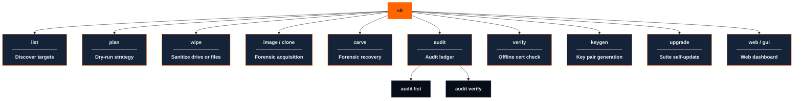
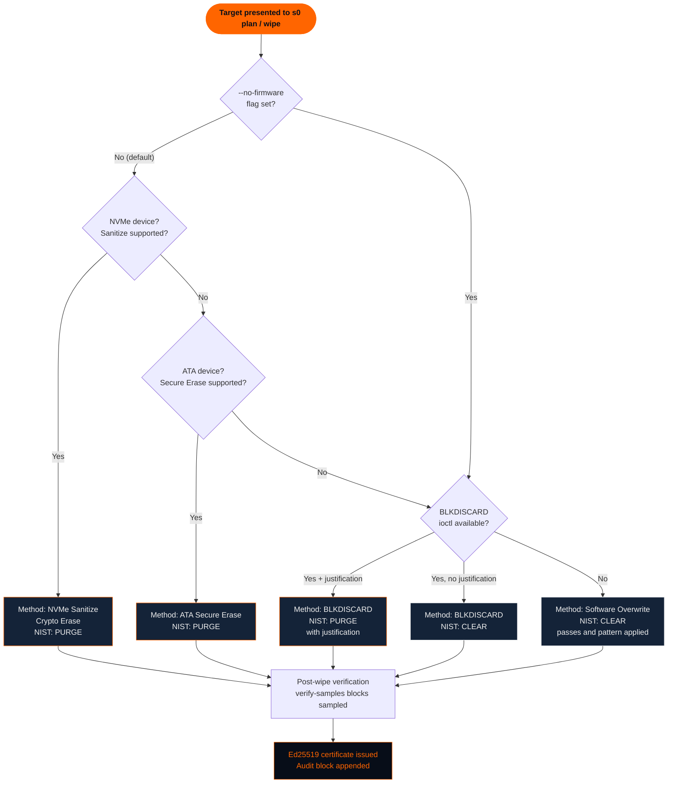

# CLI Reference

<p style="font-size: 1.1rem; color: #00adb5; font-weight: 600; margin-top: -0.4rem;">
  Complete flag-level documentation for every <code>s0</code> subcommand.
</p>

`s0` is a single unified binary that exposes ten subcommands covering the full lifecycle of forensic media sanitization, bit-stream acquisition, file carving, cryptographic verification, and certificate management. Every subcommand follows the same structural contract: human-readable defaults, `--json` machine-readable output where applicable, and cryptographically signed audit trails for every destructive or forensic operation.

---

## Command Hierarchy

```bash
s0 [--version] <subcommand> [flags]
```



---

## Global Flags

| Flag | Description |
|------|-------------|
| `--version` | Print the `s0` version string and exit. |

### Accepted on every subcommand

These are attached to every subcommand by a post-pass over the parser tree, so a
script can pass them anywhere without knowing which command it landed on:

| Flag | Short | Description |
|------|-------|-------------|
| `--format` | | Output format: `text`, `json`, or `csv`. `text` is the human format and is written to **stderr** — stdout stays empty. |
| `--json` | | Shorthand for `--format json`. |
| `--quiet` | `-q` | Suppress progress bars and banners; results are unaffected. |
| `--verbose` | `-v` | Increase diagnostic detail on stderr (`-v` info, `-vv` debug). |
| `--color` | | Colour output: `auto`, `always`, `never`. `auto` honours `NO_COLOR` and TTY detection. |
| `--no-color` | | Disable colour output (same as `--color never`). |
| `--yes` | `-y` | Assume yes for destructive confirmations. |
| `--dry-run` | | Plan only; never write to the target. |

### stdout is for machines, stderr is for humans

This is worth stating once, because getting it wrong is the most common way a
script ends up with an empty file and no error.

| Format | stdout | stderr |
|---|---|---|
| `text` (default) | **empty** | tables, headings, warnings, progress |
| `json` | one JSON envelope | diagnostics only |
| `csv` | header row + data rows | diagnostics only |

So `s0 list > devices.txt` writes an empty file, by design: the human table went to
the terminal, not into your file. `s0 list --format csv > devices.csv` is what you
want, and `s0 list --json` if you would rather parse it.

The alternative — making `text` degrade to one record per line when stdout is not a
terminal — was specified here once and never implemented. It is also the worse
design: the *same* flag would produce two different formats depending on whether a
terminal happened to be attached, so a script would work interactively and silently
produce something else in a pipeline. If you want records, ask for `csv` or `json`
and they will be the same everywhere.

Two consequences worth knowing:

* `s0 <cmd> --json` always emits a parseable envelope, even when the command fails.
  Check the `status` field; do not rely on the exit code alone.
* Only `json` and `csv` write to stdout, so `s0 <cmd> --format text | grep ...`
  finds nothing. Redirect stderr (`2>&1`) if you want to search the human output.

### Long-form aliases

These are **aliases, not global flags** — each is a second spelling of a flag that
exists on one or more specific subcommands. Both spellings are accepted
interchangeably wherever they appear:

| Alias | Canonical flag | Accepted by |
|-------|----------------|-------------|
| `--operator-id` | `--operator` | `wipe`, `carve`, `image` / `clone` |
| `--signing-key` | `--key` | `wipe`, `carve`, `image` / `clone` |

```bash
s0 wipe --target /dev/sdb --operator-id "analyst-42" --signing-key ~/.s0/lab_private.pem --yes

s0 carve --target evidence.raw --out-dir ./recovered --operator-id "analyst-42" --signing-key ~/.s0/lab_private.pem
```

---

## s0 list

List all block-device targets visible to the system, with metadata useful for selecting a wipe target. Image files (`.raw`, `.img`, `.dd`) are also valid targets for every other subcommand and require no root privileges.




```bash
s0 list [--format {text,json}]
```



| Flag | Type | Default | Description |
|------|------|---------|-------------|
| `--format` | `text` \| `json` | `text` | Render output as a human-readable table or machine-readable JSON array. |

**Output columns (text mode)**

| Column | Description |
|--------|-------------|
| `PATH` | Kernel device path (e.g. `/dev/sda`, `/dev/nvme0n1`) |
| `TYPE` | Target kind: `block` (hardware disk or partition) or `image` (disk image file) |
| `STORAGE` | Storage bus/medium: `NVMe`, `SSD`, `HDD`, `eMMC`, `IMAGE_FILE`, `UNKNOWN` |
| `CAPACITY` | Formatted size (e.g. `465.8 GiB`, `931.5 GiB`) |
| `MODEL` | Drive model string from kernel / sysfs |
| `SERIAL` | Drive serial number from kernel / sysfs |
| `MOUNTED?` | `YES` / `-` — whether any partition is currently mounted |
| `OS_DRIVE?` | `YES [OS]` / `-` — whether target hosts the running root/OS filesystem |



```
usage: s0 list [-h] [--format {text,json,csv}] [--json] [--quiet] [--verbose]
               [--color {auto,always,never}] [--no-color] [--yes] [--dry-run]

options:
  -h, --help            show this help message and exit

output:
  --format {text,json,csv}
                        output format. 'text' is for humans and is written to stderr, tables and
                        all; stdout stays empty. Use 'json' or 'csv' to get anything on stdout
                        that a script can read
  --json                shorthand for --format json
  --quiet, -q           suppress progress bars and banners; results are unaffected
  --verbose, -v         increase diagnostic detail on stderr (-v info, -vv debug)
  --color {auto,always,never}
                        colour output; 'auto' honours NO_COLOR and TTY detection
  --no-color            disable colour output (same as --color never)

execution:
  --yes, -y             assume yes for destructive confirmations
  --dry-run             plan only; never write to the target
```



- **Output Format (`--format`)**:
    - **`text` (Default / Recommended for Operators)**: Clean ASCII tabular view with explicit headers. Recommended for field technicians confirming physical drive labels against serial numbers before initiating sanitization.
    - **`json` (Recommended for Automation & Agents)**: Returns a typed JSON array. Recommended when piping to `jq`, feeding downstream bash loops, or running autonomous forensic triage agents.



**Human-readable table (default)**
```bash
s0 list
```
```text
PATH           TYPE    STORAGE        CAPACITY  MODEL                    SERIAL           MOUNTED?  OS_DRIVE?
/dev/sda       block   SSD           465.8 GiB  Samsung SSD 870 EVO      S5YANG0N123456K  YES       -
/dev/nvme0n1   block   NVMe          931.5 GiB  Samsung SSD 980 PRO 1TB  S464NX0M789012A  YES       YES [OS]
/dev/sdb       block   USB            28.9 GiB  SanDisk Ultra Fit        4C5300012309181  -         -
```

**JSON output for scripting**
```bash
s0 list --format json | jq '.[] | select(.mounted == false)'
```
```json
[
  {
    "path": "/dev/sdb",
    "kind": "block",
    "storage_type": "USB",
    "capacity_bytes": 31029854208,
    "model": "SanDisk Ultra Fit",
    "serial": "4C5300012309181",
    "mounted": false,
    "os_drive": false
  }
]
```

**Filter unmounted drives and feed into a wipe loop**
```bash
TARGETS=$(s0 list --format json | jq -r '.[] | select(.mounted == false) | .path')
for DEV in $TARGETS; do
    s0 wipe --target "$DEV" --yes --operator "batch-job-01"
done
```




**No root required for image files**
`s0 list` enumerates block devices and may require root to show all entries. However, any `.raw`, `.img`, or `.dd` image file works as a `--target` in `plan`, `wipe`, `erase`, `image`, and `carve` without elevated privileges — ideal for CI/CD test pipelines.


---

## s0 plan

Perform a complete dry-run analysis: s0 inspects the target, selects the optimal erasure method, and prints the full execution plan. **No bytes are written. No audit entry is created.** This is the mandatory first step before any destructive operation in production workflows.




```bash
s0 plan --target PATH \
        [--passes N] \
        [--pattern zero|random] \
        [--no-firmware] \
        [--discard-purge-justification TEXT] \
        [--require-tier Clear|Purge|Destroy] \
        [--firmware] \
        [--force]
```



| Flag | Type | Default | Required | Description |
|------|------|---------|----------|-------------|
| `--target` | path | — | **yes** | Block device (e.g. `/dev/sda`) or image file path. |
| `--passes` | integer | `1` | no | Number of overwrite passes to plan for. |
| `--pattern` | `zero` \| `random` | `zero` | no | Overwrite byte pattern for software passes. |
| `--no-firmware` | flag | off | no | Skip NVMe Sanitize / ATA Secure Erase; plan software overwrite only. |
| `--discard-purge-justification` | string | — | no | Free-text evidence that allows `BLKDISCARD` to be classed as NIST *Purge* rather than *Clear*. |
| `--require-tier` | `Clear` \| `Purge` \| `Destroy` | — | no | Assert the minimum sanitization tier the medium must support; s0 refuses when the device cannot achieve it. |
| `--firmware` | flag | off | no | Shortcut for `--require-tier Purge`: only firmware-mediated Purge methods satisfy this request. |
| `--force` | flag | off | no | Override refusals for mounted or root devices. |

**Reported output fields**

| Field | Description |
|-------|-------------|
| `method` | Selected erasure method identifier (e.g. `nvme_sanitize`, `ata_secure_erase`, `blkdiscard`, `overwrite`) |
| `nist_category` | NIST SP 800-88 Rev. 2 tier: `Clear` or `Purge` |
| `summary` | One-line human description of the chosen plan |
| `commands` | Exact system commands / ioctl calls that `wipe` will execute |
| `warnings` | Any caveats or limitations (e.g. HPA/DCO detected, mounted partitions, CoW filesystem) |
| `alternatives` | Other methods considered and why they were ranked lower |
| `hpa_dco` | Whether a Host Protected Area or Device Configuration Overlay was detected |



```
usage: s0 plan [-h] [--version] [--target TARGET] [--passes PASSES] [--pattern {zero,random}]
               [--no-firmware] [--discard-purge-justification TEXT] [--force]
               [--require-tier {Clear,Purge,Destroy}] [--firmware] [--format {text,json,csv}]
               [--json] [--quiet] [--verbose] [--color {auto,always,never}] [--no-color] [--yes]
               [--dry-run]

options:
  -h, --help            show this help message and exit
  --version             show program's version number and exit
  --target TARGET       target drive, image, file, or directory
  --passes, -p PASSES   overwrite passes (default 1: one zero pass is the Clear-tier technique in
                        NIST SP 800-88 Rev. 2). Verification is by sampling, so this is a bound on
                        residual data, not a guarantee the medium is blank -- see --verify-samples
  --pattern {zero,random}
                        overwrite pattern: 'zero' (single/multi-pass zeros) or 'random' (CSPRNG
                        bytes)
  --no-firmware         skip firmware methods (ATA SE/NVMe sanitize); overwrite only
  --discard-purge-justification TEXT
                        record drive-spec deterministic-TRIM evidence to let BLKDISCARD claim
                        Purge
  --force               override mounted/root safety refusals
  --require-tier {Clear,Purge,Destroy}
                        assert the minimum sanitization tier the medium must support; s0 refuses
                        when the device cannot achieve it
  --firmware            shortcut for --require-tier Purge: only firmware-mediated Purge methods
                        satisfy this request

output:
  --format {text,json,csv}
                        output format. 'text' is for humans and is written to stderr, tables and
                        all; stdout stays empty. Use 'json' or 'csv' to get anything on stdout
                        that a script can read
  --json                shorthand for --format json
  --quiet, -q           suppress progress bars and banners; results are unaffected
  --verbose, -v         increase diagnostic detail on stderr (-v info, -vv debug)
  --color {auto,always,never}
                        colour output; 'auto' honours NO_COLOR and TTY detection
  --no-color            disable colour output (same as --color never)

execution:
  --yes, -y             assume yes for destructive confirmations
  --dry-run             plan only; never write to the target
```



- **Overwrite Pattern (`--pattern zero` vs `random`)**:
    - **`zero` (Default / Strongly Recommended)**: A single pass of fixed zeros is the Clear-tier technique on modern media. Writing zeros also achieves maximum write speed (1,280-1,350 MB/s). Note what this does *not* claim: s0 verifies by sampling, so `--verify-samples 64` bounds residual data at roughly 45,730 ppm (4.573%) at 95% confidence. A zero readback proves the sampled blocks were zeroed, not that the whole medium is blank, and the certificate records the bound instead of an unconditional guarantee.
    - **`random`**: Requires user-space CSPRNG generation, reducing write throughput to ~450 MB/s. Recommend only when required by legacy military contracts or internal policies specifying pseudorandom noise.
- **Pass Count (`--passes 1`)**:
    - **`1` pass (Recommended)**: Multi-pass overwriting (e.g. DoD 5220.22-M 3-pass or 7-pass) adds needless write wear on flash cells. One pass is the Rev. 2 Clear-tier technique. On SSDs prefer a hardware Purge command; Clear is a weaker tier than Purge.
- **Firmware vs Overwrite (`--no-firmware`)**:
    - **Leave unset / Allow Firmware (Recommended)**: For NVMe and SATA drives, firmware commands (Crypto Erase / Sanitize) execute in seconds and erase all physical flash blocks including over-provisioned areas and bad blocks that software overwrite cannot reach (Purge tier). Use `--no-firmware` only if connected via an unstable USB-to-SATA bridge that crashes during SCSI/ATA pass-through commands.
- **Safety Refusal Override (`--force`)**:
    - **Avoid `--force` (Strong Recommendation)**: `s0` refuses to touch mounted partitions or root (`/`) filesystems to protect operator systems. Only use `--force` in dedicated air-gapped test benches or inside bootable live ISO environments where root devices are loop-mounted.



**Inspect an NVMe drive**
```bash
s0 plan --target /dev/nvme0n1
```
```text
┌─────────────────────────────────────────────────────────┐
│  s0 · Wipe Plan                                         │
├─────────────────────────────────────────────────────────┤
│  Target       : /dev/nvme0n1                            │
│  Model        : Samsung SSD 980 PRO 512GB               │
│  Serial       : S5GXNX0T123456                          │
│  Capacity     : 512.1 GB                                │
│  Method       : NVME_SANITIZE_CRYPTO_ERASE              │
│  NIST Category: Purge                                   │
│  Summary      : NVMe sanitize crypto executed by        │
│                 controller firmware                      │
│  Commands     : nvme sanitize /dev/nvme0n1              │
│                   --crypto-erase --no-dealloc=no        │
│                 nvme sanitize-log /dev/nvme0n1           │
│                   # poll until finished                  │
│  Warnings     : Crypto-erase variants require a SED-    │
│                 capable drive; the controller must      │
│                 report support or the command fails     │
│                 (we check first).                       │
│  Alternatives : NVMe Sanitize Block Erase, NVMe Format  │
│                 User Data Erase, BLKDISCARD, overwrite   │
│  HPA/DCO      : Not applicable (NVMe)                   │
└─────────────────────────────────────────────────────────┘
```


**Those `Commands` lines are `nvme-cli`, not s0**
The plan prints the exact `nvme-cli` invocations it would run, so they read like flags. `--crypto-erase`, `--block-erase`, `--no-dealloc=no`, `-s 1`, `-s 2`, and `sanitize-log` are **nvme-cli's** options. s0 has no `--sanact`, `--crypto-erase`, or `--block-erase` flag of its own — those appear only as the *contents* of the plan's `commands` field. To make s0 choose a different NVMe method, change the tier request (`--require-tier`, `--firmware`) or suppress firmware methods (`--no-firmware`), not the emitted command.


**Force software-only plan with 3 random passes**
```bash
s0 plan --target /dev/sda --no-firmware --passes 3 --pattern random
```

**Promote BLKDISCARD to Purge with justification**
```bash
s0 plan --target /dev/sdb \
    --discard-purge-justification "Manufacturer TLC NAND with FTL-backed discard; confirmed in datasheet Rev.C §4.2"
```




**plan does not guarantee execution**
The method selected by `plan` is the method `wipe` will use given the same flags. If you change flags (e.g. add `--no-firmware`) between `plan` and `wipe`, the execution plan changes accordingly.



**HPA/DCO Detection**
If `plan` reports a Host Protected Area (HPA) or Device Configuration Overlay (DCO), sectors outside the reported capacity may exist and will **not** be erased by software overwrite. Firmware-based methods (NVMe Sanitize, ATA Secure Erase) cover the full physical capacity including HPA/DCO regions.


---

## s0 wipe

The primary sanitization engine. `s0 wipe` executes the method selected by the planning logic, runs post-wipe verification sampling, records a tamper-evident audit block, and issues an **Ed25519-signed certificate** in JSON and PDF form.


**Destructive — data is permanently unrecoverable**
`s0 wipe` destroys all data on the target device. The interactive confirmation prompt (`WIPE`) exists specifically to prevent accidents. In automated pipelines, pass `--yes` only after prior human review of `s0 plan` output.





```bash
s0 wipe --target PATH \
        [--yes] \
        [--key PEM] \
        [--out-dir DIR] \
        [--operator ID] \
        [--organization NAME] \
        [--no-pdf] \
        [--verify-samples N] \
        [--passes N] \
        [--pattern zero|random] \
        [--no-firmware] \
        [--require-tier Clear|Purge|Destroy] \
        [--force] \
        [--json] \
        [--portal-url URL] \
        [--qr-url-template TMPL] \
        [--plant-markers] \
        [--discard-purge-justification TEXT]
```



| Flag | Type | Default | Required | Description |
|------|------|---------|----------|-------------|
| `--target` | path | — | **yes** | Block device or image file to sanitize. |
| `--yes` | flag | off | no | Skip the interactive `WIPE` confirmation prompt. |
| `--key` | path | auto | no, but recommended | Path to issuer Ed25519 private key PEM. Auto-discovers demo key from `src/s0/data/keys/` if omitted. |
| `--out-dir` | path | `.` | no | Directory where certificate files are written. |
| `--operator` | string | `unknown-operator` | no, but recommended | Operator identity recorded in the certificate payload. |
| `--organization` | string | `Digital Forensics & Data Sanitization Lab` | no, but recommended | Issuing organization name recorded in the certificate. |
| `--no-pdf` | flag | off | no | Skip PDF certificate generation (JSON and QR are still produced). |
| `--verify-samples` | integer | `64` | no | Number of 4 096-byte blocks to sample and check post-wipe. |
| `--passes` | integer | `1` | no | Number of overwrite passes (relevant for software overwrite method). |
| `--pattern` | `zero` \| `random` | `zero` | no | Byte pattern written during software overwrite passes. |
| `--no-firmware` | flag | off | no | Skip NVMe/ATA firmware erase; use software overwrite only. |
| `--require-tier` | `Clear` \| `Purge` \| `Destroy` | — | no | Refuse to run unless the device can achieve this tier. s0 will not silently downgrade: without this flag the selected method is always reported, whatever it is. |
| `--force` | flag | off | no | Override safety refusals for mounted or root devices. |
| `--json` | flag | off | no | Emit structured JSON to stdout throughout execution (for CI/CD pipelines). |
| `--portal-url` | URL | `https://sector-zero.pages.dev/verify/` | no | Base URL embedded in the certificate QR code for online verification. |
| `--qr-url-template` | string | — | no | Full URL template with `{cert_uuid}` placeholder. Overrides `--portal-url` when set. |
| `--plant-markers` | flag | off | no | Write known marker patterns before wiping, then assert zero hits after. Intended for demo/test validation. |
| `--discard-purge-justification` | string | — | no | Evidence text that lets `BLKDISCARD` be classified as NIST *Purge* rather than *Clear*. |

**Output files**

| File | Description |
|------|-------------|
| `certificate_<UUID8>.json` | Signed certificate in s0 Canonical JSON v1 format. |
| `certificate_<UUID8>.pdf` | Human-readable PDF with embedded QR code. |
| `certificate_<UUID8>.qr.png` | Standalone QR code image linking to the verification portal. |



```
usage: s0 wipe [-h] [--version] [--target TARGET] [--passes PASSES] [--pattern {zero,random}]
               [--no-firmware] [--discard-purge-justification TEXT] [--force]
               [--targets TARGETS [TARGETS ...]] [--require-tier {Clear,Purge,Destroy}]
               [--allow-downgrade] [--yes] [--key KEY] [--out-dir OUT_DIR] [--operator OPERATOR]
               [--organization ORGANIZATION] [--no-certificate] [--no-pdf]
               [--verify-samples VERIFY_SAMPLES] [--plant-markers] [--portal-url PORTAL_URL]
               [--qr-url-template QR_URL_TEMPLATE] [--format {text,json,csv}] [--json] [--quiet]
               [--verbose] [--color {auto,always,never}] [--no-color] [--dry-run]

options:
  -h, --help            show this help message and exit
  --version             show program's version number and exit
  --target TARGET       target drive, image, file, or directory
  --passes, -p PASSES   overwrite passes (default 1: one zero pass is the Clear-tier technique in
                        NIST SP 800-88 Rev. 2). Verification is by sampling, so this is a bound on
                        residual data, not a guarantee the medium is blank -- see --verify-samples
  --pattern {zero,random}
                        overwrite pattern: 'zero' (single/multi-pass zeros) or 'random' (CSPRNG
                        bytes)
  --no-firmware         skip firmware methods (ATA SE/NVMe sanitize); overwrite only
  --discard-purge-justification TEXT
                        record drive-spec deterministic-TRIM evidence to let BLKDISCARD claim
                        Purge
  --force               override mounted/root safety refusals
  --targets, -t TARGETS [TARGETS ...]
                        multiple target files or directories to sanitize
  --require-tier {Clear,Purge,Destroy}
                        refuse to run unless the device can achieve this tier. s0 will not
                        silently downgrade: without this flag the selected method is always
                        reported, whatever it is
  --allow-downgrade     if --require-tier cannot be met, proceed with the best available method
                        and record the downgrade on the certificate
  --yes, -y             skip interactive confirmation prompt
  --key, --signing-key KEY
                        issuer private key PEM (default: demo issuer key)
  --out-dir OUT_DIR     directory to store certificate, PDF, and QR assets (default: .)
  --operator, --operator-id OPERATOR
                        operator identifier for certificate
  --organization ORGANIZATION
                        organization name for certificate
  --no-certificate      explicitly run without generating an Ed25519 compliance certificate
  --no-pdf              skip generating human-readable PDF compliance certificate
  --verify-samples VERIFY_SAMPLES
                        blocks sampled for readback verification (default: 64). Sampling bounds
                        residual data rather than eliminating it: 64 clean blocks mean under
                        ~45,730 ppm (4.573%) residual at 95% confidence. Raise it for a tighter
                        bound, or use --require-tier Purge to prefer a hardware erase. The bound
                        is recorded in the certificate.
  --plant-markers       plant recoverable markers first, then require 0 grep hits afterwards
  --portal-url PORTAL_URL
                        verification portal base URL (default: https://sector-
                        zero.pages.dev/verify/)
  --qr-url-template QR_URL_TEMPLATE
                        URL template for encoded verification QR code

output:
  --format {text,json,csv}
                        output format. 'text' is for humans and is written to stderr, tables and
                        all; stdout stays empty. Use 'json' or 'csv' to get anything on stdout
                        that a script can read
  --json                shorthand for --format json
  --quiet, -q           suppress progress bars and banners; results are unaffected
  --verbose, -v         increase diagnostic detail on stderr (-v info, -vv debug)
  --color {auto,always,never}
                        colour output; 'auto' honours NO_COLOR and TTY detection
  --no-color            disable colour output (same as --color never)

execution:
  --dry-run             plan only; never write to the target
```



- **Verification Sampling (`--verify-samples 64`)**:
    - **`64` samples (Default / Recommended)**: Verifies 64 evenly spaced 4,096-byte blocks (262,144 bytes total) across the entire LBA span. Mathematically ensures $>99.9\%$ confidence that sanitization ran across the entire address space without introducing I/O latency.
    - **`256` or `1024` samples (Recommended for Regulatory Escrow)**: Recommended when producing certificates for judicial proceedings, defense audits, or strict regulatory escrow.
- **Confirmation Mode (`--yes`)**:
    - **Omit `--yes` for Interactive Lab Use (Recommended)**: Keeps the mandatory terminal prompt (`Type WIPE to confirm:`) active, eliminating inadvertent drive selection errors.
    - **Pass `--yes` for CI/CD & Headless Live ISO (Recommended)**: Pass `--yes` only in non-interactive batch runners after an upstream script has verified drive serial numbers.
- **Authority Key Management (`--key`)**:
    - **Supply Lab Key (`--key /path/to/private.pem`, Recommended for Production)**: The auto-discovered demo key provides integrity but not identity. Always use your organization's registered private key for legal compliance.



**Minimal interactive wipe**
```bash
sudo s0 wipe --target /dev/sdb
```

**Non-interactive with operator metadata**
```bash
sudo s0 wipe \
    --target /dev/sda \
    --yes \
    --operator "jane.doe@forensics.lab" \
    --organization "Acme Forensics Ltd." \
    --out-dir /mnt/evidence/certs/
```

**3-pass random overwrite, software-only (e.g. USB thumb drive)**
```bash
sudo s0 wipe \
    --target /dev/sdc \
    --no-firmware \
    --passes 3 \
    --pattern random \
    --yes
```

**JSON output for CI/CD integration**
```bash
sudo s0 wipe --target /dev/nvme0n1 --yes --json 2>&1 | tee wipe.log
```
```json
{"event": "start",     "target": "/dev/nvme0n1", "method": "nvme_sanitize"}
{"event": "progress",  "stage": "sanitize",       "elapsed_s": 1.2}
{"event": "progress",  "stage": "verify",         "samples": 64, "hits": 0}
{"event": "complete",  "nist_category": "PURGE",  "cert_uuid": "a1b2c3d4",
 "cert_path": "/tmp/certs/certificate_a1b2c3d4.json"}
```

**Custom QR URL template**
```bash
sudo s0 wipe --target /dev/sda --yes \
    --qr-url-template "https://verify.myorg.internal/cert/{cert_uuid}"
```

**Demo / test mode with marker planting**
```bash
s0 wipe --target disk_image.raw \
    --plant-markers \
    --yes \
    --operator "qa-pipeline"
```




**Auto-key discovery**
When `--key` is omitted, `s0 wipe` walks `src/s0/data/keys/` looking for a PEM file matching the pattern `*_private.pem`. The demo keypair ships in that directory so out-of-the-box usage works without any key management. For production deployments, always supply your own authority key via `--key`.



**Verification sampling**
Post-wipe, s0 reads `--verify-samples` × 4 096-byte blocks from random LBA offsets. Each block is checked against the expected overwrite pattern. The sample count, hit count (must be `0`), and sampled LBA list are all recorded in the certificate payload for auditability.


---

## s0 wipe (Files & Folders)

Securely erase individual files and directories with full metadata scrubbing using the unified `s0 wipe` command. `s0 wipe` automatically detects when target paths are files or folders (or when `--targets` is specified) and routes them through in-place cluster overwrites, zeroing timestamps, directory entry scrambling, and Alternate Data Stream purges. A signed compliance certificate is produced by default without requiring root privileges.




```bash
s0 wipe --targets PATH... \
        [--passes N] \
        [--pattern zero|random] \
        [--out-dir DIR] \
        [--operator ID] \
        [--organization NAME] \
        [--key PEM] \
        [--no-certificate] \
        [--no-pdf] \
        [--portal-url URL] \
        [--qr-url-template TMPL]
```



| Flag | Type | Default | Required | Description |
|------|------|---------|----------|-------------|
| `--targets` | path(s) | — | yes (one of `--target` / `--targets`) | One or more file or directory paths to erase (or specify single target via `--target`). Directories are recursed. |
| `--passes` | integer | `1` | no | Number of overwrite passes per file. |
| `--pattern` | `zero` \| `random` | `zero` | no | Byte pattern for overwrite passes. |
| `--out-dir` | path | `.` | no | Directory where the erasure certificate is written. |
| `--operator` | string | *(empty)* | no, but recommended | Operator identity recorded in the certificate. |
| `--organization` | string | `Digital Forensics & Data Sanitization Lab` | no, but recommended | Issuing organization name. |
| `--key` | path | auto | no, but recommended | Signing key PEM path. |
| `--no-certificate` | flag | off | no | Skip certificate generation entirely. |
| `--no-pdf` | flag | off | no | Skip PDF rendering; produce JSON certificate only. |
| `--portal-url` | URL | `https://sector-zero.pages.dev/verify/` | no | Portal URL embedded in QR code. |
| `--qr-url-template` | string | — | no | Full URL template with `{cert_uuid}` placeholder. |



- **Filesystem Context**:
    - **Standard Filesystems (ext4, NTFS, FAT32)**: Direct in-place inode/cluster overwrites with hardware flush (`fsync()` / `FlushFileBuffers()`). Highly effective.
    - **Copy-on-Write Filesystems (Btrfs, ZFS, APFS, ReFS)**: Operating system CoW mechanics allocate new blocks on write, leaving prior block allocations in storage until garbage collection. When sanitizing files on CoW filesystems, whole-disk/partition wiping (`s0 wipe --target /dev/...`) is strongly recommended.
- **Compliance Records**: Keep certificate generation enabled unless running automated tests or batch unlinking temporary staging directories.



**Erase a single sensitive file**
```bash
s0 wipe --target /home/user/secret_report.pdf
```

**Erase multiple files and an entire directory**
```bash
s0 wipe \
    --targets /tmp/staging/ /var/log/audit.log /home/user/.ssh/id_rsa \
    --passes 3 \
    --operator "alice@forensics.org"
```

**Erase without generating a certificate (quick cleanup)**
```bash
s0 wipe --targets /tmp/scratch/ --no-certificate
```

**Use random pattern and save cert to evidence folder**
```bash
s0 wipe \
    --targets /data/case_work/temp/ \
    --pattern random \
    --out-dir /evidence/2026-09-09/ \
    --operator "investigator-7"
```




**Filesystem and OS limitations**
On **Copy-on-Write filesystems** (Btrfs, ZFS, APFS), the overwrite pass writes to a new block rather than the original LBA. The old data blocks may remain in the CoW snapshot tree. `s0 wipe` documents this limitation explicitly in its output. See [`secure-erasure.md`](secure-erasure.md) for detailed mechanics.


---

## s0 image

Forensic bit-stream drive imaging, cloning, and fault-tolerant acquisition following NIST SP 800-86 and ISO/IEC 27037 standards. `s0 image` streams physical sectors from source devices into raw forensic image containers or direct physical clone disks, computes simultaneous SHA-256 and MD5 hashes, recovers gracefully from bad sectors, and produces an **Ed25519-signed acquisition certificate and manifest**.


**Alias**
`s0 image` and `s0 clone` are identical entrypoints. Use `s0 clone` when duplicating directly to a target physical disk.





```bash
s0 image --source SOURCE --destination DESTINATION \
         [--block-size BYTES] [--no-recovery] [--out-dir DIR] \
         [--operator ID] [--organization NAME] [--key PEM] \
         [--no-certificate] [--yes]
```



| Flag | Type | Default | Required | Description |
|------|------|---------|----------|-------------|
| `--source` | path | — | **yes** | Source block device (e.g. `/dev/sdb`, `\\.\PhysicalDrive1`) or raw image file. |
| `--destination`, `--dest` | path | — | **yes** | Destination raw image file (`.raw`, `.img`, `.dd`) or target physical clone block device. |
| `--block-size` | integer | `1048576` (1MB) | no | I/O buffer block size in bytes. |
| `--no-recovery` | flag | off | no | Abort acquisition immediately on first I/O read error instead of zero-filling bad sectors. |
| `--out-dir` | path | `.` | no | Directory to store acquisition manifest and signed certificate. |
| `--operator` | string | `op-forensic` | no, but recommended | Operator identity recorded in the forensic acquisition manifest. |
| `--organization` | string | `Digital Forensics & Incident Response Lab` | no, but recommended | Issuing organization name. |
| `--key` | path | auto | no, but recommended | Path to Ed25519 issuer private key PEM. |
| `--no-certificate` | flag | off | no | Skip generating signed Ed25519 acquisition certificate and manifest. |
| `--yes` | flag | off | no | Skip interactive confirmation when cloning to a physical disk. |

**Output files**

| File | Description |
|------|-------------|
| `<out-dir>/acquisition_manifest_<UUID8>.json` | Signed forensic acquisition manifest containing source metadata, dual hashes (SHA-256 and MD5), throughput, and bad sector logs. |
| `<out-dir>/certificate_<UUID8>.json` | Signed Ed25519 compliance certificate. |
| `<out-dir>/certificate_<UUID8>.pdf` | Printable PDF certificate with embedded QR verification. |



```
usage: s0 image [-h] --source SOURCE --destination DESTINATION [--block-size BLOCK_SIZE]
                [--no-recovery] [--out-dir OUT_DIR] [--operator OPERATOR]
                [--organization ORGANIZATION] [--key KEY] [--no-certificate] [--no-pdf] [--yes]
                [--force] [--format {text,json,csv}] [--json] [--quiet] [--verbose]
                [--color {auto,always,never}] [--no-color] [--dry-run]

Acquire a bit-stream image to a file (preserves evidence; the source is not modified). Both
commands share the same options; only the destination kind differs.

options:
  -h, --help            show this help message and exit
  --source SOURCE       path to source block device or raw image file
  --destination, --dest DESTINATION
                        destination image FILE
  --block-size BLOCK_SIZE
                        buffer block size in bytes (default: 1048576 / 1MB)
  --no-recovery         abort on I/O read error instead of zero-filling bad sectors
  --out-dir OUT_DIR     directory to store acquisition manifest and certificate
  --operator, --operator-id OPERATOR
                        operator ID
  --organization ORGANIZATION
                        organization name
  --key, --signing-key KEY
                        path to Ed25519 issuer private key PEM
  --no-certificate      skip generating signed Ed25519 acquisition certificate
  --no-pdf              skip generating printable PDF certificate
  --yes, -y             skip interactive confirmation when cloning to a physical disk
  --force               overwrite destination image file if it already exists

output:
  --format {text,json,csv}
                        output format. 'text' is for humans and is written to stderr, tables and
                        all; stdout stays empty. Use 'json' or 'csv' to get anything on stdout
                        that a script can read
  --json                shorthand for --format json
  --quiet, -q           suppress progress bars and banners; results are unaffected
  --verbose, -v         increase diagnostic detail on stderr (-v info, -vv debug)
  --color {auto,always,never}
                        colour output; 'auto' honours NO_COLOR and TTY detection
  --no-color            disable colour output (same as --color never)

execution:
  --dry-run             plan only; never write to the target
```



- **I/O Buffer Size (`--block-size 1048576`)**:
    - **`1048576` (1MB, Default / Recommended)**: Optimal sequential throughput across USB 3.0, SATA III, and NVMe interfaces while avoiding excessive kernel cache pressure.
    - **`4194304` (4MB, Recommended for High-Speed NVMe-to-NVMe)**: Reduces syscall overhead on PCIe Gen4/Gen5 solid-state media.
- **Error Recovery Mode (`--no-recovery`)**:
    - **Omit `--no-recovery` (Default / Recommended for Incident Response)**: Aging or seized physical drives frequently possess bad sectors. `s0 image` uses ddrescue-style recovery: bad sectors are replaced with zeros, their precise byte offset and length are recorded in the manifest, and imaging proceeds to recover all surviving evidence.
    - **`--no-recovery` (Recommended for Clean Master Media)**: Aborts on read failure. Use when duplicating pristine reference drives where any physical error requires immediate clean-room escalation.
- **Acquisition Target Selection**:
    - **Raw File Destination (`.raw`)**: Recommended for forensic preservation. Mountable read-only by tools like Autopsy, FTK, or `s0 carve`.
    - **Physical Disk Destination (`/dev/sdX`)**: Recommended for rapid hardware swap. Always verify destination size is $\ge$ source.



**Acquire evidence drive to raw image with full cryptographic verification**
```bash
sudo s0 image \
    --source /dev/sdb \
    --destination /evidence/case_889/suspect_drive.raw \
    --operator "det.morales@dfir.gov" \
    --organization "State Cyber Crime Unit" \
    --out-dir /evidence/case_889/
```

**Physical disk clone (drive duplication)**
```bash
sudo s0 clone \
    --source /dev/sdb \
    --destination /dev/sdc \
    --yes \
    --operator "tech-04"
```

**Forensic acquisition from aging disk with 4MB buffer**
```bash
sudo s0 image \
    --source /dev/sda \
    --destination /mnt/san/evidence/degraded.raw \
    --block-size 4194304 \
    --out-dir /mnt/san/evidence/
```



---

## s0 carve

Forensic file carving and recovery from raw disk images or live block devices. `s0 carve` combines two complementary techniques: **filesystem-aware inode/MFT/FAT traversal** (for fragmented or deleted inodes) and **header–footer magic carving** with Shannon entropy filtering for unrecognized or overwritten filesystem structures.




```bash
s0 carve --target PATH \
         --out-dir DIR \
         [--extensions EXT,...] \
         [--custom-sig PATH_OR_JSON] \
         [--min-confidence N] \
         [--session PATH] \
         [--write-session PATH] \
         [--hash-set PATH] \
         [--hash-algorithms LIST] \
         [--bodyfile PATH] \
         [--gaps-bodyfile PATH] \
         [--all-space] \
         [--operator ID] \
         [--organization NAME] \
         [--key PEM] \
         [--no-certificate]
```



| Flag | Type | Default | Required | Description |
|------|------|---------|----------|-------------|
| `--target` | path | — | **yes** | Raw disk image (`.raw`, `.img`, `.dd`) or block device (e.g. `/dev/sda`). |
| `--out-dir` | path | — | **yes** | Directory to write carved files and the recovery index into. |
| `--extensions` | comma-separated | all | no | Restrict carving to specific types (e.g. `jpg,png,pdf,zip`). |
| `--custom-sig` | path or JSON | — | no | Path to JSON file (or inline JSON) defining custom file signature(s) with hex magic bytes. |
| `--min-confidence` | 0–100 | `50` | no | Discard recovered files scoring below this threshold. |
| `--session` | path | — | no | Resume from a session file written by an earlier run: extents it already recovered are not carved again (refused if the image has changed since). |
| `--write-session` | path | — | no | Write a session file recording this run's recovered extents, so an interrupted carve can be resumed. |
| `--hash-set` | path | — | no | Suppress files already known: a hash list (`md5`/`sha1`/`sha256`/`sha512`, bare or NSRL-style) or a directory to hash in place. |
| `--hash-algorithms` | comma-separated | all found | no | Comma-separated algorithms to keep from `--hash-set` (default: all found). |
| `--bodyfile` | path | — | no | Write a bodyfile of the recovered byte ranges, for a second tool to read the same bytes instead of the whole volume again. |
| `--gaps-bodyfile` | path | — | no | Write a bodyfile of the ranges that were searched but produced no file. For fragmented recovery the holes are the finding. |
| `--all-space` | flag | off | no | Search the whole volume instead of only unallocated space. By default the filesystem's own allocation map is read (ext4/FAT32/exFAT/NTFS) and carving is restricted to free space, so files that are still allocated are not reported as recoveries. Use this only when the allocation map cannot be trusted. |
| `--operator` | string | `s0_config.json` | no, but recommended | Forensic operator identity for the manifest certificate (default: `op-forensic`). |
| `--organization` | string | `s0_config.json` | no, but recommended | Issuing organization name (default from central configuration). |
| `--key` | path | auto (`s0_config.json`) | no, but recommended | Signing key PEM for the manifest certificate. |
| `--no-certificate` | flag | off | no | Skip manifest certificate generation. |

**Supported file types**

| Extension | Format | Detection Method | Max Size |
|-----------|--------|-----------------|----------|
| `jpg` | JPEG image | `FF D8 FF` header + `FF D9` footer | 30 MB |
| `png` | PNG image | `89 50 4E 47` header + `49 45 4E 44` footer | 30 MB |
| `pdf` | PDF document | `%PDF-` header + `%%EOF` footer | 50 MB |
| `zip` | ZIP archive (+ `.docx` / `.xlsx` / `.pptx`) | `PK\x03\x04` header + `PK\x05\x06` footer | 100 MB |
| `gif` | GIF image | `GIF87a` / `GIF89a` header + `00 3B` footer | 20 MB |
| `gz` | Gzip archive | `1F 8B 08` header | 50 MB |
| `bmp` | BMP image | `42 4D` header | 30 MB |
| `elf` | Linux ELF binary | `7F 45 4C 46` header | 50 MB |
| `sqlite` | SQLite database | `53 51 4C 69 74 65 20 66 6F 72 6D 61 74 20 33` header | 100 MB |
| `mp3` | MP3 audio | `ID3` container & MPEG sync frames (`FF FB`, `FF F3`, `FF FA`) | 30 MB |
| `wav` | WAV audio | `RIFF` header | 50 MB |
| `flac` | FLAC lossless audio | `fLaC` header | 50 MB |
| `ogg` | OGG multimedia container | `OggS` header | 50 MB |
| `7z` | 7-Zip compressed archive | `37 7A BC AF 27 1C` header | 100 MB |
| `pcap` | PCAP packet capture | `D4 C3 B2 A1` header | 100 MB |
| `pcapng` | PCAP Next-Gen capture | `0A 0D 0D 0A` header | 100 MB |

**Output files**

| File | Description |
|------|-------------|
| `<out-dir>/<type>/carved_<offset>.ext` | Recovered file at the given LBA offset |
| `<out-dir>/recovery_index.json` | Machine-readable index of all recovered files with confidence scores and offsets |
| `<out-dir>/carving_manifest_<UUID8>.json` | Signed carving manifest certificate |



```
usage: s0 carve [-h] --target TARGET --out-dir OUT_DIR [--extensions EXTENSIONS]
                [--custom-sig CUSTOM_SIG] [--min-confidence 0-100] [--session SESSION]
                [--write-session WRITE_SESSION] [--hash-set HASH_SET]
                [--hash-algorithms HASH_ALGORITHMS] [--bodyfile BODYFILE]
                [--gaps-bodyfile GAPS_BODYFILE] [--operator OPERATOR]
                [--organization ORGANIZATION] [--key KEY] [--no-certificate] [--no-pdf]
                [--all-space] [--format {text,json,csv}] [--json] [--quiet] [--verbose]
                [--color {auto,always,never}] [--no-color] [--yes] [--dry-run]

Carve files from a raw image or block device. Recovery is signature-anchored: a file is recovered
from a header to a validated footer or an in-band end marker. Where no end marker survives, s0
stops at the last validated boundary and says so rather than padding to a guess, because a wrong
length yields a file that looks intact and is wrong. Container formats (MP4/HEIF, Matroska/WebM,
ZIP, RAR, GZIP, and the decompression containers) are parsed rather than scanned, and fragmented
files are reassembled by their in-band sequence numbers. Run `s0 carve --target IMG --out-dir OUT`
with no --extensions to carve everything in the registry; the supported-format table is in
skills/s0-forensics/references/carving-signatures.md.

options:
  -h, --help            show this help message and exit
  --target TARGET       raw disk image or block device to scan
  --out-dir OUT_DIR     directory to store carved files
  --extensions EXTENSIONS
                        comma-separated extensions to carve (e.g. jpg,png,pdf,zip,mp4,mkv). Omit
                        to carve everything in the registry
  --custom-sig CUSTOM_SIG
                        path to JSON file (or inline JSON) defining custom file signature(s) with
                        header/footer hex magic bytes
  --min-confidence 0-100
                        minimum confidence score (0-100); a value outside this range is rejected
                        rather than silently carving nothing
  --session SESSION     resume from a session file written by an earlier run: extents it already
                        recovered are not carved again (refused if the image has changed since)
  --write-session WRITE_SESSION
                        write a session file recording this run's recovered extents, so an
                        interrupted carve can be resumed
  --hash-set HASH_SET   suppress files already known: a hash list (md5/sha1/sha256/sha512, bare or
                        NSRL-style) or a directory to hash in place
  --hash-algorithms HASH_ALGORITHMS
                        comma-separated algorithms to keep from --hash-set (default: all found)
  --bodyfile BODYFILE   write a bodyfile of the recovered byte ranges, for a second tool to read
                        the same bytes instead of the whole volume again
  --gaps-bodyfile GAPS_BODYFILE
                        write a bodyfile of the ranges that were searched but produced no file.
                        For fragmented recovery the holes are the finding.
  --operator, --operator-id OPERATOR
                        operator identifier for manifest
  --organization ORGANIZATION
                        organization name for manifest
  --key, --signing-key KEY
                        signing key path (default: demo issuer key)
  --no-certificate      explicitly run without generating an Ed25519 forensic manifest certificate
  --no-pdf              skip generating printable PDF certificate
  --all-space           search the whole volume instead of only unallocated space. By default the
                        filesystem's own allocation map is read (ext4/FAT32/exFAT/NTFS) and
                        carving is restricted to free space, so files that are still allocated are
                        not reported as recoveries. Use this only when the allocation map cannot
                        be trusted.

output:
  --format {text,json,csv}
                        output format. 'text' is for humans and is written to stderr, tables and
                        all; stdout stays empty. Use 'json' or 'csv' to get anything on stdout
                        that a script can read
  --json                shorthand for --format json
  --quiet, -q           suppress progress bars and banners; results are unaffected
  --verbose, -v         increase diagnostic detail on stderr (-v info, -vv debug)
  --color {auto,always,never}
                        colour output; 'auto' honours NO_COLOR and TTY detection
  --no-color            disable colour output (same as --color never)

execution:
  --yes, -y             assume yes for destructive confirmations
  --dry-run             plan only; never write to the target
```



- **Confidence Scoring Threshold (`--min-confidence 50`)**:
    - **`50` (Default / Recommended)**: Balances recall and precision. Discards random data blocks while retaining files that may lack clean closing footers (such as unfinalized JPEGs or truncated PDFs).
    - **`25`–`35` (Recommended for Deep Forensic Carving)**: Maximizes recovery of damaged, partial, or fragmented media where footers were destroyed.
    - **`75`–`90` (Recommended for Automated Triage)**: Only extracts candidates with intact magic headers, verified footers, matching length fields, and plausible Shannon entropy profiles.
- **Target Extensions (`--extensions`)**:
    - **Filter by Case Scope (Recommended)**: For incident response or document leaks, set `--extensions pdf,sqlite,zip` to avoid extracting thousands of cached browser images and thumbnails.



**Carve all supported types from an image**
```bash
s0 carve \
    --target /evidence/seized_disk.raw \
    --out-dir /evidence/recovered/
```

**Carve only JPEGs and PDFs with high confidence**
```bash
s0 carve \
    --target /dev/sdb \
    --out-dir /tmp/carve_out/ \
    --extensions jpg,pdf \
    --min-confidence 80
```

**Full forensic carve with operator identity, skip certificate**
```bash
s0 carve \
    --target /evidence/usb_001.img \
    --out-dir /evidence/case_42/recovered/ \
    --operator "examiner.jane@dfir.lab" \
    --organization "DFIR Lab Unit 7" \
    --no-certificate
```

**Carve with Custom File Signatures**
```bash
s0 carve \
    --target /evidence/suspect_drive.raw \
    --out-dir /evidence/recovered/ \
    --custom-sig ./custom_signatures.json

s0 carve \
    --target /evidence/suspect_drive.raw \
    --out-dir /evidence/recovered/ \
    --custom-sig '{"name":"SecureContainer","extension":"sc","category":"archive","header_hex":"53454355","footer_hex":"454E44"}'
```

**Inspect the recovery index**
```bash
s0 carve --target disk.raw --out-dir ./out/
cat ./out/recovery_index.json | jq '.files[] | select(.confidence >= 90)'
```




**Filesystem-aware vs. magic carving**
`s0 carve` first attempts **filesystem-aware traversal**: it reads the ext4 inode table, NTFS `$MFT`, FAT32 directory entries, or exFAT Cluster Heap to reconstruct fragmented deleted files. Only when no recognizable filesystem superblock is found does it fall back to sequential magic-byte header/footer scanning. Both paths record LBA offsets in `recovery_index.json`.


---

## s0 audit

The `audit` namespace exposes the append-only, SHA-256 block-hash-chained audit ledger stored at `~/.s0/s0_audit.db`. Every destructive operation (`wipe`, `erase`), bit-stream acquisition (`image`), and forensic session (`carve`) appends an immutable block to the chain.

### s0 audit list

Display the most recent entries in the audit ledger.




```bash
s0 audit list [--limit N]
```



| Flag | Type | Default | Description |
|------|------|---------|-------------|
| `--limit` | integer | `50` | Maximum number of audit blocks to display, most-recent first. |

**Output columns**

| Column | Description |
|--------|-------------|
| `IDX` | Sequential block index (0-based, monotonically increasing) |
| `TIMESTAMP` | ISO 8601 UTC timestamp of the operation |
| `OPERATION` | Operation type: `DRIVE_ERASE`, `FILE_ERASE`, `DRIVE_ACQUISITION`, `FILE_CARVE` |
| `OPERATOR` | Operator identity string recorded at operation time |
| `TARGET_ID` | Device path, serial number, or file path |
| `BLOCK_HASH` | SHA-256 of this block's content chained over the previous block hash |



```
usage: s0 audit [-h] [--limit LIMIT] [--key KEY [KEY ...]] [--format {text,json,csv}] [--json]
                [--quiet] [--verbose] [--color {auto,always,never}] [--no-color] [--yes]
                [--dry-run]
                {list,verify}

positional arguments:
  {list,verify}         list audit blocks or verify hash chain

options:
  -h, --help            show this help message and exit
  --limit LIMIT         limit number of records displayed
  --key KEY [KEY ...]   trusted issuer public key(s): one or more PEM files, and/or a directory of
                        *.pem. Repeatable. A ledger signed by more than one key needs every signer
                        supplied, or verification stops at the first block it cannot attribute.

output:
  --format {text,json,csv}
                        output format. 'text' is for humans and is written to stderr, tables and
                        all; stdout stays empty. Use 'json' or 'csv' to get anything on stdout
                        that a script can read
  --json                shorthand for --format json
  --quiet, -q           suppress progress bars and banners; results are unaffected
  --verbose, -v         increase diagnostic detail on stderr (-v info, -vv debug)
  --color {auto,always,never}
                        colour output; 'auto' honours NO_COLOR and TTY detection
  --no-color            disable colour output (same as --color never)

execution:
  --yes, -y             assume yes for destructive confirmations
  --dry-run             plan only; never write to the target
```



- **Limit Sizing (`--limit 50`)**:
    - **`50` (Default / Recommended)**: Provides sufficient immediate context for recent laboratory shifts.
    - **`500` or `1000`**: Useful when auditing monthly laboratory operations or exporting historical chains for compliance audits.



**Show last 50 entries**
```bash
s0 audit list
```
```text
IDX  TIMESTAMP                OPERATION          OPERATOR              TARGET_ID         BLOCK_HASH
0    2026-09-09T07:12:33Z     DRIVE_ERASE        alice@forensics.lab   /dev/sda          a1b2c3d4...
1    2026-09-09T08:44:01Z     FILE_ERASE         bob@forensics.lab     /home/bob/sec...  9f8e7d6c...
2    2026-09-09T10:03:17Z     DRIVE_ACQUISITION  alice@forensics.lab   /dev/sdb          3b2a1c0d...
3    2026-09-09T11:15:22Z     FILE_CARVE         alice@forensics.lab   /evidence/01.raw  8e4f1a2b...
```

**Show last 5 entries**
```bash
s0 audit list --limit 5
```



---

### s0 audit verify

Cryptographically verify the integrity of the entire audit chain. Each block's stored hash is recomputed and compared; the chain linkage (each block incorporates the previous block's hash) is also validated.




```bash
s0 audit verify [--key PEM]
```



| Flag | Type | Default | Required | Description |
|------|------|---------|----------|-------------|
| `--key` | path | demo key | no, but recommended | Path to trusted authority public key PEM file for cryptographic signature verification. |



```
usage: s0 audit [-h] [--limit LIMIT] [--key KEY [KEY ...]] [--format {text,json,csv}] [--json]
                [--quiet] [--verbose] [--color {auto,always,never}] [--no-color] [--yes]
                [--dry-run]
                {list,verify}

positional arguments:
  {list,verify}         list audit blocks or verify hash chain

options:
  -h, --help            show this help message and exit
  --limit LIMIT         limit number of records displayed
  --key KEY [KEY ...]   trusted issuer public key(s): one or more PEM files, and/or a directory of
                        *.pem. Repeatable. A ledger signed by more than one key needs every signer
                        supplied, or verification stops at the first block it cannot attribute.

output:
  --format {text,json,csv}
                        output format. 'text' is for humans and is written to stderr, tables and
                        all; stdout stays empty. Use 'json' or 'csv' to get anything on stdout
                        that a script can read
  --json                shorthand for --format json
  --quiet, -q           suppress progress bars and banners; results are unaffected
  --verbose, -v         increase diagnostic detail on stderr (-v info, -vv debug)
  --color {auto,always,never}
                        colour output; 'auto' honours NO_COLOR and TTY detection
  --no-color            disable colour output (same as --color never)

execution:
  --yes, -y             assume yes for destructive confirmations
  --dry-run             plan only; never write to the target
```



- **Operational Verification**:
    - Run `s0 audit verify` daily in cron or before presenting evidence certificates in legal proceedings.
    - Any verification failure (`ERROR : BROKEN / TAMPER DETECTED`) indicates unauthorized database modification, physical sector corruption, or deliberate tampering.



**Verify chain integrity**
```bash
s0 audit verify
```
```text
[s0 audit]  Auditing hash-chained cryptographic ledger...
[s0 audit]  Chain Status  : OK : VALID & CONTINUOUS
[s0 audit]  Blocks Tested : 4
[s0 audit]  Details       : All blocks valid and hash-chain continuous
```

**Detect tampering**
```bash
s0 audit verify
```
```text
[s0 audit]  Auditing hash-chained cryptographic ledger...
[s0 audit]  Chain Status  : ERROR : BROKEN / TAMPER DETECTED
[s0 audit]  Blocks Tested : 1
[s0 audit]  Details       : Block #1 hash mismatch
```

**Use in shell scripts**
```bash
if s0 audit verify; then
    echo "Chain intact — proceeding."
else
    echo "ALERT: Audit chain compromised!" | mail -s "s0 Integrity Alert" soc@org.internal
    exit 1
fi
```



**Exit codes for `audit verify`:**

| Code | Meaning |
|------|---------|
| `0` | Chain is valid and continuous. |
| `1` | One or more blocks fail hash verification or chain linkage is broken. |


**Tamper indication is definitive**
A non-zero exit from `s0 audit verify` means at minimum one audit record has been modified after it was written. Treat all subsequent certificates from that host as untrustworthy until the incident is investigated.


---

## s0 verify

Offline verification of a signed sanitization, acquisition, or carving certificate. No network connection is required. The signature is verified against a trusted Ed25519 public key, and the certificate payload is re-canonicalized to confirm the signature covers the exact bytes on disk.




```bash
s0 verify CERTIFICATE [--key PEM]
```



| Argument / Flag | Type | Default | Required | Description |
|-----------------|------|---------|----------|-------------|
| `CERTIFICATE` | path | — | **yes** | Path to the `certificate_<UUID8>.json` or `acquisition_manifest_<UUID8>.json` to verify. |
| `--key` | path | demo key | no, but recommended | Path to a trusted Ed25519 public key PEM. If omitted, the bundled demo public key from `src/s0/data/keys/` is used. |

**Output on success**

| Field | Description |
|-------|-------------|
| `UUID` | Certificate UUID |
| `Status` | `[VALID]` or `[INVALID]` |
| `NIST tier` | `Clear` or `Purge` |
| `Device` | Target device path and serial |
| `Issuer` | Operator and organization |
| `Fingerprint` | SHA-256 fingerprint of the signing public key |



```
usage: s0 verify [-h] [--key KEY] [--format {text,json,csv}] [--json] [--quiet] [--verbose]
                 [--color {auto,always,never}] [--no-color] [--yes] [--dry-run]
                 certificate

positional arguments:
  certificate           path to certificate JSON

options:
  -h, --help            show this help message and exit
  --key KEY             path to trusted public key PEM

output:
  --format {text,json,csv}
                        output format. 'text' is for humans and is written to stderr, tables and
                        all; stdout stays empty. Use 'json' or 'csv' to get anything on stdout
                        that a script can read
  --json                shorthand for --format json
  --quiet, -q           suppress progress bars and banners; results are unaffected
  --verbose, -v         increase diagnostic detail on stderr (-v info, -vv debug)
  --color {auto,always,never}
                        colour output; 'auto' honours NO_COLOR and TTY detection
  --no-color            disable colour output (same as --color never)

execution:
  --yes, -y             assume yes for destructive confirmations
  --dry-run             plan only; never write to the target
```



- **Public Key Authority Verification**:
    - **Specify Trusted Lab Public Key (`--key`, Strongly Recommended)**: Verifying with `--key /path/to/authority_public.pem` guarantees that the certificate was signed by your accredited facility rather than an arbitrary party using the default demo key.



**Verify with bundled demo key**
```bash
s0 verify certificate_a1b2c3d4.json
```
```text
[s0 verify]  Status       : OK : CERTIFICATE AUTHENTIC & VERIFIED
[s0 verify]  UUID         : a1b2c3d4-e5f6-7890-abcd-ef1234567890
[s0 verify]  Result       : success
[s0 verify]  NIST Tier    : Purge
[s0 verify]  Device       : /dev/nvme0n1 (S5GXNX0T123456)
[s0 verify]  Issuer       : jane.doe@forensics.lab / Acme Forensics Ltd.
[s0 verify]  Fingerprint  : sha256:3d4e5f6a7b8c9d0e1f2a3b4c5d6e7f80...
```

**Verify with a custom authority public key**
```bash
s0 verify certificate_a1b2c3d4.json --key /etc/s0/authority_public.pem
```

**Batch-verify all certificates in a directory**
```bash
# Gate on the exit code, not on scraped text. In text mode the human output goes to
# stderr and stdout is empty, so piping to grep silently matched nothing and every
# certificate was reported FAILED. The exit code is the machine contract, and it is
# the same whatever --format you pass.
for cert in /evidence/certs/*.json; do
    if s0 verify "$cert" --key /etc/s0/authority_public.pem --quiet >/dev/null 2>&1; then
        echo "$cert: AUTHENTIC"
    else
        echo "$cert: FAILED (exit $?)"
    fi
done

# To record the result rather than read it, --json gives a parseable envelope:
#   s0 verify "$cert" --key ... --json | jq -r '.result.status' 
```



---

## s0 keygen

Generate an Ed25519 keypair for use as a signing authority or per-operator key. The private key is written with mode `0600`; the public key with mode `0644`.




```bash
s0 keygen [--out-dir DIR] [--name PREFIX]
```



| Flag | Type | Default | Description |
|------|------|---------|-------------|
| `--out-dir` | path | `.` | Directory where the keypair files are written. |
| `--name` | string | `operator_key` | Filename prefix. Produces `PREFIX_private.pem` and `PREFIX_public.pem`. |

**Output files**

| File | Description |
|------|-------------|
| `<name>_private.pem` | Ed25519 private key in PEM format (`mode 0600`) |
| `<name>_public.pem` | Ed25519 public key in PEM format (`mode 0644`) |



```
usage: s0 keygen [-h] [--out-dir OUT_DIR] [--name NAME] [--force] [--format {text,json,csv}]
                 [--json] [--quiet] [--verbose] [--color {auto,always,never}] [--no-color] [--yes]
                 [--dry-run]

options:
  -h, --help            show this help message and exit
  --out-dir OUT_DIR     directory to store private and public keys
  --name NAME           filename prefix for the keypair; a plain name, not a path
  --force               replace an existing private key in --out-dir. Every certificate already
                        signed with it stops being attributable, so this is deliberate or it is a
                        mistake

output:
  --format {text,json,csv}
                        output format. 'text' is for humans and is written to stderr, tables and
                        all; stdout stays empty. Use 'json' or 'csv' to get anything on stdout
                        that a script can read
  --json                shorthand for --format json
  --quiet, -q           suppress progress bars and banners; results are unaffected
  --verbose, -v         increase diagnostic detail on stderr (-v info, -vv debug)
  --color {auto,always,never}
                        colour output; 'auto' honours NO_COLOR and TTY detection
  --no-color            disable colour output (same as --color never)

execution:
  --yes, -y             assume yes for destructive confirmations
  --dry-run             plan only; never write to the target
```



- **Key Protection**:
    - Store `_private.pem` strictly on air-gapped workstations or dedicated hardware security tokens.
    - Name keys descriptively with `--name` (e.g. `dfir_lab_certifier_2026`) so public keys can be catalogued cleanly in the Verification Portal's `keys.json`.



**Generate a default keypair in the current directory**
```bash
s0 keygen
```

**Generate a named authority keypair**
```bash
s0 keygen \
    --out-dir /etc/s0/keys/ \
    --name acme_forensics_authority
```

**Generate a per-operator key and use it immediately**
```bash
s0 keygen --out-dir ~/.s0/ --name jane_doe
sudo s0 wipe \
    --target /dev/sdb \
    --key ~/.s0/jane_doe_private.pem \
    --operator "jane.doe@forensics.lab" \
    --yes
```



---

## s0 upgrade

Updates the local `s0` installation from GitHub (`kartik2005221/s0`), verifies source integrity, refreshes Python dependencies, updates editable packages (`s0` and `s0`), and asserts version parity.




```bash
s0 upgrade [--force] [--branch BRANCH]
```



| Flag | Type | Default | Description |
|------|------|---------|-------------|
| `--force` | flag | off | Force re-installation of dependencies and packages even if local repository is already on the latest upstream commit. |
| `--branch` | string | this checkout's own branch | Upstream branch to track. |



```
usage: s0 upgrade [-h] [--force] [--branch BRANCH] [--format {text,json,csv}] [--json] [--quiet]
                  [--verbose] [--color {auto,always,never}] [--no-color] [--yes] [--dry-run]

options:
  -h, --help            show this help message and exit
  --force               force re-installation of dependencies even if up to date
  --branch BRANCH       upstream branch to track (default: this checkout's own branch)

output:
  --format {text,json,csv}
                        output format. 'text' is for humans and is written to stderr, tables and
                        all; stdout stays empty. Use 'json' or 'csv' to get anything on stdout
                        that a script can read
  --json                shorthand for --format json
  --quiet, -q           suppress progress bars and banners; results are unaffected
  --verbose, -v         increase diagnostic detail on stderr (-v info, -vv debug)
  --color {auto,always,never}
                        colour output; 'auto' honours NO_COLOR and TTY detection
  --no-color            disable colour output (same as --color never)

execution:
  --yes, -y             assume yes for destructive confirmations
  --dry-run             plan only; never write to the target
```



- **Standard Upgrade (`s0 upgrade`)**:
    - **Recommended**: Queries `git rev-parse HEAD` against `origin/master`. If new commits exist, pulls with `git pull --ff-only` (`--ff-only` is git's flag, not an s0 flag), updates dependencies, and prints the updated version and commit hash. Exits quickly if already up to date.
- **Force Rebuild (`s0 upgrade --force`)**:
    - **Recommended for Troubleshooting**: Use `--force` if virtual environment packages or dependencies become corrupted, or when testing freshly modified local source branches.
- **Tracking a Different Branch (`--branch`)**:
    - Only needed when you want to track something other than the branch this checkout is on — a release tag line, for example. Leave it unset otherwise.



**Check and upgrade to latest release**
```bash
s0 upgrade
```
```text
╔══════════════════════════════════════════════════════════════════╗
║      S0 (Sector Zero) — Suite Upgrade & Maintenance Tool         ║
╚══════════════════════════════════════════════════════════════════╝

[s0 upgrade]  Found S0 installation at: ~/s0
[s0 upgrade]  Current commit: abbc07d
[s0 upgrade]  Pulling latest changes from GitHub origin/master...
[s0 upgrade]  OK : Source updated: abbc07d → 4a9f12c
[s0 upgrade]  Refreshing dependencies...
[s0 upgrade]  OK : Dependencies refreshed.

[s0 upgrade]  OK : S0 upgraded successfully to 2.4.4 (4a9f12c)
```

**Force reinstall dependencies**
```bash
s0 upgrade --force
```



### `s0 uninstall`

Safely removes the s0 suite, its dedicated virtual environment, and registered PATH symlinks.




**Interactive confirmation prompt**
```bash
s0 uninstall
```

**Non-interactive removal (audit ledger still backed up — this is the default)**
```bash
s0 uninstall --yes
```

**Destroy the audit ledger instead of backing it up**
```bash
s0 uninstall --yes --purge-all
```



| Option | Short | Description |
|---|---|---|
| `--yes` | `-y` | Skip interactive confirmation prompt |
| `--purge-all` | `--purge` | Permanently delete the audit ledger without a backup |

```text
usage: s0 uninstall [-h] [--yes] [--purge-all]

options:
  -h, --help         show this help message and exit
  --yes, -y          skip interactive confirmation prompt
  --purge-all, --purge
                    permanently delete audit ledger without backup
```


**The ledger backup is the default, and the filename is timestamped**
Unless you pass `--purge-all`, `s0 uninstall` copies `~/.s0/s0_audit.db` to `~/s0_audit.db.bak.<YYYYmmdd_HHMMSS>`, so each uninstall produces a distinct backup rather than silently overwriting the previous one. Only `--purge-all` destroys the ledger with no copy — irreversibly, and only if that is what you want.




---

## Method Selection Logic

`s0` applies a strict hardware-capability waterfall when selecting an erasure method. The first method that is both **supported by the hardware** and **not excluded by flags** is chosen. This waterfall maps directly to NIST SP 800-88 Rev. 2 tiers.



### Method Detail

| Priority | Method | NIST Category | Prerequisite | Covers HPA/DCO |
|----------|--------|---------------|--------------|----------------|
| 1 | **NVMe Sanitize** (Crypto Erase) | **Purge** | NVMe drive, Sanitize command supported | Yes |
| 2 | **NVMe Format** (Crypto Erase fallback) | **Purge** | NVMe drive, Format NVM with crypto erase | Yes |
| 3 | **ATA Secure Erase** (Enhanced) | **Purge** | ATA/SATA drive, Security Feature Set supported | Yes |
| 4 | **BLKDISCARD** + justification | **Purge** | Block device with discard support; justification provided | No |
| 5 | **BLKDISCARD** (no justification) | **Clear** | Block device with discard support | No |
| 6 | **Software Overwrite** | **Clear** | Any writable block device or file | No |


**NVMe Format vs. NVMe Sanitize**
NVMe Sanitize is preferred because it operates in the background on the controller (survives host power cycles) and is the operation explicitly called out in NIST SP 800-88 Rev. 2 §2.4. NVMe Format with Crypto Erase is used when Sanitize is not supported — it is still a Purge-tier operation but must complete in a single controller session.


---

## Exit Codes

Exit codes follow the `sysexits.h` convention, so `0` is success, `1` is "ran and
failed", and everything in `64`–`78` distinguishes *why* it did not succeed.
Compatible with standard shell `&&` / `||` chaining and CI/CD pass/fail gates.

This table is the authoritative list. An earlier version claimed a "consistent
three-value contract" and then listed thirteen codes, which is how a caller ends up
trusting the summary instead of the table.

| Code | Symbolic | Meaning | Typical Triggers |
|------|----------|---------|-----------------|
| `0` | `EX_OK` | Operation completed successfully. | Wipe done, cert issued; audit chain valid; verification passed. |
| `1` | `EX_FAILURE` | Operation was attempted but failed at runtime. | Hardware command rejected; signature mismatch; post-wipe verification found non-zero blocks. |
| `2` | *(unnamed)* | A s0-internal guard refused, or a parameter was out of range. **Listed separately because it collides with a code that means something else.** It is what `wipe` returns for a mounted-filesystem refusal, an out-of-range `--passes`/`--verify-samples`, an operator declining the confirmation prompt, and a missing platform engine; and what `live` returns for a missing ISO or target. It is *not* argparse's usage error -- `main()` remaps argparse's own 2 to `64`. Read `2` as "s0 declined; the message says why", not as a usage error. |
| `64` | `EX_USAGE` | Bad flags or arguments. | Missing required flag; unparseable subcommand. argparse's own exit 2 is remapped to this. |
| `65` | `EX_DATAERR` | Supplied data is malformed. | Certificate is not valid JSON; the certificate payload does not match the schema; a malformed `signature` field. **Not** what `audit verify` returns when it cannot attribute a block -- that is `1`. |
| `66` | `EX_NOINPUT` | Input file missing or unreadable. | `--target` does not exist; `s0 live devices` found no removable USB drive. |
| `69` | `EX_UNAVAILABLE` | A required program or service is unavailable. | A required helper binary is not installed and no fallback exists. |
| `70` | `EX_SOFTWARE` | An internal invariant failed. | Should not occur; please report. |
| `73` | `EX_CANTCREAT` | Output could not be created. | `--out-dir` is not writable or does not exist. |
| `74` | `EX_IOERR` | I/O error while reading or writing. | Source image unreadable; write failed part-way. |
| `75` | `EX_TEMPFAIL` | Temporary failure, including operator abort. | Requested tier not satisfiable and `--allow-downgrade` was not given; the confirmation prompt did not match; Ctrl-C at a prompt. |
| `77` | `EX_NOPERM` | Refused, or insufficient privileges. | Wipe without root; key file not readable; `image`/`clone` onto an existing destination without `--force`; a refused `s0 plan`. Not all of these are permission problems -- the code means "s0 declined", so read the message. |
| `78` | `EX_CONFIG` | Configuration error. | No issuer signing key configured and `--no-certificate` was not given. |
| `130` | `EX_INTERRUPTED` | Interrupted by SIGINT. | Ctrl-C during a wipe, carve or acquisition. The target may be partially written and must not be released. |

> **A non-zero exit is never a success.** Operator abort and "found no target"
> both return non-zero, so `s0 <cmd> && next_step` cannot run `next_step` after a
> refusal. Before this was fixed, `s0 live flash ... && echo "USB ready"` printed
> "USB ready" after the operator declined to flash.

Only `0` and `1` mean "it ran". Everything else means it did not, for a reason worth
distinguishing: `64` is your mistake, `65` is the data's, `66` is a missing input,
and `77` is s0 declining. Treating them as one bucket is how a pipeline reports a
successful wipe of a device that was never touched.

`s0 verify` additionally exits `75` for a certificate signed with the **published
demonstration key**: the signature is cryptographically valid and evidentially
worthless, since the private key is in the repository. That is non-zero in every
output format so a pipeline cannot read an unaccredited document as a pass.

```bash
s0 wipe --target /dev/sdb --yes && echo "Wipe succeeded" || echo "Wipe FAILED (exit $?)"
```

---

## Environment & Files

`s0` uses a small set of well-known paths for persistent state and key material.

| Path | Purpose |
|------|---------|
| `~/.s0/s0_audit.db` | SQLite database storing the append-only, hash-chained audit ledger. Created automatically on first use. |
| `src/s0/data/keys/*_private.pem` | Demo/development Ed25519 private key. Auto-discovered when `--key` is not specified. |
| `src/s0/data/keys/*_public.pem` | Corresponding demo public key. Used by `s0 verify` when `--key` is not specified. |
| `<out-dir>/certificate_<UUID8>.json` | Signed certificate output from `s0 wipe`. |
| `<out-dir>/certificate_<UUID8>.pdf` | PDF certificate with embedded QR code. |
| `<out-dir>/certificate_<UUID8>.qr.png` | Standalone QR code PNG. |
| `<out-dir>/acquisition_manifest_<UUID8>.json` | Signed acquisition manifest (from `s0 image`). |
| `<out-dir>/recovery_index.json` | Carving session index (from `s0 carve`). |
| `<out-dir>/carving_manifest_<UUID8>.json` | Signed carving manifest certificate. |


**Relocating the audit database**
`~/.s0/s0_audit.db` is the fixed default location. In multi-user or shared-lab environments, consider running `s0` under a dedicated service account so the audit DB is written to a protected system path (e.g. `/var/lib/s0/s0_audit.db`), preventing per-user fragmentation of audit records.



**Demo keys are public**
The keys in `src/s0/data/keys/` are committed to the open-source repository and are known to the public. Certificates signed with the demo key provide **integrity** (tamper-evidence) but **not authenticity** (anyone can reproduce the signature). Generate a private authority keypair with `s0 keygen` before any production or legal-hold use.


---

## Scripting & Automation

### Machine-readable output

`s0 wipe` and `s0 list` emit structured output for pipeline consumption.

```bash
s0 list --format json \
  | jq -r '.[] | select(.mounted == false) | .path' \
  | while read -r DEV; do
      echo "[*] Wiping $DEV ..."
      sudo s0 wipe \
          --target "$DEV" \
          --yes \
          --json \
          --operator "automated-sanitization-pipeline" \
          --out-dir "/var/lib/s0/certs/$(date +%F)/" \
        | tee -a /var/log/s0/wipe-$(date +%F).ndjson
  done
```

### Validate every certificate after issuance

```bash
CERT_DIR="/var/lib/s0/certs/$(date +%F)"
PUB_KEY="/etc/s0/authority_public.pem"
FAIL=0

for cert in "$CERT_DIR"/*.json; do
    if s0 verify "$cert" --key "$PUB_KEY" > /dev/null 2>&1; then
        echo "OK: $cert"
    else
        echo "INVALID: $cert"
        FAIL=1
    fi
done

exit $FAIL
```

### Audit chain health check (cron-friendly)

```bash
#!/usr/bin/env bash
set -euo pipefail

if ! s0 audit verify > /tmp/s0_audit_result.txt 2>&1; then
    mail -s "[ALERT] s0 audit chain broken on $(hostname)" \
         soc@org.internal < /tmp/s0_audit_result.txt
    exit 1
fi
```

### Forensic carve + immediate index query

```bash
s0 carve \
    --target /evidence/seized.raw \
    --out-dir /evidence/recovered/ \
    --extensions jpg,pdf,sqlite \
    --min-confidence 70 \
    --operator "examiner@dfir.lab"

jq -r '.files[] | select(.extension == "sqlite") | .path' \
    /evidence/recovered/recovery_index.json \
  | while read -r db; do
      echo "=== $db ==="
      sqlite3 "$db" ".tables"
  done
```

### --json output envelope

`--json` emits **exactly one** JSON document on stdout, not a stream of events. The
documented ndjson event stream (`"event": "start" | "progress" | "verify" |
"complete" | "error"`) never existed -- there is no `event` key in any envelope, so
`grep '"event":"complete"'` matched nothing, forever.

Every subcommand that supports `--json` emits the same envelope:

| Key | Meaning |
|---|---|
| `schema` | `s0.<command>/1` |
| `schema_version` | Semantic version of the envelope shape |
| `tool` | `name`, `version`, `platform` |
| `invocation` | `command`, `args`, and timing fields |
| `status` | `success` or `failure` |
| `warnings`, `errors` | Non-fatal warnings and fatal errors |
| `result` | Command-specific payload |
| `artifacts` | Files written, with absolute paths. Omitted when empty. |
| `audit` | Audit-ledger record. Omitted when not recorded. |
| `signature` | Certificate signature block. Omitted when unsigned. |

Numbers are integers only: Canonical JSON v1 forbids floats, so percentages and
sizes are emitted as integer fields. A document carries no floats.

Human output -- banners, progress, tables, warnings -- always goes to **stderr**, so
piping stdout yields only the JSON document:

```bash
s0 wipe --target disk.img --yes --json 2>/dev/null | jq -r '.artifacts[]?.path'
s0 wipe --target disk.img --json --dry-run   # plan only; nothing is written
```

`--format csv` renders the same `result` payload as CSV on every subcommand that
accepts it. Rows come from the record list when the payload has one -- so
`s0 audit list --format csv` is one row per block, with `block_count` carried down
as a column. Nested values are JSON-encoded in a single cell, `None` is an empty
cell, and booleans are `true`/`false`.

```bash
s0 audit list --format csv > ledger.csv
s0 list --format json | jq -r '.result[] | select(.mounted == false) | .path'
```

---

## `s0 web`

Launch the local interactive s0 Web Dashboard in your default web browser. Binds exclusively to `127.0.0.1` (localhost loopback) for forensic workstation isolation.

### Usage
```bash
sudo s0 web [--port PORT] [--host HOST] [--no-browser]
```

### Options
| Option | Type | Default | Description |
|---|---|---|---|
| `--port` | Integer | `8669` | Port to bind local HTTP server |
| `--host` | String | `127.0.0.1` | Host address to bind (strict loopback isolation) |
| `--no-browser` | Flag | `false` | Start server without auto-opening default web browser |

> **Note on Permissions:** Root privileges (`sudo`) are required to open and sanitize raw physical block devices. If launched without sudo, `s0 web` runs in limited mode with a warning banner, allowing file/folder operations while disabling raw block device operations.

### Features
- **Drive Eraser Tab:** Visual block device selection, real-time overwrite / sanitize progress bar, temperature tracking, and instant signed certificate download.
- **File Eraser Tab:** Drag-and-drop batch folder/file path selection, NIST pattern picker, and instant metadata sanitization.
- **Forensic Carver Tab:** Raw image source browsing, file extension filtering, custom signature hex editor, and interactive recovered artifacts inspector.
- **Audit Ledger Tab:** Live block timeline, block detail inspector, and one-click cryptographic hash-chain verification.

---

## `s0 live`

Acquire, inspect, and deploy bare-metal s0 Live bootable media. Automatically discovers official cloud-built hybrid ISO releases, validates cryptographic SHA-256 signatures, filters out internal OS disks, and writes directly to target USB pendrives without requiring external tools like Rufus or BalenaEtcher.

### Synopsis
```bash
s0 live devices [--json]

s0 live download [--version TAG] [--out-dir DIR] [--allow-older]

s0 live flash --target DEVICE [--iso PATH] [-y|--yes] [--force]

s0 live build [--out-dir DIR]
```

### Subcommands & Options

#### 1. `s0 live devices`
Inspect connected storage and filter for removable USB flash drives, protecting internal system/OS drives from accidental selection.

| Option | Type | Default | Description |
|---|---|---|---|
| `--json` | Flag | `false` | Output machine-readable JSON array of discovered USB drives |

#### 2. `s0 live download`
Fetch official release assets directly from GitHub with automatic SHA-256 integrity validation.

| Option | Type | Default | Description |
|---|---|---|---|
| `--version` | String | `latest` | Specific version tag to download (e.g., `v2.4.4`) |
| `--out-dir` | Path | `.` | Directory to save downloaded ISO and `.sha256` checksum file |
| `--allow-older` | Flag | `false` | Allow downloading the Live ISO from an older release if the target release has no ISO attached |

#### 3. `s0 live flash`
Burn the Live ISO to a target USB flash drive with automatic partition unmounting and block-stream progress reporting.

| Option | Type | Default | Description |
|---|---|---|---|
| `--target`, `-t` | String | *Required* | Target device path (e.g., `/dev/sdb`, `/dev/disk2`, `\\.\PhysicalDrive1`) |
| `--iso` | Path | Auto-detect | Path to ISO image (defaults to newest `s0-live-*.iso` in current directory) |
| `--yes`, `-y` | Flag | `false` | Bypass interactive `FLASH` prompt |
| `--force` | Flag | `false` | Allow write even if device removable flag cannot be confirmed |

#### 4. `s0 live build`
Execute the Debian Bookworm live-build pipeline natively on Linux to generate a custom hybrid ISO.

| Option | Type | Default | Description |
|---|---|---|---|
| `--out-dir` | Path | `iso` | Destination directory for compiled `.hybrid.iso` image |


**Platform Support**
`s0 live download`, `s0 live devices`, and `s0 live flash` are supported natively across **Linux, macOS, and Windows**. `s0 live build` requires Debian live-build kernel features and is supported natively on Linux (or inside Docker/WSL2).


---

*CLI Reference · s0 (Sector Zero) · NIST SP 800-88 Rev. 2 Compliant Forensic Sanitization Suite*
