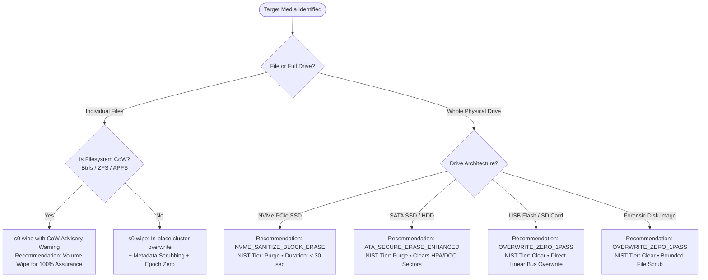
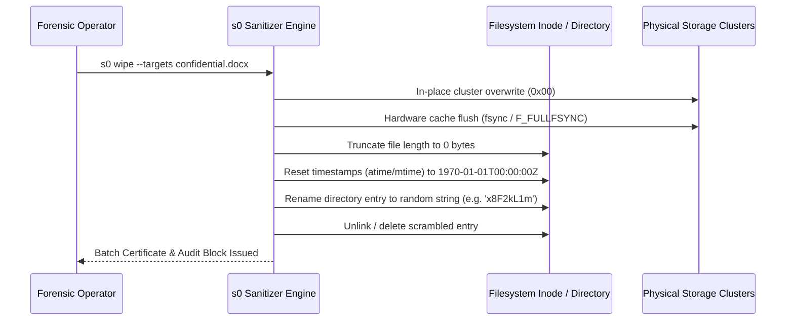

# Secure Data Erasure Guide


**Document Scope & Standards**
- **Primary Focus:** In-depth technical guide to storage sanitization, controller firmware commands, file cluster overwriting, and metadata destruction.
- **Applicable Standards:** NIST SP 800-88 Rev. 1, IEEE 2883-2022, DoD 5220.22-M
- **Modules Covered:** Module 1 (Defensive Media & File Sanitizer)


---

## 1. Executive Summary & Philosophy

Data sanitization is not simply writing zeros or calling `rm`. On modern storage architectures, filesystems, flash controllers, and operating systems employ caching, wear-leveling, copy-on-write, and journaling layers designed to preserve data — directly opposing erasure.

The **s0 Eraser Engine** is built around three core principles:
1. **Target Abstraction Selection:** Choosing between physical block-level firmware purges (for whole disks) and cluster-level in-place overwriting (for individual files).
2. **Absolute Engineering Honesty:** Explicitly identifying physical storage boundaries (such as SSD Flash Translation Layers and Copy-on-Write filesystems) where host-level overwriting cannot reach isolated physical blocks.
3. **Cryptographic Verification:** Confirming erasure through post-operation sampled readback and issuing tamper-evident Ed25519-signed certificates.

---

## 2. Choosing the Right Erasure Method

When preparing to sanitize media, operators face multiple choices. The following decision matrix provides unambiguous recommendations based on device hardware and compliance requirements:



### Recommendation Reference Table

| Target Hardware / Scenario | Recommended Method | NIST SP 800-88 Tier | Rationale & Trade-offs |
|---|---|:---:|---|
| **NVMe SSD (M.2 / U.2 PCIe)** | `NVME_SANITIZE_BLOCK_ERASE` | **Purge** | **(Recommended)** Hardware controller applies voltage reset to all flash blocks including overprovisioned cells. Takes < 30s for 1TB. Preserves flash write cycles. |
| **Self-Encrypting NVMe (SED)** | `NVME_FORMAT_CRYPTO_ERASE` | **Purge** | Destroys internal controller encryption keys. Instantaneous (< 5s). Data becomes irrecoverable ciphertext. |
| **SATA SSD / Traditional HDD** | `ATA_SECURE_ERASE_ENHANCED` | **Purge** | Commands drive firmware to overwrite user sectors, reallocated bad sectors, and Host Protected Areas (HPA). |
| **SATA HDD (Fast Decommission)** | `OVERWRITE_ZERO_1PASS` | **Clear** | **(Recommended)** Overwrites all addressable LBAs with zeros. Sufficient per NIST Appendix A. Avoids CSPRNG random bottleneck. |
| **USB Flash Drives / SD Cards** | `OVERWRITE_ZERO_1PASS` | **Clear** | Firmware erase commands are rarely supported over USB bridge chips; sequential zero overwrite guarantees all accessible blocks are cleared. |
| **Classified / Defense Contract** | `SHRED_RANDOM_NPASS` (3 passes) | **Clear** | Use only when external contractual compliance mandates multi-pass pseudo-random patterns (e.g. DoD 5220.22-M). Slower (~150 MB/s). |
| **Sensitive File / Directory** | `s0 wipe --target ...` / `--targets ...` | **Clear** | In-place cluster overwrite, filename scrambling, timestamp zeroing, and Windows ADS / macOS xattr cleansing. |

---

## 3. Drive Eraser: Firmware & Overwrite Mechanics

### 3.1 NVMe Controller-Level Sanitization
NVMe drives manage flash cells using an internal Flash Translation Layer (FTL). When an operating system writes to a logical sector, the FTL directs that write to any available physical cell for wear-leveling. Standard OS-level overwriting cannot reach:
- Retired bad blocks containing historical data fragments
- Overprovisioned flash capacity (typically 7–20% of the drive)
- Unmapped SLC cache blocks

To overcome this, s0 executes direct NVMe Admin commands:

```bash
# Recommendation: Execute controller firmware purge (NIST Purge)
sudo s0 wipe --target /dev/nvme0n1 --operator "analyst-01"
```

s0 selects:
1. **NVMe Sanitize Block Erase (`0x02`):** Low-level electrical block reset across all physical NAND channels.
2. **NVMe Format Crypto Erase (`0x04`):** If the controller supports cryptographic erase, s0 commands the controller to invalidate and regenerate the Media Encryption Key (MEK).

### 3.2 SATA ATA Secure Erase & Hidden Sectors
Traditional SATA hard drives and older SATA SSDs support ATA Security commands managed via `hdparm`. s0 automates the security handshake:

1. **Security Lock Check:** Verifies whether the drive is in an ATA "Frozen" state (set by motherboard BIOS). If frozen, s0 guides sleep-cycle unfreezing.
2. **HPA & DCO Detection:** Probes whether Host Protected Areas (`HPA`) or Device Configuration Overlays (`DCO`) hide sectors from the OS.
3. **ATA Command Issuance:** Sets a temporary password (`s0temp`), issues `SECURITY ERASE UNIT` or `SECURITY ERASE UNIT ENHANCED`, and verifies lock removal upon completion.

### 3.3 Kernel BLKDISCARD (TRIM / UNMAP)
On modern Linux kernels, the `BLKDISCARD` ioctl commands the flash controller to mark LBA ranges as unmapped.


**The BLKDISCARD Purge Condition**
`BLKDISCARD` qualifies for the NIST **Purge** tier *only* if the drive controller supports **DRAT** (Deterministic Read After Trim) and **RZAT** (Return Zeros After Trim). If the controller returns stale data or random noise upon reading trimmed LBAs, `BLKDISCARD` is classified strictly as **Clear**.

Use `--discard-purge-justification "Vendor Spec DRAT/RZAT verified"` to record drive-spec evidence in the certificate.


### 3.4 Logical Overwrite Engine (Zero vs. Random)

```bash
# Recommendation: Single-pass zero overwrite (fastest, fully compliant)
s0 wipe --target /dev/sdb --pattern zero --passes 1

# Alternative: Multi-pass random overwrite (use when mandated by policy)
s0 wipe --target /dev/sdb --pattern random --passes 3
```

#### Why Single-Pass Zeroing is Recommended:
- **Speed:** Writing zeros saturates the bus at **1,280–1,350 MB/s**. Generating CSPRNG random numbers throttles throughput to **450–480 MB/s**.
- **Compliance:** NIST SP 800-88 Rev. 1 Appendix A explicitly states that for modern high-density ATA/SCSI/SATA storage, a single overwrite pass renders previous data unrecoverable even using Magnetic Force Microscopy (MFM).
- **Verification Certainty:** Reading back zero bytes is verifiable with $O(1)$ comparisons. Random overwrite verification requires comparing against pre-recorded seed samples.

---

## 4. File & Folder Erasure: Cluster Overwrite Mechanics

Standard file deletion (`rm` or Windows `del`) simply removes the directory entry and marks clusters as unallocated in the filesystem bitmap. The file data remains on disk until overwritten by new files.

`s0 wipe` automatically detects files and directories to perform true forensic erasure across Linux, Windows, and macOS:

```bash
# Recommendation: Sanitize files with metadata cleansing and certificate issuance
s0 wipe --targets /evidence/suspect_payload.bin /evidence/staging_dir/ --passes 1
```

### 4.1 In-Place Cluster Overwrite Mechanics
1. **Extent Discovery:** s0 determines the exact physical clusters allocated to the file using Linux `FIEMAP`/`filefrag` ioctls or Win32 `FSCTL_GET_RETRIEVAL_POINTERS`.
2. **Direct Block Scrubbing:** Opens the file descriptor with `O_SYNC` / `GENERIC_WRITE` and overwrites every allocated byte in-place.
3. **Hardware Cache Flushing:**
   - **Linux:** POSIX `fsync(fd)` followed by `fdatasync(fd)`.
   - **macOS:** Darwin-specific `fcntl(fd, F_FULLFSYNC, 0)` forcing drive controller cache write-through.
   - **Windows:** Win32 `FlushFileBuffers(handle)`.

### 4.2 Forensic Metadata Cleansing
Overwriting file content is only half the battle. File metadata stored in directory nodes can leak filenames, file sizes, creation timestamps, and ownership. `s0 wipe` scrubs this residue:



### 4.3 Windows Alternate Data Streams (ADS)
On NTFS volumes, files can contain hidden named data streams (e.g. `file.pdf:Zone.Identifier` indicating internet origin, or malware payloads concealed in secondary streams).  
`s0` on Windows automatically enumerates all alternate data streams via `FindFirstStreamW`/`FindNextStreamW`, scrubs each stream in-place, and truncates the stream records before unlinking the primary file.

---

## 5. Storage Boundaries & Limitations

### Copy-on-Write (CoW) Filesystems
On Btrfs, ZFS, APFS, and ReFS volumes, overwriting an existing file causes the filesystem to allocate **new** physical blocks elsewhere on the drive to receive the updated data. The original physical clusters remain intact until reclaimed by filesystem garbage collection or snapshot pruning.


**CoW Advisory Warning**
`s0` inspects `/proc/mounts` and volume flags. When target files reside on CoW storage, s0 automatically attaches a signed **CoW Warning** to the certificate notes.

**Recommendation:** For 100% data destruction certainty on CoW filesystems, sanitize the entire volume or block device rather than individual files.


---

## 6. Post-Wipe Verification & Mathematical Readback

To eliminate the possibility of silent hardware write failures or buffered fake writes, every `s0 wipe` operation concludes with automated **sampled readback verification**:

1. **Uniform Distribution:** Selects 64 evenly distributed blocks across the full physical LBA space (start, 25%, 50%, 75%, end, and pseudo-random offsets).
2. **Buffer Validation:** Reads 4,096 bytes per sample (262,144 bytes total) directly using unbuffered I/O.
3. **Pattern Match:** Asserts that 100% of sampled bytes match the designated wipe pattern (e.g. `0x00`).
4. **Planted Marker Verification (Optional Demo Mode):** When `--plant-markers` is specified, s0 plants unique cryptographic canary tokens across the disk before wiping, and requires 0 grep hits post-wipe.

```bash
# Verify an existing certificate offline against trusted public key
s0 verify certificate_8f21bc90.json --key core/keys/demo_issuer_public.pem
```
