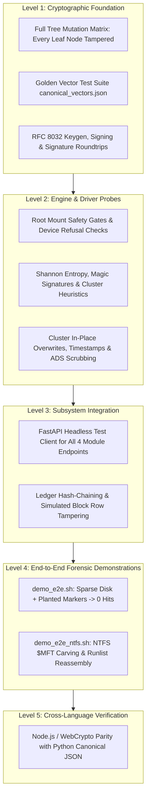

# Forensic Test Plan & Verification Strategy

> **Continuous Integration Status:** 190+ Automated Tests Passing (100% Green)  
> **Frameworks:** pytest, pytest-cov, unittest, Headless Browser / Node Test Runners  
> **Primary Orchestrator:** `bash scripts/build_all.sh`

---

## 1. Quality Assurance Strategy & Test Pyramid

In forensic data sanitization and legal evidence handling, software defects are catastrophic:
- An undetected flaw in a wiping routine could leave classified intelligence readable on decommissioned hardware.
- A bug in a carving algorithm could miss crucial evidence in a criminal investigation or calculate inaccurate hashes that compromise chain of custody.
- A signature validation defect could permit an adversary to present fraudulent wipe certificates in court.

To mitigate these risks, s0 employs a rigorous **five-layer test pyramid**:



---

## 2. Test Suites Reference

| Test File | Subsystem | Invariants & Test Objectives |
|---|---|---|
| `core/tests/test_canonical.py` | Cryptographic Core | Asserts that `s0_core.canonical` generates byte-exact output matching RFC-inspired golden test vectors in `canonical_vectors.json`. Asserts rejection of floating-point numbers. |
| `core/tests/test_crypto.py` | Cryptographic Core | Tests Ed25519 keypair generation, PEM serialization/deserialization, SHA-256 fingerprint derivation, and signature validation roundtrips. |
| `core/tests/test_tamper.py` | Cryptographic Core | **The Tamper Matrix:** Recursively traverses every key and value in a valid certificate, mutates each character individually, and asserts that `verify_certificate()` rejects 100% of mutations. |
| `core/tests/test_pdf.py` | Certificate Rendering | Validates ReportLab PDF document compilation, table geometry, font fallbacks, and optical QR code matrix rendering. |
| `linux/cli/tests/test_selection_safety.py`| Module 1: Drive Eraser | Asserts that the safety engine refuses to wipe root (`/`), `/boot`, mounted partitions, or devices with unreadable capacity unless `--force` is supplied. |
| `linux/cli/tests/test_overwrite.py` | Module 1: Drive Eraser | Validates single-pass zero and multi-pass CSPRNG random block streaming, block boundary alignment, and `fsync()` flushing. |
| `linux/cli/tests/test_firmware_probes.py`| Module 1: Drive Eraser | Unit tests parser routines for `hdparm -I`, `nvme id-ctrl`, HPA/DCO boundary queries, and ATA Security status flags. |
| `linux/cli/tests/test_e2e_demo.py` | Module 1: Drive Eraser | Programmatically builds a loopback disk image, plants confidential marker tokens, executes sanitization, performs 64-block sampling, and asserts zero marker hits. |
| `linux/cli/tests/test_file_eraser.py` | File/Folder Erasure | Tests cluster overwriting, inode timestamp zeroing (`1970-01-01T00:00:00Z`), directory entry scrambling, recursive directory unlinking, and batch certificate generation. |
| `linux/cli/tests/test_carver.py` | Module 2: File Carver | Tests 3-point Shannon entropy calculations, confidence scoring math, sliding-window header/footer carving, and recovery manifest generation. |
| `linux/cli/tests/test_ntfs_carver.py` | Module 2: File Carver | Mounts synthetic NTFS images with deleted files; validates $MFT resident extraction and multi-fragment non-resident runlist reassembly. |
| `linux/cli/tests/test_audit.py` | Audit Ledger (Supporting) | Tests genesis block initialization, append-only block insertion, SHA-256 hash chaining, and asserts that modifying a database row breaks verification. |
| `web/tests/test_gui.py` | Web Dashboard | Uses FastAPI's `TestClient` to execute end-to-end API calls across all four tabs without launching a live browser. |
| `verification-portal/tests/test_portal.py`| Verification Portal | Tests that the pure JavaScript verifier (`verify.js`) produces identical verification decisions to the Python reference engine across valid and tampered certificates. |
| `windows/cli/tests/` | Windows Subsystem | Validates Win32 API interactions, Alternate Data Stream (`:Zone.Identifier`) enumeration, and ReFS CoW detection. |
| `macos/cli/tests/` | macOS Subsystem | Tests Apple Darwin `fcntl(F_FULLFSYNC)` flushes, `xattr -c` quarantine removal, and APFS snapshot warnings. |

---

## 3. Running Test Suites

### Master Build & Test Orchestration
To execute the complete QA verification pipeline:

```bash
bash scripts/build_all.sh
```

### Targeted Pytest Execution
```bash
.venv/bin/pytest core/tests linux/cli/tests web/tests windows/cli/tests macos/cli/tests verification-portal/tests -v

.venv/bin/pytest core/tests -v

.venv/bin/pytest linux/cli/tests/test_carver.py linux/cli/tests/test_ntfs_carver.py -v
```

### Forensic End-to-End Demonstrations
To execute real-world disk sanitization and evidence extraction scenarios:

```bash
S0_DEMO_SIZE_MIB=32 bash linux/cli/demo_e2e.sh

bash linux/cli/demo_e2e_ntfs.sh
```
