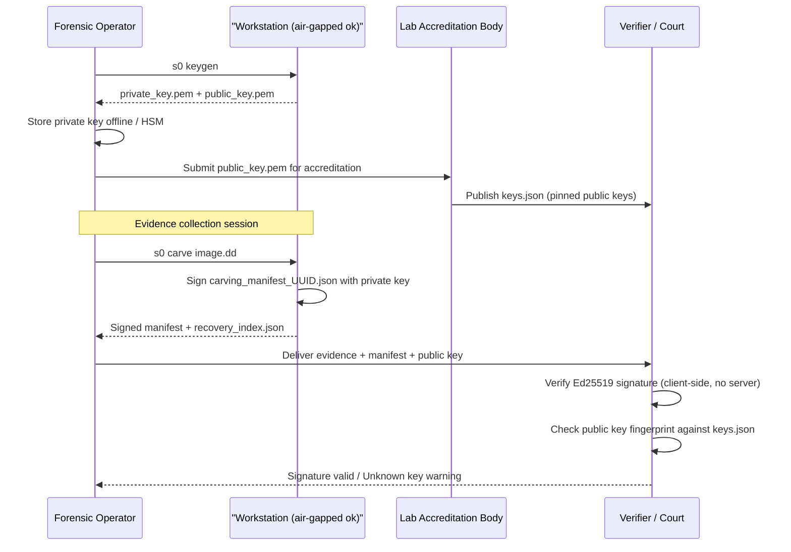
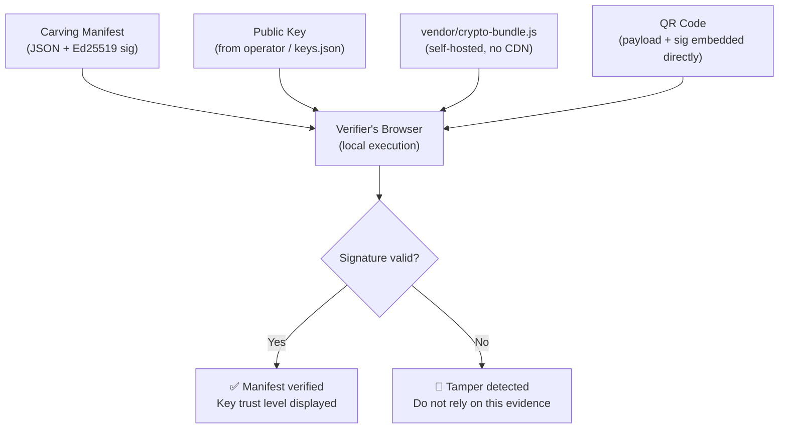

# Security Model

s0's security design is built around a single principle: **math over claims**. Rather than asserting that evidence is trustworthy, s0 produces cryptographically verifiable artifacts that allow any third party — a court, a defense attorney, an opposing expert — to independently confirm that the evidence was not tampered with, was collected by a known key holder, and arrived intact.

This page describes exactly what s0 protects against, what it explicitly does not protect against, and the architectural decisions behind both. Honest documentation of limitations is not a weakness — it is the foundation of credible forensic practice.

---

## Threat Model

The following table maps each identified threat to the specific control s0 uses to mitigate it.

| Threat | Attack Vector | s0 Mitigation |
|--------|--------------|---------------|
| **Evidence tampering** | Modifying carved files or reports after collection | Ed25519-signed carving manifest covers every output file; any modification invalidates the signature |
| **Audit record alteration** | Editing historical entries in the operation log | SHA-256 hash chain — each record includes the hash of the previous record; breaking any link breaks the entire chain from that point forward |
| **Incomplete sanitization** | Residual data surviving a wipe operation | Post-wipe 64-block sampled readback verifies sectors read back as zero; explicit warnings for CoW and FTL environments where host-level wipe is insufficient |
| **False-positive forensic evidence** | Submitting low-confidence fragments as confirmed evidence | Four-axis confidence scoring (0–100) + signed manifests that embed per-file confidence scores |
| **Key compromise (remote)** | Attacker obtaining the signing private key via network | Private key never transmitted; no remote key storage; stays on forensic workstation under operator control |
| **Signature forgery** | Presenting an unsigned or self-signed manifest as authoritative | Accredited lab keys pinned in `keys.json` in the verification portal; unknown keys shown as amber warning, not accepted silently |

---

## Key Management Lifecycle

### Key Generation

Ed25519 keys are generated locally. The private key never leaves the forensic workstation.

```bash
# Generate local Ed25519 keypair for forensic authority
s0 keygen --out-dir ./my_lab_key --name authority
```

This produces:
- `my_lab_key_private.pem` — keep this **offline and access-controlled**
- `my_lab_key_public.pem` — distribute to verifiers and submit to accreditation body

The public key fingerprint is the SHA-256 hash of the DER-encoded `SubjectPublicKeyInfo` structure:

```bash
openssl pkey -in my_lab_key_public.pem -pubin -outform DER \
  | sha256sum
```

### Full Lifecycle



### Key Trust Levels

| Key Status | Verification Portal Display | Meaning |
|-----------|---------------------------|---------|
| In `keys.json` (accredited) | 🟢 Green — Verified issuer | Key belongs to a known accredited lab |
| Valid signature, not in `keys.json` | 🟡 Amber — Unknown issuer | Mathematically valid but unaccredited; treat with appropriate scrutiny |
| Invalid or missing signature | 🔴 Red — Signature invalid | Manifest has been tampered with or key mismatch |

!!! note "Demo key"
    s0 ships with a demo keypair at `core/keys/demo_issuer_public.pem`. This key is intentionally excluded from `keys.json` — manifests signed with it will always show as amber. Use it only for testing and training.

---

## What s0 Protects Against

### Manifest Tamper Detection

Every carving session produces a signed manifest:

```json
{
  "session_id": "a3f2bc91-4d2e-...",
  "carved_at": "2026-09-09T13:44:02Z",
  "source_sha256": "e3b0c44298fc1c14...",
  "files": ["..."],
  "signature": "base64-encoded-ed25519-signature"
}
```

The `signature` field covers the entire JSON body (excluding the signature field itself). Any modification — to a confidence score, a filename, a SHA-256 hash, or a timestamp — produces a signature verification failure. There is no partial tampering: either the manifest is intact or it is not.

### Audit Chain Integrity

The operation audit ledger uses a SHA-256 hash chain. Each entry contains the hash of the entry immediately before it:

```
Entry 1: { data: "...", prev_hash: "0000...0000", hash: "aabbcc..." }
Entry 2: { data: "...", prev_hash: "aabbcc...",   hash: "ddeeff..." }
Entry 3: { data: "...", prev_hash: "ddeeff...",   hash: "112233..." }
```

**If an attacker modifies Entry 2:**

```
Entry 2 (modified): { data: "MODIFIED", prev_hash: "aabbcc...", hash: "XXXX..." }
Entry 3 (unchanged): { data: "...", prev_hash: "ddeeff...", ... }
                                                   ^^^^^^^^
                              This no longer matches XXXX... → CHAIN BROKEN
```

s0's audit verifier recomputes every hash and checks each `prev_hash` linkage. A single modification breaks all entries from that point forward — the exact position of the break identifies where the tampering occurred.

### Post-Wipe Verification

After a wipe operation, s0 performs a sampled readback of 64 blocks drawn from the beginning, middle, end, and random positions across the target. Each block is verified to read back as zero (or the chosen wipe pattern). The readback results are included in the wipe certificate.

### Confidence-Scored Evidence

Signed manifests embed the confidence score for every carved file. This prevents a downstream consumer from presenting a 32-confidence JPEG fragment as if it were a high-certainty recovery. The score is part of the signed payload — it cannot be upgraded without invalidating the signature.

---

## What s0 Does NOT Protect Against

This section documents the limits of s0's guarantees. These are not bugs — they are physical and architectural realities that no software tool can overcome. Knowing these limits is essential for accurate evidence characterization.

### Flash Translation Layer (SSD / eMMC / NVMe)

!!! danger "Host-level overwrite does not reach all flash cells"
    Solid-state storage devices contain a **Flash Translation Layer (FTL)** — firmware that maps logical block addresses to physical NAND cells. The FTL performs wear-leveling, manages overprovisioning, and maintains a pool of spare blocks for bad block replacement.

    When s0 (or any software) writes zeros over an LBA range, the FTL may:

    - Write the zeros to **new physical cells** and retire the old cells to the spare pool — leaving the original data physically present in overprovisioned NAND
    - Keep "retired" bad blocks containing original data accessible to FTL firmware but not to the host OS

    **What to do instead:** Use the drive's own secure erase command, which instructs the FTL controller to erase all cells including overprovisioned and spare blocks:

    ```bash
    # NVMe
    nvme format /dev/nvme0n1 --ses=1        # Cryptographic erase (if supported)
    nvme sanitize /dev/nvme0n1 --sanact=4   # Block erase sanitize

    # SATA SSD (ATA Secure Erase)
    hdparm --security-set-pass NULL /dev/sda
    hdparm --security-erase NULL /dev/sda
    ```

    s0 emits an explicit warning when wiping a device identified as SSD/NVMe.

### Copy-on-Write Filesystems (Btrfs, ZFS, APFS)

!!! danger "File-level overwrite does not overwrite original blocks"
    On CoW filesystems, writing new data to an existing file **allocates new blocks** for the new version rather than overwriting the original blocks in place. The original blocks are released to the free pool and reclaimed lazily.

    This means: writing zeros to a file path on Btrfs/ZFS/APFS does **not** overwrite the original physical sectors. The data remains physically present until the CoW engine reclaims the blocks through normal garbage collection.

    s0 detects mounted Btrfs, ZFS, and APFS volumes and emits a `[WARN] CoW filesystem detected` message before any wipe operation.

    **What to do instead:**

    - For Btrfs/ZFS: destroy the dataset or volume directly (`btrfs subvolume delete`, `zfs destroy`), then scrub free space
    - For APFS: use Apple's `diskutil secureErase` on the volume
    - In all cases: verify with `s0 carve` afterward and inspect confidence scores

### Journaling Remnants

!!! warning "ext4 and NTFS journals may outlive file deletion"
    The ext4 journal and NTFS journal (`$LogFile` + `$UsnJrnl`) may contain committed metadata records describing files that have since been deleted from the main filesystem structures.

    Journal forensics requires dedicated tooling (e.g., `jcat`, `fsstat` from The Sleuth Kit, or NTFS journal parsers). s0's carving engines do not specifically target journal structures.

    **What to do instead:** Use `tune2fs -O ^has_journal` to disable journaling before wiping (ext4), or use a dedicated journal scrubber. For NTFS, truncate `$LogFile` and `$UsnJrnl:$J` explicitly.

### Multi-User Systems During Erasure

!!! warning "s0 does not lock files against concurrent access"
    On a multi-user system, other processes may read target files while s0 is wiping them. s0 does not employ kernel-level file locking or memory barrier synchronization across processes.

    **What to do instead:** Boot from a forensic live OS (e.g., CAINE, Tails) to ensure the target volume is unmounted and no competing processes are active.

### Network-Mounted Paths

!!! warning "Network shares: no physical sector control"
    If the target path is on a network-mounted volume (NFS, SMB/CIFS, iSCSI at the file layer), s0's write operations pass through the network filesystem layer. The actual physical write behavior on the remote server is determined by the remote OS and its storage stack — not by s0.

    **What to do instead:** Perform erasure operations on the remote server directly, or image the remote server's physical storage and operate on the image.

### Encrypted Volumes

s0 carving on an encrypted volume (VeraCrypt, BitLocker, LUKS, FileVault) yields no carved files — the ciphertext is high-entropy noise with no recognizable magic bytes. This is correct behavior: the encryption is working.

This is listed here not as a limitation but as a clarification. If you expected to recover files from an encrypted volume and got zero results, that outcome is accurate — not a tool failure.

---

## Zero-Trust Verification Architecture

The s0 verification portal is designed so that **no trust in the s0 infrastructure is required**.



### Design Properties

| Property | How it's achieved |
|----------|--------------------|
| **No server dependency** | All cryptographic operations execute in the browser via `vendor/crypto-bundle.js` |
| **No data exfiltration** | Certificate and manifest bytes never leave the browser tab; no network requests are made |
| **Offline operation** | The verification portal works via `file:///` protocol — no web server required |
| **Air-gap compatible** | All crypto libraries are self-hosted in `vendor/crypto-bundle.js`; zero CDN dependencies |
| **QR code self-contained** | The QR code embeds the certificate payload and its Ed25519 signature directly — scanning alone is sufficient for verification without a separate manifest file |

!!! tip "Verifying on an air-gapped machine"
    Copy the verification portal directory and `vendor/crypto-bundle.js` to a USB drive. Open `verify.html` via `file:///` on the air-gapped machine. Load the manifest and public key from local files. The entire verification completes with zero network access.

---

## Audit Ledger Tamper Detection — Worked Example

The following demonstrates how the SHA-256 hash chain surfaces even a single-character modification.

**Original ledger (3 entries):**

```
┌─────────────────────────────────────────────────────────────┐
│ Entry 1                                                     │
│   event:     "carve_started"                                │
│   source:    "suspect.dd"                                   │
│   operator:  "lab-analyst-01"                               │
│   prev_hash: "0000000000000000"  (genesis)                  │
│   hash:      "aabbcc1122334455..."                          │
├─────────────────────────────────────────────────────────────┤
│ Entry 2                                                     │
│   event:     "file_carved"                                  │
│   file_id:   "0001"                                         │
│   confidence: 94                                            │
│   prev_hash: "aabbcc1122334455..."  ✅ matches Entry 1      │
│   hash:      "ddeeff6677889900..."                          │
├─────────────────────────────────────────────────────────────┤
│ Entry 3                                                     │
│   event:     "carve_complete"                               │
│   total:     1203                                           │
│   prev_hash: "ddeeff6677889900..."  ✅ matches Entry 2      │
│   hash:      "112233aabbccddee..."                          │
└─────────────────────────────────────────────────────────────┘
```

**After attacker modifies Entry 2** (changes `confidence: 94` to `confidence: 30`):

```
┌─────────────────────────────────────────────────────────────┐
│ Entry 2 (MODIFIED)                                          │
│   confidence: 30  ← changed                                 │
│   prev_hash: "aabbcc1122334455..."                          │
│   hash:      "ddeeff6677889900..."  ← NOT recomputed        │
│                                       (attacker omitted)    │
├─────────────────────────────────────────────────────────────┤
│ Entry 3 (unchanged)                                         │
│   prev_hash: "ddeeff6677889900..."  ← still refers to      │
│                                       pre-modification hash │
│                                                             │
│   s0 recomputes Entry 2 hash from modified content:         │
│   → computed: "XXXX999888777..."                            │
│   → stored:   "ddeeff6677889900..."                         │
│   → MISMATCH at Entry 2 → chain broken from Entry 2 onward │
└─────────────────────────────────────────────────────────────┘
```

s0's audit verifier reports:

```
[FAIL] Hash chain broken at entry 2
[FAIL] Expected prev_hash in entry 3: ddeeff6677889900...
[FAIL] Computed hash of entry 2:      XXXX999888777...
[FAIL] Ledger integrity: COMPROMISED — entries 2 onward are untrustworthy
```

Even if the attacker updates Entry 2's stored hash, Entry 3's `prev_hash` still references the original value — the cascade forces a full rewrite of every subsequent entry. Producing a validly chained replacement ledger requires the Ed25519 private key, which the attacker does not possess.
