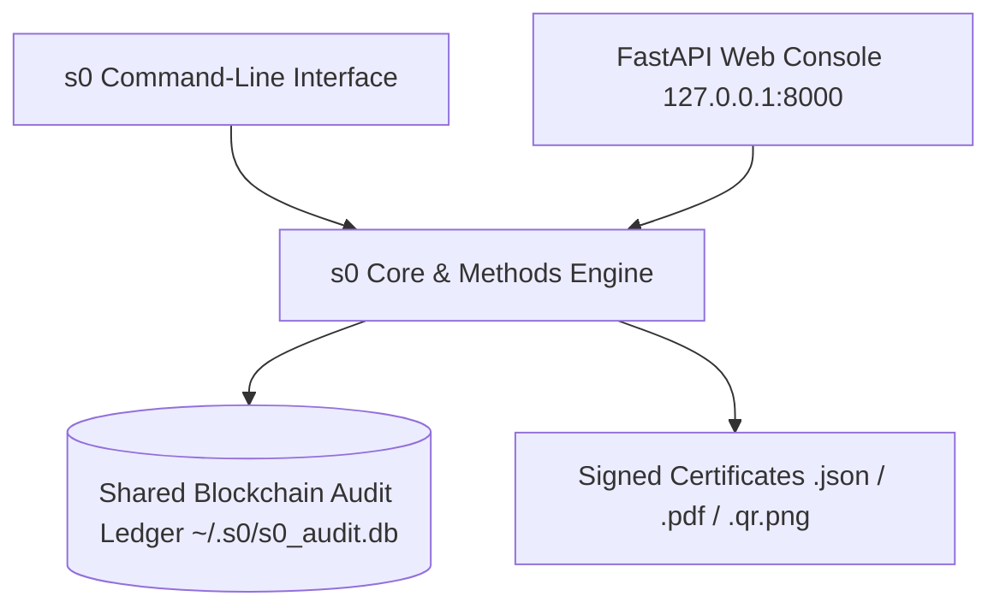

# Web Dashboard Operator Guide

> **Interface Type:** Local Forensics Operator Console  
> **Backend Architecture:** FastAPI (Python 3.10+) asynchronous server  
> **Frontend Stack:** Vanilla HTML5, CSS3 (Forensic Dark Theme `#222831`), JavaScript (Zero external framework dependencies)  
> **Default Bind Address:** `127.0.0.1:8000` (Strict loopback isolation)

---

## 1. Overview & Architecture

The **s0 Web Dashboard** provides a responsive, visual operating console for investigators and lab technicians who prefer a graphical interface over the command line.

Crucially, the Web Dashboard is **not a separate engine**. It runs the exact same cryptographic, sanitization, and carving routines as the `s0` CLI:
- Initiating a drive wipe from the web browser writes to the **same** local SQLite ledger (`~/.s0/s0_audit.db`).
- Carving from the web dashboard uses the **same** structure and entropy scoring engines.
- Certificates issued through the dashboard carry the identical Ed25519 digital signatures and Canonical JSON structure.



---

## 2. Launching the Dashboard

Execute the launcher script from the root of the repository:

=== "Linux & macOS"
    ```bash
    bash gui/run.sh
    ```
    The server initializes dependencies, binds to loopback, and prints:
    ```
    INFO:     Uvicorn running on http://127.0.0.1:8000 (Press CTRL+C to quit)
    ```
    Open `http://127.0.0.1:8000` in your web browser.

=== "Windows"
    ```powershell
    python -m uvicorn gui.app:app --host 127.0.0.1 --port 8000
    ```
    Or execute `gui\run.bat` if available.

!!! warning "Security & Network Exposure"
    The dashboard is explicitly engineered for **local, single-operator forensic workstations**. By default, it binds strictly to `127.0.0.1` (localhost). Do not bind to `0.0.0.0` or expose the dashboard port to an untrusted local area network without authentication proxies, as it possesses the authority to perform irreversible storage erasure.

---

## 3. The Four Forensic Modules

### Tab 1: Secure Drive Eraser

The Drive Eraser tab automates whole-media sanitization:

```
┌────────────────────────────────────────────────────────────────────────┐
│ [TAB 1: DRIVE ERASER]                                                  │
├────────────────────────────────────────────────────────────────────────┤
│ Target Device: [/dev/sdb - Samsung SSD 870 500GB (465.8 GiB)]       ▼  │
│ Recommended Profile: [NIST SP 800-88 Purge (ATA Secure Erase)]        │
│ Overwrite Passes: [1]   Pattern: [Zero Overwrite (0x00)]               │
│ Operator Identity: [analyst-07]  Organization: [Cyber Crime Cell]      │
│                                                                        │
│ Safety Confirmation: Type "WIPE" to proceed: [ WIPE        ]           │
│                                                                        │
│ [ ■ START PERMANENT SANITIZATION ]                                     │
├────────────────────────────────────────────────────────────────────────┤
│ PROGRESS: [████████████████████████████░░░░] 78.4%                     │
│ Speed: 482 MB/s | Elapsed: 00:08:12 | ETA: 00:02:15 | Temp: 38°C       │
└────────────────────────────────────────────────────────────────────────┘
```

#### Step-by-Step Drive Sanitization Workflow:
1. **Select Target Device:** Choose from the auto-detected list of non-root block devices. Any mounted partitions are flagged with a prominent warning badge.
2. **Review Recommended Tier:** The system analyzes device geometry and controller bus (NVMe vs SATA vs USB) to recommend the highest applicable NIST SP 800-88 tier (`Purge` or `Clear`).
3. **Configure Operator Metadata:** Enter your forensic operator ID and organization name for inclusion in the tamper-evident certificate.
4. **Safety Confirmation Gate:** To prevent accidental destruction of secondary evidence drives, the `Start Sanitization` button remains locked until the operator explicitly types the confirmation phrase `WIPE`.
5. **Real-Time Telemetry Stream:** Monitor the live SVG progress bar, real-time read/write throughput, estimated time remaining, and real-time controller thermal telemetry (queried every 2 seconds via Linux `hwmon` or SMART).
6. **Certificate Receipt:** Upon completion, the dashboard renders direct download buttons for the signed `.json` certificate and the official printable `.pdf` report.

---

### Tab 2: Secure File & Folder Eraser

Designed for targeted evidence sanitization, GDPR/DPDPA data destruction requests, or sanitizing sensitive staging folders:

```
┌────────────────────────────────────────────────────────────────────────┐
│ [TAB 2: FILE & FOLDER ERASER]                                          │
├────────────────────────────────────────────────────────────────────────┤
│ Target Paths (one per line):                                           │
│ ┌────────────────────────────────────────────────────────────────────┐ │
│ │ /home/investigator/evidence/case_89/suspect_chat_export.pdf        │ │
│ │ /tmp/extracted_archive_dump/                                       │ │
│ └────────────────────────────────────────────────────────────────────┘ │
│ Overwrite Passes: [1]   Fill Pattern: [Crypto Random Overwrite (0x??)] │
│                                                                        │
│ [ 🗑 EXECUTE TARGETED SANITIZATION ]                                  │
├────────────────────────────────────────────────────────────────────────┤
│ Status: Processed 48 files (1.2 GiB). All clusters overwritten.        │
│ Timestamps zeroed (1970-01-01). Directory entries randomized.         │
│ Issued Batch Certificate: certificate_8f21bc90.json                    │
└────────────────────────────────────────────────────────────────────────┘
```

#### Capabilities & Behavior:
- **In-Place Cluster Overwriting:** Allocations are overwritten in-place before unlinking to prevent residual sector carving.
- **Timestamp Zeroing:** Modification (`mtime`) and access (`atime`) timestamps are reset to epoch zero (`1970-01-01T00:00:00Z`).
- **Filename Scrambling:** Directory entry names are replaced with randomized alphanumeric strings prior to unlinking, scrubbing filename traces from directory nodes.
- **Copy-on-Write Warnings:** If paths reside on Btrfs, ZFS, or APFS volumes, the dashboard displays an inline advisory warning that snapshot or block redirect semantics may preserve historical extents.

---

### Tab 3: Forensic File Carver

The Carver tab recovers deleted artifacts from disk images (`.raw`, `.img`, `.dd`) or raw storage devices without mounting the volume:

```
┌────────────────────────────────────────────────────────────────────────┐
│ [TAB 3: FORENSIC FILE CARVER]                                          │
├────────────────────────────────────────────────────────────────────────┤
│ Image / Block Source: [/evidence/seized_usb_stick.raw]                 │
│ Target Extensions:  [x] JPG  [x] PNG  [x] PDF  [x] ZIP  [ ] ELF  ...    │
│ Minimum Confidence Threshold: [ 65% ] ────────────●───────             │
│ Destination Output Directory: [/home/investigator/recovered_cases]     │
│                                                                        │
│ [ 🔍 START EVIDENCE CARVING ]                                          │
├────────────────────────────────────────────────────────────────────────┤
│ Carved Artifacts Table:                                                │
│ ID       Type   Size       Confidence  SHA-256 (Prefix)  Action        │
│ CRV_001  PDF    2.4 MiB    95%         4a8f910b2c1...    [ Download ]  │
│ CRV_002  JPG    480 KiB    88%         b1c900e478a...    [ Download ]  │
│ CRV_003  ZIP    14.1 MiB   70%         8e12ff98012...    [ Download ]  │
│                                                                        │
│ Total Artifacts Recovered: 38 | Manifest: carving_manifest_1092a.json  │
└────────────────────────────────────────────────────────────────────────┘
```

#### Key Capabilities:
- **Filesystem-Aware Acceleration:** Automatically detects ext4 (inode extents) or NTFS ($MFT) structures to index recovered files in seconds.
- **Entropy & Confidence Filtering:** Use the interactive confidence slider to filter out fragmented noise or corrupted candidates before exporting.
- **Instant Triage:** Review extracted file sizes, SHA-256 hashes, and download recovered artifacts directly from the browser table.

---

### Tab 4: Blockchain Audit Ledger

The Audit Ledger tab provides visual verification of forensic chain of custody:

```
┌────────────────────────────────────────────────────────────────────────┐
│ [TAB 4: BLOCKCHAIN AUDIT LEDGER]                                       │
├────────────────────────────────────────────────────────────────────────┤
│ Ledger Status:  [ ✅ VALID & CONTINUOUS (42 Blocks Verified) ]          │
│ [ 🔄 VERIFY CHAIN CONTINUITY ]  [ 📥 EXPORT AUDIT LOG (JSON) ]         │
│                                                                        │
│ Timeline:                                                              │
│ • Block #42 | DRIVE_ERASE  | 2026-09-09 14:22:15 UTC | analyst-07     │
│   Hash: 4b227777d4dd1fc6... | Prev: 88c019a2e41bf901... | Target: sdb │
│                                                                        │
│ • Block #41 | FILE_CARVE   | 2026-09-09 11:05:40 UTC | investigator-4 │
│   Hash: 88c019a2e41bf901... | Prev: f100e49ab88190c3... | Target: raw │
│                                                                        │
│ • Block #00 | GENESIS      | 2026-09-01 09:00:00 UTC | system-init    │
│   Hash: 0000000000000000... | Prev: 0000000000000000... | Initialized │
└────────────────────────────────────────────────────────────────────────┘
```

#### Auditor Functions:
- **One-Click Hash Chain Verification:** Computes the mathematical SHA-256 continuity from the genesis block to the tip in under 20 milliseconds.
- **Tamper Simulation & Detection:** If any actor manually edits an entry in the SQLite database file, clicking `Verify Chain Continuity` immediately flags the exact index where the hash chain severed.
- **Inspect Block Payloads:** Click on any block to expand the raw signed canonical JSON payload, certificate UUID, and operator attribution.
